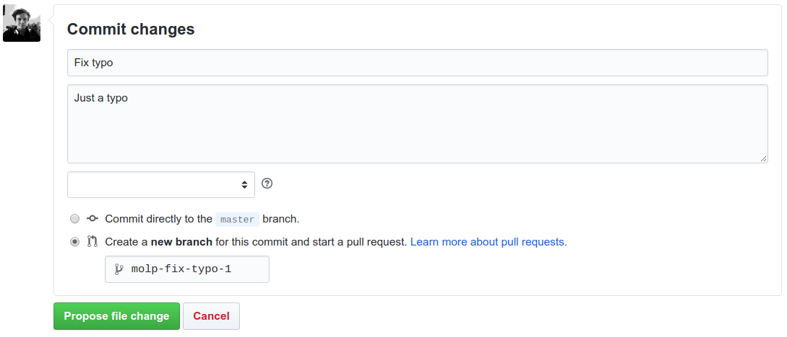

# AirlineSim Documentation

This is the official AirlineSim documentation.  

While the initial content is created by the team, we highly encourage you to contribute articles and corrections via GitHub Pull Requests. See below for details.

## How to contribute to the documentation

The AirlineSim documentation website consists of static websites that are being generated using [Hugo](https://gohugo.io) using the data in this repository.

All contributions are being reviewed by a AirlineSim team member and then added to this repository.

There are two ways to contribute content: Using the GitHub website or Editing the wiki on your own machine.

### Using the GitHub website

On the top right corner of each article in the documentation you will find a "Edit this page" button:

Clicking on it will open the corresponding source file in GitHub. You can now edit and preview the file to your liking. When you're done scroll down and enter a summary and a short description about your change. The summary will become the commit message and is usually in present tense ("Fix typo", "Add more details", etc.).

As shown below select the second option to create a new branch and start a pull request:

This will save your changes to your own branch and immediately open the window for a new Pull Request. If you plan to do multiple changes at once you can now edit other files and come back to this later. If you want to submit the changes now, fill out the details and hit "create pull request" 

A member of the team will then review your changes and either accept them or get back to you if he/she has questions. In both cases you will get a notification.

### Editing the wiki on your own machine

#### Install Hugo

Hugo is a static site generator that runs on most operating systems. Please visit [the official website](https://gohugo.io/getting-started/installing/) and follow the installation instructions.

#### Clone the repository

If you don't have an (GitHub)[https://github.com/] account please create one to proceed.

TBD