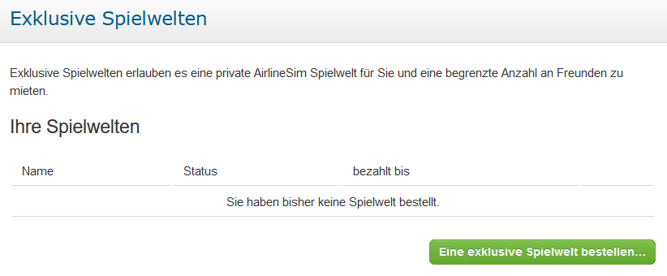

# Spielwelten

Nach dem Login zeigt das Dashboard eine Liste mit den zur Verfügung stehenden Spielwelten an. Die Anzahl der möglichen Spielwelten pro Konto ist nicht begrenzt, allerdings werden für jeden aktiven Server [Credits]() berechnet.

## Kurzzeit-Spielwelten

Wie der Name schon sagt, haben Kurzzeit-Spielwelten eine begrenzte Laufzeit. Meist stehen sie 8 - 10 Monate zur Verfügung, bevor die nächste Iteration startet. Welche Welten derzeit verfügbar sind, zeigt die untenstehende Tabelle.


**Info**  
Auf Kurzzeit-Spielwelten verbraucht die erste Holding 4 Credits am Tag. Für jede weitere Holding fallen 2 Credits am Tag an.


## Langzeit-Spielwelten

Im Gegensatz zu zeitlich begrenzten Servern haben Langzeit-Spielwelten kein bestimmtes Enddatum. Die aktuell verfügbaren Welten befinden sich ebenfalls in der Tabelle weiter unten.


**Info**  
Auf Langzeit-Spielwelten verbraucht die erste Holding 6 Credits am Tag. Jede weitere Holding kostet 4 Credits am Tag.


## Spielwelt-Konfigurationen

Die folgende Liste zeigt alle derzeit verfügbaren Kurzzeit- und Langzeit-Spielwelten sowie einige ihrer Konfigurationsdetails. Bitte beachtet, dass nur ein AirlineSim-Konto verwendet werden darf, auch wenn eine Spielwelt das Erstellen mehrerer Holdings erlaubt (weitere Informationen dazu gibt es in unseren Spielregeln).

### Kurzzeit-Spielwelten

| Spielwelt | Start | Ende | Erste Holding | Zusätzliche Holding | Standard-Preisformel | Turnarounds | ORS-Version | Bemerkungen |
| :-- | :-- | :-- | :-- | :-- | :-- | :-- | :-- | :-- |
| Bleriot V | Mai 2023 | 22. Jan. 2024 | 4 Credits | 2 Credits | Ver. 3 | dynamisch | Ver. 2 | Nur aktuelle Flugzeugtypen, doppelte Slots |
| Domination VI | Nov. 2023 | 22. Jul. 2024 | 4 Credits | 2 Credits | Ver. 3 | dynamisch | Ver. 2 | Alle Länder investitionsoffen, doppeltes Startkapital, Standard-Slots |
| Otto X | Apr. 2022 | 18. Dez. 2023 | 4 Credits | 2 Credits | Ver. 3 | dynamisch | Ver. 2 | Nur aktuelle Flugzeugtypen, doppelte Slots |
| Yeager VIII | Aug. 2023 | 21. März 2024 | 4 Credits | 2 Credits | Ver. 3 | dynamisch | Ver. 2 | Nur aktuelle Flugzeugtypen, doppelte Slots |
| Junkers V | Sep. 2023 | 27. Mai 2024 | 4 Credits | -- | Ver. 3 | dynamisch | Ver. 2 | Nur aktuelle Flugzeugtypen, doppelte Slots |
| Quimby XIV | Juli 2023 | 31. März 2024 | 4 Credits | -- | Ver. 3 | dynamisch | Ver. 2 | Nur aktuelle Flugzeugtypen, Standard-Slots |

### Langzeit-Spielwelten

| Spielwelt | Start | Ende | Erste Holding | Zusätzliche Holding | Standard-Preisformel | Turnarounds | ORS-Version | Bemerkungen |
| :-- | :-- | :-- | :-- | :-- | :-- | :-- | :-- | :-- |
| Yeouido | Jun. 2023 | -- | 6 Credits | -- | Ver. 3 | dynamisch | Ver. 2 | Nur aktuelle Flugzeugtypen, Standard-Slots |
| Limatambo | Dez. 2020 | -- | 6 Credits | -- | Ver. 3 | dynamisch | Ver. 2 | Nur aktuelle Flugzeugtypen, Standard-Slots |
| Xiguan | Dez. 2018 | -- | 6 Credits | -- | Ver. 3 | dynamisch | Ver. 1 | Nur aktuelle Flugzeugtypen, Standard-Slots |
| Hoover | Dez. 2017 | -- | 6 Credits | -- | Ver. 3 | dynamisch | Ver. 1 | Nur aktuelle Flugzeugtypen, Standard-Slots |
| Riem | März 2015 | -- | 6 Credits | 4 Credits | Ver. 2 | statisch | Ver. 1 | Fortgeschrittene Spielwelt durch reduziertes Aufkommen, IPOs möglich, Standard-Slots |
| Ellinikon | Aug. 2014 | -- | 6 Credits | 4 Credits | Ver. 2 | statisch | Ver. 1 | IPOs möglich, Standard-Slots |
| Aspern | Nov. 2013 | -- | 6 Credits | -- | Ver. 1 | statisch | Ver. 1 | IPOs möglich, nur aktuelle Flugzeugtypen, Standard-Slots |
| Gatow | Feb. 2013 | -- | 6 Credits | -- | Ver. 1 | statisch | Ver. 1 | IPOs möglich, Standard-Slots |
| Pearls | Jun. 2012 | -- | 6 Credits | -- | Ver. 1 | statisch | Ver. 1 | IPOs möglich, Standard-Slots |
| Meigs | März 2012 | -- | 6 Credits | -- | Ver. 1 | statisch | Ver. 1 | IPOs möglich, Standard-Slots |
| Stapleton | Jul. 2011 | -- | 6 Credits | 4 Credits | Ver. 1 | statisch | Ver. 1 | IPOs möglich, Standard-Slots |
| Fornebu | Sept. 2010 | -- | 6 Credits | 4 Credits | Ver. 1 | statisch | Ver. 1 | IPOs möglich, Standard-Slots |
| Tempelhof | Aug. 2010 | -- | 6 Credits | 4 Credits | Ver. 1 | statisch | Ver. 1 | IPOs möglich, Standard-Slots |
| Croydon | Nov. 2009 | -- | 6 Credits | 4 Credits | Ver. 1 | statisch | Ver. 1 | IPOs möglich, Standard-Slots |
| Nicosia | Aug. 2009 | -- | 6 Credits | 4 Credits | Ver. 1 | statisch | Ver. 1 | IPOs möglich, Standard-Slots |
| Devau | Feb. 2008 | -- | 6 Credits | 4 Credits | Ver. 1 | statisch | Ver. 1 | IPOs möglich, Standard-Slots |
| Idlewild | Okt. 2007 | -- | 6 Credits | 4 Credits | Ver. 1 | statisch | Ver. 1 | IPOs möglich, Standard-Slots |
| Kaitak | Aug. 2007 | -- | 6 Credits | 4 Credits | Ver. 1 | statisch | Ver. 1 | IPOs möglich, Standard-Slots |

## Exklusive Spielwelten

### Was ist eine exklusive Spielwelt?

Aufgrund steigender Nachfrage bietet AirlineSim seit einiger Zeit neben den öffentlichen Servern auch private Spielwelten an, die individuell konfiguriert werden können. 

Technisch gesehen funktionieren exklusive Spielwelten genau wie die öffentlichen Server und bieten somit die gleichen Möglichkeiten zur Anpassung. Daten- und Spielupdates werden ebenfalls normal durchgeführt. Im Gegensatz zu öffentlichen Welten kann die Konfiguration exklusiver Server jedoch frei nach Wunsch gestaltet werden!

### Was genau kann ich konfigurieren?

Sofern nicht anders angegeben haben exklusive Spielwelten eine Kapazität von 25 Accounts, die vom Admin der Spielwelt festgelegt und vom AirlineSim-Support freigeschaltet werden. Die Anzahl der Holdings ist nicht begrenzt. Sobald der Server online ist, kann das Support-Team den Airlines beliebige Geldbeträge zur Verfügung stellen, um ihnen beispielsweise einen schnelleren Start zu ermöglichen. 

Darüber hinaus können die folgenden Parameter je nach Wunsch angepasst werden:

* Startkapital
* Anzahl an Holdings pro Account
* Nachtflugverbote an / aus
* Verkehrsbünde an / aus
* Reguläre / doppelte Slots
* Börsengänge an / aus
* Dynamische Turnaroundzeiten an / aus
* Verfügbare Flugzeuge (alle / nur aktuelle)
* Auswahl der Flugzeugtypen
* Gebrauchte Flugzeuge zum Start an / aus
* Globales Aufkommen an Passagieren und Fracht (1 - 100%)
* Liste der investitionsoffenen Länder
* Anti-Cheating-Beschränkungen an / aus

Bei der Auswahl der investitionsoffenen Länder könnt ihr entweder eine der Listen wählen, die auch auf öffentlichen Spielwelten Anwendung finden, oder in keinem Land / allen Ländern Investitionen zulassen.

Sind Anti-Cheating-Beschränkungen deaktiviert, können Spielende mit ihren eigenen Holdings interagieren (auf dem Flugzeugmarkt, dem Aktienmarkt und bei Interlining-Verträgen).

### Wie sieht es mit den Spielregeln aus?

Auf exklusiven Spielwelten findet keine Durchsetzung der Spielregeln durch das AirlineSim-Team statt - auch Firmennamen oder der Börsenhandel werden nicht überprüft. Server-Admins können jedoch selbst die Einhaltung der Regeln kontrollieren, sofern sie das möchten.

Da exklusive Spielwelten technisch gesehen mit den öffentlichen identisch sind, können hartkodierte Beschränkungen (z. B. in Bezug auf Flugzeuge, Börsenhandel oder die Anzahl der Holdings) nicht aufgehoben werden.

### Wie viel kostet ein privater Server?

Eine exklusive Spielwelt kostet 360€ (inkl. MwSt.) für 30 Tage. Für die ersten 90 Tage ist eine nicht erstattungsfähige Vorauszahlung zu leisten. Die Servermiete für die folgenden Zeiträume wird monatlich berechnet.

### Wo kann ich meine eigene Spielwelt bestellen?

Bestellungen könnt ihr direkt in eurem AirlineSim-Account vornehmen. Nach dem Login stehen unter dem Menüpunkt "Exklusive Spielwelten" alle notwendigen Informationen zur Verfügung.

Sobald der Kauf abgeschlossen ist, wird die Spielwelt innerhalb von 5 Werktagen durch das AirlineSim-Team eingerichtet. Falls Fragen zur Bestellung aufkommen, könnt ihr euch jederzeit an den [Support](https://www.airlinesim.aero/blog/de/pages/support/) wenden.
