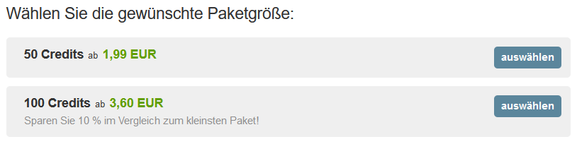

# Zahlungssystem

AirlineSim verwendet ein Pay-to-Play-Bezahlsystem, bei dem Credits gekauft werden, um Zugang zum Spiel zu erhalten. Durch dieses Modell werden In-Game-Käufe vermieden, was  Fairness und Immersion fördern soll.

Hier erfahrt ihr alles, was ihr über Credits, Preise, Zahlungsmethoden sowie die Premium-Features des Spiels wissen müsst. Bei Fragen zum Zahlungsvorgang werft gerne einen Blick auf unsere [Zahlungs-FAQ]().

## Credits

Nach der Registrierung werden eurem AirlineSim-Konto 60 kostenlose Credits gutgeschrieben, die eine Probezeit von etwa zwei Wochen abdecken. Wenn ihr nach Ablauf der Probezeit weiterspielen und die Premium-Funktionen des Spiels nutzen möchtet, werden weitere Credits benötigt.

Das Credit-System ist ein Prepaid-Modell und daher völlig flexibel. Der Kauf von Credits stellt kein wiederkehrendes Abonnement dar, sodass ihr Credits erwerben könnt, wann immer ihr möchtet. Falls ihr euch dazu entschließt, nicht weiterzuspielen, lasst ihr die restlichen Credits einfach auslaufen. Bitte beachtet, dass Credits nicht zurückerstattet werden können.

## Credit-Verbrauch

Nach der Gründung der ersten Holding werden täglich Credits vom AirlineSim-Konto abgezogen.

Auf Kurzzeit-Spielwelten kostet die erste Holding 4 Credits pro Tag und Spielwelt, für jede weitere Holding (sofern erlaubt) werden 2 zusätzliche Credits berechnet.

Auf Langzeit-Spielwelten verbraucht die erste Holding 6 Credits pro Tag und Spielwelt, während jede weitere Holding 4 zusätzliche Credits kostet.

Sollten die Credits ausgehen, werden die Unternehmen des Kontos gesperrt, bis weitere Credits hinzugefügt werden. Während dieses Zeitraums wird das Konto weiterhin täglich mit Credits belastet. Dadurch soll verhindert werden, dass ein unfairer Vorteil entsteht, wenn Spielende ihr Konto aufgeben und erst nach einigen Wochen wieder einsteigen, ohne für das Wachstum ihrer Firma bezahlt zu haben.


**Beispiel**  
Verfügt ein Spieler über eine Holding auf einem Kurzzeit-Server, liegt 5 Tage nach dem Ausgehen der Credits ein Kontostand von -20 Credits vor. Diese müssen bezahlt werden, bevor der Zugang zum Spiel wiederhergestellt wird.


Wird ein negativer Kontostand nicht innerhalb von 28 Tagen beglichen, kommt es zur Löschung der Airlines. Dadurch soll eine Bestrafung aktiver Accounts vermieden werden. Das AirlineSim-Konto selbst bleibt jedoch aktiv. Bitte beachtet: Die Frist von 28 Tagen gilt nur für Premium-Accounts, die zuvor bereits Credits erworben haben. Bei Testkonten dauert es 7 Tage nach dem Aufbrauchen der Credits, bis die Airlines gelöscht werden.

## Preise

AirlineSim bietet ein gestaffeltes Preismodell mit verschiedenen Paketgrößen an, sodass die Menge an Credits je nach Bedarf ausgewählt werden kann.

Das kleinste Paket besteht aus 50 Credits und beginnt bei 1,99€. Ein einfaches Konto, das pro Tag 4 Credits verbraucht, kostet für 30 Tage also etwa 4,78 €.

Bei größeren Paketen sind Mengenrabatte verfügbar:

* 100 Credits: 3,60€ (10% Ersparnis im Vergleich zum kleinsten Paket)
* 250 Credits: 8,60€ (14% Ersparnis im Vergleich zum kleinsten Paket)
* 500 Credits:16,60€ (17% Ersparnis im Vergleich zum kleinsten Paket)
* 1000 Credits: 31,70€ (20% Ersparnis im Vergleich zum kleinsten Paket)
* 2000 Credits: 62,40€ (22% Ersparnis im Vergleich zum kleinsten Paket)
* 5000 Credits: 149,00€ (25% Ersparnis im Vergleich zum kleinsten Paket)

## Zahlungsmöglichkeiten & Checkout

Um Credits zu erwerben, loggt euch einfach in eurem AirlineSim-Konto ein und klickt auf "Credits kaufen". Anschließend könnt ihr die gewünschte Paketgröße aussuchen, einen Gutscheincode eingeben und die Zahlungsmethode festlegen.


**Info**  
Derzeit können folgende Zahlungsarten verwendet werden: Kredit- oder Debitkarte (Visa, MasterCard, American Express), PayPal, paysafecard, Online-Überweisung und Vorkasse.


Bitte beachtet: Welche Zahlungsmethoden tatsächlich zur Verfügung stehen, hängt sowohl vom Land, in dem ihr seid, als auch von der gewählten Paketgröße ab. Wenn eine Zahlungsmethode fehlt, könnt ihr versuchen, verschiedene Paketgrößen auszuwählen.

Sobald die Zahlung bearbeitet wurde, werden die Credits eurem Konto gutgeschrieben.

## Premium-Features

Die folgenden Funktionen sind während des Testzeitraums nicht verfügbar und werden erst freigeschaltet, wenn das Konto durch den Kauf von Credits den Premium-Status erhalten hat:

* Mehrere Holdings
* Mehrere Fluggesellschaften in einer Holding
* Anbieten von Verträgen (Verkauf / Leasing von Flugzeugen, Interlining)
* Verkauf von Flugzeugen
* Bieten auf nicht-offizielle Flugzeugangebote
* Eigene Gebäude
* Entlassung von Personal
* Börsenfunktionen ([Börsengänge]() und Aktienhandel)
* [Das Online Reservation System (ORS)]()
* Integrierte Flight-Operations-Kontrolle
