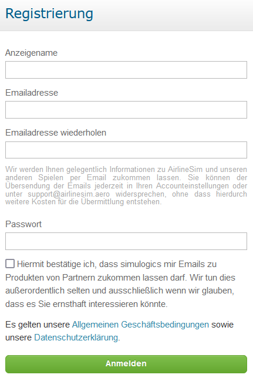

# Registrierung

Bevor ihr loslegt, müsst ihr ein Konto anlegen. Besucht dazu einfach die [AirlineSim-Website](https://www.airlinesim.aero/de) und klickt auf die Login-Schaltfläche. Anschließend geht ihr auf "Jetzt registrieren" und wählt einen Anzeigenamen (ohne Sonder- / Leerzeichen), gebt eine gültige E-Mail-Adresse ein und erstellt ein Passwort für euer Konto.

{}
**Info**  
Manchmal kann es zu Problemen kommen, wenn Registrierungs-Mails an Hotmail- oder MSN-Adressen gesendet werden. Versucht, wenn möglich, eine andere E-Mail-Adresse für die Registrierung zu verwenden. Falls ihr euch bereits mit einer Hotmail- oder MSN-Adresse bei AirlineSim registriert habt, wendet euch einfach an den [Support](https://www.airlinesim.aero/blog/de/pages/support/).
{}

Auch ein Login über Facebook ist möglich.

Nachdem ihr die Allgemeinen Geschäftsbedingungen und unsere Datenschutzerklärung akzeptiert habt, müsst ihr nur noch auf "Anmelden" klicken. In Kürze erhaltet ihr dann eine E-Mail mit dem Bestätigungscode, den ihr eingeben müsst, um die Registrierung abzuschließen. Solltet ihr die Bestätigungs-E-Mail nicht erhalten, überprüft bitte den Spam-Ordner.

Sobald ihr euch erfolgreich angemeldet habt, kann es auch schon losgehen! Denkt daran, eure Anmelde- und Kontodaten sicher aufzubewahren. Wenn ihr Hilfe beim Ändern des Passworts oder der E-Mail-Adresse benötigt, schaut euch gerne unseren Artikel zu den [Accounteinstellungen]() an.

{}
**Wichtig**  
Bitte beachtet, dass nur ein Konto verwendet werden darf. Das Anlegen mehrerer Accounts ist verboten. Weitere Informationen findet ihr in unseren Spielregeln.
{}
