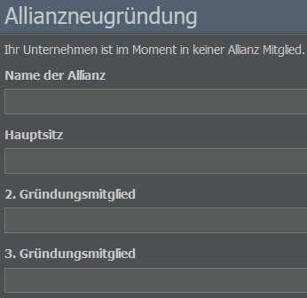

# Allianzen

Ihr möchtet im Spiel Verbindungen zu anderen Mitgliedern der Community aufbauen, wisst aber nicht genau wie? Dann kommt vielleicht eine Allianz für euch infrage. Was es damit auf sich hat, fragt ihr euch?

Allianzen sind geschäftliche Kooperationsvereinbarungen zwischen einer Reihe von Unternehmen. Sie verleihen dem Spiel einen Hauch von Realität und bieten euch eine großartige Möglichkeit, AirlineSim zusammen mit anderen zu genießen. Die Ziele einer Allianz, ihre Mitgliedschaftskriterien und andere Formalitäten werden von ihren Mitgliedern intern festgelegt.

Einige Allianzen "schaffen" zusätzliche Hubs, indem sie Interlining betreiben und zur gleichen Zeit den gleichen Flughafen anfliegen. Andere unterstützen ihre Mitglieder durch den Kauf von Aktien, wenn sie an die Börse gehen, stehen neuen Mitgliedern beratend zur Seite oder legen bestimmte Regeln fest.

Wie ihr sehen könnt, sind die Möglichkeiten endlos: Vom freundlichen Austausch bis hin zu kompletten Interlining-Vereinbarungen - eine gute Allianz bietet all das und noch mehr!

## Wie kann ich beitreten?

Wenn ihr Teil einer Allianz werden möchtet, habt ihr mehrere Optionen: Ihr könnt eine neue Allianz gründen, von einer bestehenden Allianz eingeladen werden oder euch um die Mitgliedschaft bewerben. Beachtet dabei, dass ein Unternehmen jeweils nur einer Allianz angehören kann - seid ihr also bereits Mitglied einer Allianz, müsst ihr diese zuerst verlassen, bevor ihr euch bei einer anderen Allianz bewerben könnt.

### Gründung einer Allianz

Um eine neue Allianz zu gründen, werden drei Gründungsmitglieder benötigt - ihr selbst und zwei weitere. Gebt im Menü "Neue Allianz" (Commercial-Tab) den Namen eurer Allianz, ihren Hauptsitz und den Namen des zweiten und dritten Gründungsmitglieds ein.

Das erste Gründungsmitglied ist die Person, die die Allianz einrichtet. Die beiden anderen werden benachrichtigt und können den Antrag annehmen oder ablehnen. Die Allianz wird gebildet, sobald alle Gründungsmitglieder zugestimmt haben.

### Bewerbung um Mitgliedschaft

Wenn ihr einer bestehenden Allianz beitreten möchtet, ruft zunächst deren Informationsseite auf (eine Liste aller verfügbaren Allianzen findet ihr im Datenbank-Tab). Hier findet ihr ein Bewerbungsformular für die Mitgliedschaft (nicht sichtbar, wenn ihr bereits Mitglied einer Allianz seid).

Die Informationen, die ihr hier eingebt, helfen den Allianzmitgliedern, über euren Antrag zu entscheiden. Ihr könnt auch Fragen stellen, etwa zur Tätigkeit der Allianz, was den Mitgliedern an ihr gefällt oder wie man sich gegenseitig hilft. So erfahrt ihr, was euch erwartet, wenn ihr beitretet.

Nachdem ihr die Bewerbung eingereicht habt, erhalten alle Mitglieder eine Nachricht über den Antrag und müssen abstimmen. Wenn die Mehrheit zustimmt, seid ihr offiziell Mitglied!

## Allianzen verwalten

Als Teil einer Allianz könnt ihr entweder Mitglied, Manager oder Direktor sein.

Mitglieder können an Diskussionen und Entscheidungen über die Aufnahme neuer Mitglieder teilnehmen. Manager können den Infotext und das Logo der Allianz verwalten. Ein Direktor hat außerdem Zugang zum Direktor-Tab in der Allianzverwaltung und kann Manager ernennen, Mitglieder entfernen oder zurücktreten und ein anderes Mitglied zum Direktor machen.

Managementaufgaben können also nur von Managern oder Direktoren durchgeführt werden. Sie können den Auftritt der Allianz durch Hinzufügen eines Unternehmensprofils sowie eines großen und kleinen Logos individuell gestalten. Das kleine Logo darf bis zu 23 x 23 Pixel groß sein und wird auf den Ankunfts- und Abflugtafeln aller Flüge der Allianzmitglieder angezeigt.

## Allianz-Übersicht

Alle wichtigen Details zu einer Allianz findet ihr auf deren Informationsseite im Commercial-Tab.

Der Abschnitt "Übersicht" zeigt eine Auflistung aller Allianzmitglieder sowie deren Status und Hubs. Seid ihr Teil der Allianz, werden hier auch alle ausstehenden Mitgliedsanträge angezeigt. Denkt daran, dass jedes Mitglied eine Stimme abgeben kann - je mehr Mitglieder die Allianz hat, desto mehr Stimmen müssen also abgegeben werden.

Die Registerkarte "Zahlen und Fakten" bietet euch eine Zusammenfassung der statistischen Informationen aller Allianzmitglieder, z.B. in Bezug auf Einnahmen, beförderte Passagiere und Fracht.

Der Abschnitt "Flugplan" zeigt die Flugpläne der Mitglieder an.
