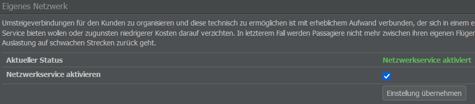

# Interlining

Eine weitere Möglichkeit euch mit anderen zu vernetzen ist das Interlining. Hierbei geht es um Vereinbarungen zwischen Airlines in Bezug auf Passagiertransfers, insbesondere die Möglichkeit für Passagiere, zwischen Flügen umzusteigen, die von Fluggesellschaften mit Interlining-Vereinbarungen durchgeführt werden.

In der Realität ist dies eine ziemlich komplizierte Angelegenheit, aber in AirlineSim wird ein vereinfachtes Modell verwendet.

## Einrichtung von Interlining-Abkommen

Damit Passagiere zwischen Flügen von zwei verschiedenen Airlines umsteigen können, muss ein Interlining-Abkommen abgeschlossen werden. Diese Verträge umfassen derzeit das gesamte Streckennetz der beteiligten Fluggesellschaften, es gibt also keine Einschränkungen hinsichtlich bestimmter Flughäfen oder Strecken.

Um ein Interlining-Angebot zu verschicken, könnt ihr entweder das Menü "Interlining" im Commercial-Tab oder den Button "Interlining-Antrag schicken" auf der Übersichtsseite eurer gewünschten Partner-Airline nutzen.

Sobald euer Angebot durch das andere Unternehmen bestätigt wird, werden eure beiden Streckennetze sofort miteinander verknüpft und Passagiere und Fracht können zwischen den Flügen beider Firmen transferiert werden.


**Info**  
Beim Interlining gelten dieselben Regeln wie für Transfers zwischen euren eigenen Flügen. Beachtet also die Mindesttransferzeiten der Flughäfen und lasst die Passagiere nicht länger als acht Stunden warten (die maximale Wartezeit hängt vom Server ab, kann also in zukünftigen Spielwelten länger sein).


## Tipps zur Auswahl des Partner-Unternehmens

Natürlich ist Interlining auch mit Kosten verbunden. Interlining-Abkommen ermöglichen es euch zwar, mehr Tickets zu verkaufen, erfordern aber auch zusätzliche Angestellte zur Netzwerkplanung (mindestens eine Person pro Fluggesellschaft und Vertrag, bei großen Fluggesellschaften eventuell auch mehr).

Es lohnt sich daher, den Wert des zusätzlich erzeugten Aufkommens gegen den Aufwand zur Aufrechterhaltung des Interlining-Vertrags abzuwägen, insbesondere wenn die Partner-Airline sehr groß ist.

Bevor ihr eine Interlining-Vereinbarung annehmt, solltet ihr prüfen, wo eure Partner-Firma ansässig ist, ob ihre Strecken zu eurem Streckennetz passen und ob ihre Flüge im [Online Reservation System (ORS)]() erscheinen. Im Idealfall kommuniziert die andere Airline mit euch, verfügt über ein gutes regionales und internationales Streckennetz und führt Flüge durch, die im ORS gut bewertet werden.

Warum ist das wichtig? Routen mit Anschlussflügen erhalten immer eine niedrigere Bewertung als Direktflüge. Wenn die Flüge der Partner-Airline (oder eure eigenen) eine niedrige Bewertung haben, werden die kombinierten Flüge möglicherweise gar nicht im ORS angezeigt. In diesem Fall werden die Fluggäste andere Wege bevorzugen, um von A nach B nach C zu fliegen.


**Beispiel**  
Nehmen wir an, ihr seid in Istanbul ansässig und sucht einen Interlining-Partner in London. Wenn eure beiden Airlines nur die großen europäischen Hauptstädte anfliegen, werdet ihr keine Passagiere gewinnen.

Wenn eure Partner-Firma jedoch Inlands- und Regionalflüge durchführt, werdet ihr auf euren Flügen nach London zusätzliche Passagiere erhalten, die einen Anschlussflug nach Aberdeen oder Glasgow nehmen.

Umgekehrt werdet ihr Fluggäste gewinnen, die eure Inlandsflüge von Ankara nach Istanbul nutzen und dann einen Anschlussflug nach London nehmen.


Der Standort eurer Partner-Airline ist weniger wichtig, aber in der Regel bietet ein Hub, der weit von eurem Standort entfernt ist, viele verschiedene Ziele. Ihr könnt aber auch einen Vertrag mit Unternehmen abschließen, die denselben Hub wie ihr nutzen.

## Kündigung von Abkommen

Ihr könnt ein Interlining-Abkommen jederzeit kündigen. In diesem Fall läuft es bis zum Ende der Abrechnungswoche, in der die Kündigung beantragt wurde.

## Internes Interlining

Wir haben bereits über die mit dem Interlining verbundenen Kosten gesprochen, aber auch die Aufrechterhaltung von Verbindungen zwischen euren eigenen Flügen ist nicht kostenlos! Diese werden genauso gehandhabt wie externe Verbindungen und erfordern eine Reihe von Angestellten, um einen reibungslosen Ablauf zu gewährleisten.

Auf der Interlining-Seite könnt ihr die Netzwerkverwaltung aktivieren oder deaktivieren, indem ihr die Option "Netzwerkservice aktivieren" an- oder abwählt.

Beachtet jedoch, dass eine Deaktivierung dazu führt, dass Fluggäste nicht mehr zwischen euren Flügen transferieren können, was insbesondere auf Nebenstrecken zu einer geringeren Nachfrage führen kann.
