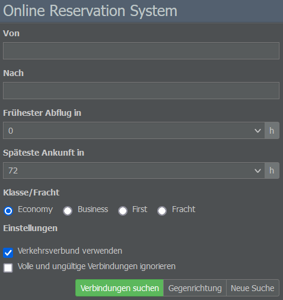
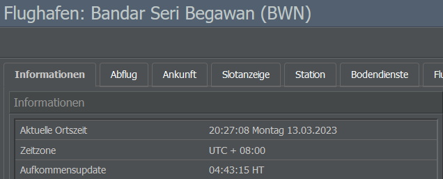

# Online Reservation System

Das Online Reservation System (ORS) ist eines der Kernfeatures des Spiels. Es generiert täglich eine Vielzahl von Verbindungen und verteilt die Passagiere auf die Flüge der Spielenden.

Die Flüge werden drei Tage vor ihrem Abflug in das ORS aufgenommen. Nehmen wir mal an, ihr aktiviert einen Flugplan am Montagmorgen und der erste Flug soll um 11 Uhr abheben. In diesem Fall müsst ihr bis 11 Uhr warten, bevor euer erster Flug in der Flugliste erscheint. Wenn ihr den Flugplan mit einer dreitägigen Verzögerung aktiviert, erscheint er erst am Donnerstagmorgen.

Daraufhin werden nach und nach neue Flüge in die Liste aufgenommen. Ein Flug nach dem anderen, und immer drei Tage im Voraus. Jeder Flughafen berechnet einmal am Tag seine Passagiernachfrage (die genaue Zeit findet ihr auf der Informationsseite des Flughafens unter “Aufkommensupdate”). Zu diesem Zeitpunkt wird euer Flug mit den anderen verfügbaren Flügen verglichen und die Passagiere buchen ihre Tickets.

Wenn ihr den Flugplan ohne Verzögerung aktiviert, haben die Fluggäste nur einen Tag Zeit, euren ersten Flug zu buchen. Wenn ihr den Flugplan mit einer dreitägigen Verzögerung aktiviert, wird euer Flug an drei aufeinanderfolgenden Tagen geprüft, sodass die Fluggäste drei Tage lang Zeit haben, Tickets zu buchen.

Auf einer durchschnittlichen Strecke wird sich euer Flug im Laufe der drei Tage allmählich füllen. Auf einer stark frequentierten Strecke kann es durchaus vorkommen, dass ein Flugzeug bereits nach einem Tag ausgebucht ist. Wenn die Nachfrage gering ist, kann euer Flugzeug auch nach drei Tagen noch halb leer sein.

Wenn das ORS euren Flug prüft, wägt es Sitzplätze, Bordservice, Terminals und das Image eurer Airline gegen den Preis ab. Dieses Preis-Leistungs-Verhältnis entscheidet über die Bewertung des Fluges. Eine hohe Bewertung bedeutet, dass die Fluggäste euren Flug bevorzugen werden. Eine niedrige Bewertung bedeutet, dass Passagiere lieber mit der Konkurrenz fliegen (wenn deren Bewertung höher ist).

Im ORS wird die Bewertung durch grüne Balken dargestellt (der genaue Wert wird angezeigt, wenn ihr mit dem Mauszeiger darüber fahrt), was es zu einem praktischen Tool macht, um eure Flug-Performance zu verfolgen.
