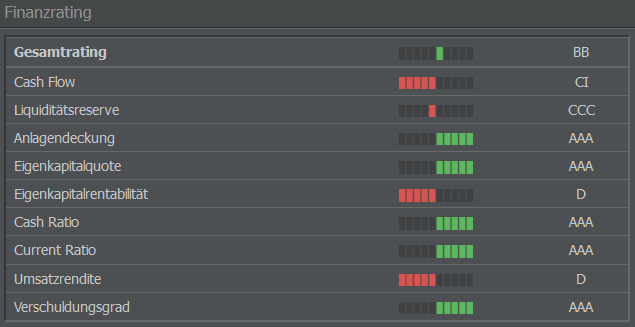
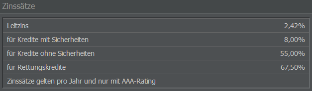

# Insolvenz und Kredite

## Zahlungsunfähigkeit

Zahlungsunfähigkeit oder Insolvenz bedeutet, dass eine natürliche oder juristische Person nicht in der Lage ist, ihre Rechnungen aus eigener Kraft zu bezahlen, d. h. das regelmäßige Einkommen reicht nicht aus, um die laufenden Kosten zu decken. In den meisten Fällen ist auch das Kreditlimit erreicht. Dies führt oft dazu, dass das Unternehmen aufgegeben und die Geschäftstätigkeit eingestellt wird.

{}
**Info**  
In AirlineSim gibt es keinen Überziehungskredit, aus dem Leasingraten oder Gehälter bezahlt werden können, sodass die Liquidität eures Unternehmens durch den Kontostand bestimmt wird.
{}

Wenn ihr nicht in der Lage seid, die Leasingrate eines Flugzeugs zu zahlen, gilt euer Unternehmen zu diesem Zeitpunkt als zahlungsunfähig. In diesem Fall wird der Leasingvertrag sofort gekündigt, das Flugzeug zurückgegeben und die Kaution (abzüglich der Leasingrate) auf euer Bankkonto zurückerstattet.

Wenn ihr die Löhne und Gehälter eurer Angestellten am Wochenende nicht zahlen könnt, sind die Folgen gravierender, da euer Unternehmen dann liquidiert wird.

Ohne ausreichende Beobachtung kann also auch ein gesundes Unternehmen in finanzielle Schwierigkeiten geraten. Es ist daher wichtig, genau zu kalkulieren und Bargeldreserven zu bilden, solange euer Unternehmen Gewinn macht. Ein Zeitplan hilft bei der Überwachung von Fixkosten (Leasingraten, Bodenabfertigung), Darlehen, Gehältern und der voraussichtlichen Dividendenausschüttung.

## Unternehmensliquidation

Wird ein Unternehmen wegen Zahlungsunfähigkeit zum Zeitpunkt des Wochenabschlusses liquidiert oder wird das Unternehmen in der Zwischenzeit aufgegeben, wird es wie folgt aufgelöst:

* Flugzeuge werden an den Leasinggeber zurückgegeben (die Kaution wird abzüglich der Leasingkosten zurückerstattet) oder vermarktet (zu 15% des Buchwerts).
* Das Personal wird entlassen, Gehälter und Abfindungen werden gezahlt.
* Darlehen werden getilgt (Zinsen werden anteilig berechnet).
* Gebäude werden abgerissen (gegen eine Gebühr).

Der Liquidationsprozess wird durch die Auszahlung des übrig gebliebenen Betrags an das übergeordnete Unternehmen abgeschlossen.

## Das Kreditsystem

In AirlineSim werden Kredite von der AS-Bank verwaltet und ausgezahlt. Die Kreditwürdigkeit und damit die maximale Kreditsumme, die euch angeboten wird, sowie die entsprechenden Zinsen werden von verschiedenen Faktoren beeinflusst:

* Dem Rating eures Unternehmens,
* der Höhe des Eigenkapitals,
* der Höhe der bereits abgeschlossenen Kredite
* und der Höhe des Gewinns.

In Abständen von sieben Tagen nach Unterzeichnung des Kreditvertrags müssen das Darlehen und die Zinsen in Raten gezahlt werden. Ihr könnt den Kreditvertrag jederzeit auflösen, wenn der Saldo eures Bankkontos die sofortige Begleichung des Darlehens erlaubt (zuzüglich einer zusätzlichen Gebühr).

Das Spiel bietet Darlehen mit und ohne Sicherheiten an.

### Kredite ohne Sicherheiten

Kredite ohne Sicherheiten erlauben es euch, eure Liquidität zu erhöhen. Wenn ihr im Menü “Unternehmensfinanzierung” (Management-Tab) zur Registerkarte “Fremdkapital” navigiert, habt ihr die Möglichkeit, einen Kredit ohne Sicherheiten zu beantragen (Abschnitt “Neuer Kredit”). Diese Art von Darlehen ist nicht an die von euch geplanten Investitionen gebunden, sodass die Zinsen im Vergleich zu einem Darlehen mit Sicherheiten etwas höher sind. Der konkrete Zinssatz für einen Kredit ohne Sicherheiten richtet sich nach dem aktuellen Leitzins, kann aber je nach Bonität auch höher sein.

### Kredite mit Sicherheiten

Kredite mit Sicherheiten werden nur beim Kauf neuer Flugzeuge angeboten, sind also immer an eine bestimmte Investition gebunden und erhöhen nicht die Liquidität eures Unternehmens. Sie sind daher in gewisser Weise mit einem finanzierten Kauf gleichzusetzen. Das konkrete Objekt, in das ihr investiert habt, dient der Absicherung des Kredits und geht im Falle der Illiquidität in das Eigentum der AS-Bank über. Daher ist die AS-Bank bereit, höhere Kredite und niedrigere Zinsen anzubieten als bei einem Kredit ohne Sicherheiten.

## Ratings

Bewertungen spielen eine wichtige Rolle, wenn es um Finanzen in AirlineSim geht. Eure Kreditwürdigkeit wird über verschiedene Ratings dargestellt, wobei AAA die beste und D die schlechteste Bewertung ist:

AAA - AA - A - BBB - BB - B - CCC - CC - C - CI - D

Ihr könnt die Ratings eurer Airline auf der Übersichtsseite / dem Dashboard eures Unternehmens einsehen.

### Auswirkung der Ratings

Das Spiel bewertet jedes Unternehmen in Bezug auf seine Kreditwürdigkeit. Das daraus resultierende Rating wird veröffentlicht (d. h. für alle sichtbar) und nach jeder Transaktion, die sich auf die Kreditwürdigkeit auswirken kann, aktualisiert.

Das Rating (d. h. eure Kreditwürdigkeit) beeinflusst drei wichtige Aspekte des Spiels.

* **Finanzierte Käufe von AirlineSim**: Wenn ihr ein Flugzeug von einem AS-Unternehmen leasen oder ein von der AS-Bank finanziertes Flugzeug kaufen möchtet, muss euer Rating mindestens B oder besser sein. Manchmal reicht auch ein Rating von BB nicht aus. Wenn ein Flugzeug von anderen Spielenden geleast wird, spielt das Rating jedoch keine Rolle, sodass ihr auch mit einem CCC-Rating Flugzeuge leasen könnt.

* **Zinsen und Darlehen**: Je niedriger euer Rating ist, desto niedriger ist die maximale Kreditsumme, die euch angeboten wird, und desto mehr weichen die Zinsen vom Leitzins ab. In den meisten Fällen bietet die AS-Bank keine neuen Kredite an, wenn das Rating CCC oder schlechter ist. Je nach Verschuldungsgrad werden euch oft nicht einmal mit einem B-Rating neue Kredite angeboten.

* **Börsengänge (Initial Public Offerings)**: Ein Börsengang ist nicht möglich, wenn euer Rating BBB oder niedriger ist. Denkt jedoch daran, dass potenzielle Investorinnen und Investoren einen Blick auf euer Rating werfen werden - ein IPO mit einem Mindestrating von A (oder nur etwas darüber) kann sie unter Umständen abschrecken. Daher gilt: Je besser euer Rating, desto besser der Eindruck.

### Bewertete Parameter

Ratings werden aus verschiedenen finanziellen Parametern des bewerteten Unternehmens berechnet, z. B. dem Verhältnis von Eigenkapital zu Schulden (eure Kredite) und dem prognostizierten Cashflow. Die genaue Formel können wir nicht teilen, aber hier ist ein kurzer Überblick über einige der bewerteten Faktoren.

* **Cash Flow**: Der Cash Flow beschreibt den Nettogewinn in einer bestimmten Periode. In AirlineSim wird dies vereinfacht als der Gewinn aus eurer Gewinn- und Verlustrechnung abzüglich der Abschreibungen dargestellt. (Die GuV findet ihr, indem ihr das Menü “Accounting” im Management-Tab auswählt und zur Registerkarte “Bilanz” navigiert). 

* **Liquiditätsreserve**: Dies ist der Betrag des frei verfügbaren Kapitals auf eurem Bankkonto.

* **Anlagendeckung**: Dieser Parameter bezieht sich auf das Verhältnis zwischen euren Aktiva (wie euren Flugzeugen, dem Sperrkonto und den optionalen Gebäuden) und dem Nettoeigenkapital. Theoretisch gibt es drei verschiedene Verhältnisse, im Spiel findet aber nur das erste Anwendung und wird wie folgt berechnet: Anlagendeckung = Eigenkapital / Vermögen x 100.

* **Eigenkapitalquote**: Diese Kennzahl gibt an, wie viel eigenes Geld (einschließlich des Geldes eurer Aktionärinnen und Aktionäre) in eurem Unternehmen steckt. Darlehen werden als Fremdkapital betrachtet. Beispiel: Hat das Unternehmen laut Bilanz ein Gesamtvermögen von 100 Millionen AS$ und Darlehen von 35,5 Millionen AS$, beträgt die Eigenkapitalquote 64,5 %.

* **Eigenkapitalrentabilität**: Dieser Wert gibt die Rendite des eingesetzten Kapitals in einem bestimmten Zeitraum an und beschreibt, wie viel Geld eine Airline aus dem verfügbaren Nettoeigenkapital gewinnt. Die Kennzahl wird wie folgt berechnet: Eigenkapitalrentabilität = Gewinn / Nettoeigenkapital x 100.

* **Cash Ratio**: Die Cash Ratio beschreibt die kurzfristige Fähigkeit, finanzielle Verpflichtungen zu erfüllen. Der Wert wird wie folgt berechnet: Cash Ratio = Liquide Mittel (das Geld auf eurem Bankkonto) / kurzfristige Schulden (alle regelmäßigen Zahlungen wie Gehälter, Leasingraten usw.)

* **Current Ratio**: Das gleiche wie die Cash Ratio, in diesem Fall wird das aktuelle Vermögen (liquide Mittel plus Sicherheitsleistungen) jedoch ebenfalls zu den liquiden Mitteln gezählt.

* **Umsatzrendite**: Dies ist der prozentuale Anteil des Gewinns an euren Einnahmen (pro Woche in AirlineSim). Der Wert wird wie folgt berechnet: Umsatzrendite = Gewinn / Einnahmen x 100

* **Verschuldungsgrad**: Der Verschuldungsgrad ist der Anteil der Kredite im Vergleich zu eurem Gesamtvermögen, also gewissermaßen das Gegenteil eurer Gewinnspanne. Der Wert wird wie folgt berechnet: Verschuldungsgrad = Kredite / Eigenkapital x 100

## Leitzinsen

In der Realität legt die zuständige Zentralbank die Leitzinsen in bestimmten Abständen fest. In AirlineSim sind Leitzinsen nicht in Stein gemeißelt. Sie werden an die aktuelle Entwicklung einer Spielwelt angepasst und können sich mehrmals am Tag ändern. Daher kann der Leitzins im Vergleich zur Realität größere und häufigere Auf- und Abschwünge durchlaufen.

Auf der Startseite jeder Spielwelt werden zwei Leitzinsen angezeigt: Einer für Kredite ohne Sicherheiten und einer für Kredite mit Sicherheiten. Beachtet dabei, dass die hier angegebenen Leitzinsen ein AAA-Rating voraussetzen - bei einem niedrigeren Rating kann die AS-Bank höhere Zinsen verlangen.
