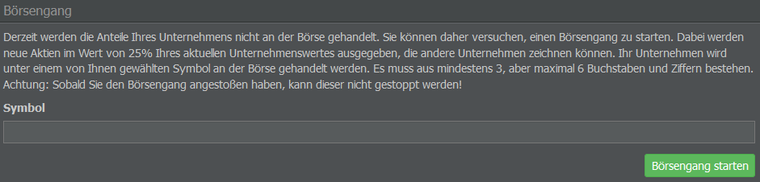

# Börsengänge (Initial Public Offerings)

In einigen Spielwelten ist es möglich, einen Börsengang (Initial Public Offering / IPO) durchzuführen. Frühestens zwei Wochen nach der Gründung eines Unternehmens könnt ihr eine Notierung an der AirlineSim-Börse beantragen und mit dem öffentlichen Aktienhandel beginnen.

## Grundregeln

Anbei noch ein paar allgemeine Regeln und Tipps zu Börsengängen und -geschäften, die besonders dazu dienen, neue IPOs zu schützen und die Einhaltung der Spielregeln sicherzustellen:

* Bei einem IPO können maximal 200% der angebotenen Aktien gezeichnet werden.
* Ein Unternehmen kann maximal 33% der angebotenen Anteile innerhalb eines IPOs zeichnen.
* Jede Firma, die einen Börsengang unternimmt, muss ein deutlich erhöhtes Eigenkapital / Aktienkapital vorweisen. Das Startkapital, das ihr zur Firmengründung erhaltet, zählt nicht dazu.
* Der Börsenkurs folgt einer bestimmten Basisrate, die eng mit dem Unternehmenswert verknüpft ist, und bietet eine grobe Prognose über die Entwicklung der Firma.
* Änderungen des Aktienkurses durch den Handel sind nur innerhalb von +/- 10% der Basisrate möglich.

## Einreichung eines IPO

Bei einem Börsengang werden Aktien in Höhe von 25% (vor dem IPO) bzw. 20% (nach dem IPO) des Firmenwertes anderen Unternehmen zur Zeichnung angeboten. Die Aktien werden an der örtlichen Börse unter einem Börsensymbol eurer Wahl gehandelt. 

Den Börsengang könnt ihr im Menü “Unternehmensfinanzierung” im Management-Tab starten. Wählt dafür einfach ein Börsensymbol aus 3 bis 6 Buchstaben und / oder Zahlen und stellt euren Antrag, indem ihr auf die grüne Schaltfläche klickt. Denkt daran, dass ein Börsengang nachträglich nicht mehr rückgängig gemacht werden kann!

## Dividendenausschüttungen

Nach der Anmeldung des Börsengangs müsst ihr 15% der wöchentlichen Gewinne an die Aktieninhabenden auszahlen. Da die Mehrheit aller Aktien euch gehört (standardmäßig besitzt ihr 80%, es sei denn, ihr habt nach dem Börsengang bereits einige Aktien separat verkauft), fließt der Großteil dieser Dividenden in die Taschen eurer eigenen Holding oder Muttergesellschaft zurück.

## Investieren

Ihr könnt auch in die IPOs von anderen Unternehmen investieren. In diesem Fall gelten bestimmte Regeln.

### Allgemeine Regeln

Erreicht der Aktienkurs nicht 50% (d. h. es wurden weniger als 50% der angebotenen Aktien gezeichnet), ist der Börsengang nicht erfolgreich und ihr erhaltet eine Rückzahlung.

Zwischen 50% und 100% bekommt ihr euren Anteil an der Investition in das Unternehmen. Habt ihr beispielsweise in 25% aller angebotenen Aktien investiert, erhaltet ihr einen Anteil von 5% an dem Unternehmen (100 % * 20% angebotene Aktien * 25% Investition = 5%), wobei jede Aktie genau 100 AS$ wert ist.

Bis zu 200% erhaltet ihr Aktien für den vollen Wert, den ihr investiert habt, nur weniger davon zu einem höheren Preis.

Überschreitet die Notierung die 200%-Marke, erhaltet ihr euren Anteil an der gesamten Investition (zu 200 AS$), aber nur bis zu einem 200%-Volumen.

### Beispiele

Hier ein Beispiel dafür, was passiert, wenn die Notierung die 200%-Marke überschreitet.

Beträgt das Grundkapital 10 Mio. AS$ (geteilt durch 100 = 100.000 AS$ Aktien-Basisfloat), habt ihr eine angestrebte Marktkapitalisierung von 12,5 Mio. AS$ (+25%) bei 100%. Der zu zeichnende Wert beträgt also 2,5 Mio. AS$ (12,5 Mio. - 10 Mio. AS$) und die Obergrenze liegt bei 200%, d.h. ihr könnt einen Höchstwert von 5 Mio. AS$ zeichnen.

Das Unternehmen, das den Börsengang durchführt, wird immer 80% aller Aktien behalten, sodass immer 20% ausgeschüttet werden müssen.


**100% werden durch euch gezeichnet:**

Wenn wir das obige Beispiel weiterführen, erhaltet ihr in diesem Szenario 25.000 Aktien zu 100 AS$ pro Aktie. Das Unternehmen, das den Börsengang durchführt, erhält 2,5 Millionen AS$, sodass ihr 20% des Unternehmens besitzt. Der neue Gesamtbuchwert des Unternehmens beträgt dann 12,5 Millionen AS$.



**200% werden von euch und einem anderen Unternehmen (B) unterzeichnet:**

In diesem Fall erhaltet ihr 12.500 Aktien zu 200 AS$ pro Aktie. Das Unternehmen, das den Börsengang durchführt, erhält 5 Millionen AS$ und ihr haltet 10% an dem Unternehmen. Der neue Gesamtbuchwert des Unternehmens beträgt 15 Mio. AS$.



**250% werden von euch und zwei anderen Unternehmen unterzeichnet (ihr unterzeichnet 100%, B 100% und C 50%):**

Ihr erhaltet 10.000 Aktien (25.000 geteilt durch 100% + 100% + 50%) zu 200 AS$ und zahlt dafür 2 Millionen AS$. Die Differenz (500.000 AS$) wird euch auf euer Bankkonto zurückerstattet.

Das Gleiche gilt für B, während C 5.000 Aktien zu 200 AS$ erhält, 1 Million AS$ zahlt und eine Rückerstattung von 250.000 AS$ erhält. Euer Anteil an dem neuen Unternehmen beträgt 8%. B besitzt ebenfalls 8%, während C einen Anteil von 4% bekommt. Der neue Gesamtbuchwert des Unternehmens beträgt 15 Millionen AS$.


## Wertminderung & Unternehmenswert

Grundsätzlich gilt, dass der Unternehmenswert geteilt durch die Anzahl der Aktien den Basisaktienkurs ergibt. Den Regeln zufolge ist eine Abweichung von diesem Basispreis zu maximal 10% möglich.

Für die drei oben genannten Szenarien lässt sich dies wie folgt zusammenfassen:

* A: Bei 125.000 Aktien mit einem Unternehmenswert von 12,5 Millionen AS$ liegt der Basispreis bei 100 AS$ und der Höchstpreis bei 110 AS$.
* B und C: Bei 125.000 Aktien zu 15 Mio. AS$ Unternehmenswert beträgt der Basispreis 120 AS$ und der Höchstpreis 132 AS$.

Die Aktienkurse werden täglich neu berechnet / angepasst, wobei sich eng an den tatsächlichen Buchwert gehalten wird. Je besser das Unternehmen (in Bezug auf den Cashflow) abschneidet, desto schneller steigen die Aktien. Eine Dividendenausschüttung ist im Grunde eine Bilanzverkürzung, bei der Eigenkapital abgezogen wird, was zu einer Wertminderung der Aktien führt.
