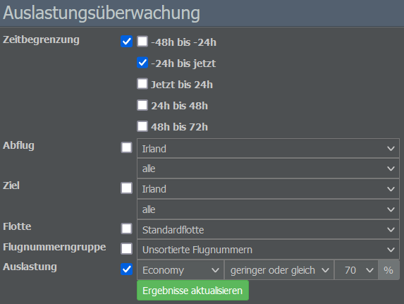

# Ladefaktoren

Ein Flugzeug, das halb leer fliegt, verliert Geld. Achtet also darauf, eure Flugzeuge so voll wie möglich zu halten. Wenn ihr nicht genug Nutzlast habt, braucht ihr ein weiteres Flugzeug, das Gewinn macht, um die Verluste auszugleichen. Das bedeutet jedoch, dass ihr Geld in zwei Flugzeuge investieren müsst und das Nettoergebnis trotzdem gleich Null ist.

{}
**Beispiel**  
Nehmen wir an, ihr habt ein Flugzeug mit 100 Sitzplätzen und der Punkt, ab dem ihr die Kosten decken könnt, liegt bei etwa 70%. Das bedeutet, dass ihr mit 70 Passagieren gerade so überleben könnt, mit 80 Passagieren 10% Gewinn erzielt, mit 90 Passagieren 20% und mit einem vollbesetzten Flugzeug 30%.
{}

Jede Strecke und jedes Flugzeug ist anders, dennoch ist es wichtig, sich hohe Ziele zu setzen. Versucht daher, eure durchschnittliche Auslastung bei 90% oder höher zu halten.

Ihr könnt die Performance eurer Airline im Auge behalten, indem ihr zum Menü “Auslastungsüberwachung” im Commercial-Tab navigiert. Hier könnt ihr die Auslastung für eine Zeitspanne, Strecke, Flotte und Flugnummerngruppe eurer Wahl überprüfen.

Möchtet ihr eure Auslastung erhöhen, denkt ihr vielleicht zuerst daran, billigere Tickets zu verkaufen. Niedrigere Preise funktionieren jedoch nicht immer. In der realen Welt können niedrige Preise neue Passagiere anlocken, die sonst nicht fliegen würden. Im Spiel ist die Anzahl der Passagiere jedoch fix.

Welche Möglichkeiten gibt es also, wenn die Auslastung trotz günstiger Tickets nicht steigt?

* **Überprüfung des Flugplans**: Habt ihr die Ankünfte und Abflüge an bzw. von eurem Hub als Wellen eingeplant und die Mindesttransferzeiten berücksichtigt? Gute Verbindungen verbessern in der Regel die Auslastung.
* **Optimierung des Serviceangebots**: Habt ihr eurem Flug ein Serviceprofil zugewiesen? Nur wenige Passagiere werden das Flugzeug besteigen, wenn es keinen Bordservice gibt.
* **Verbindungen über Interlining-Verträge**: Wenn ihr einen Interlining-Vertrag mit einer Airline habt, die an eurem Zielflughafen angesiedelt ist, stellt sicher, dass eure Flüge mit deren Flügen verbunden sind.

Wenn sich die Auslastung trotz allem nicht verbessert, kann es sinnvoll sein, sich nach einer rentableren Strecke umzusehen. Ausnahme: Euer Flugzeug ist nur halb voll, aber die meisten Fluggäste sind Transferpassagiere. In diesem Fall solltet ihr ein kleineres Flugzeug leasen, um die Strecke zu bedienen.
