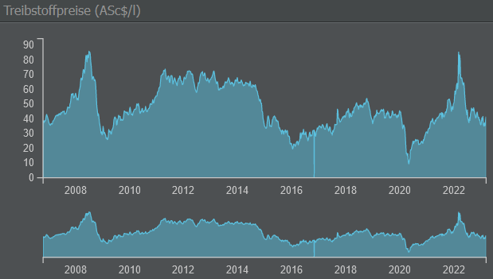

# Treibstoffverbrauch

Treibstoff ist nicht billig. Jeder Dollar, den ihr für Treibstoff bezahlt, verringert euren Gewinn, daher ist es wichtig, das richtige Flugzeug für die richtige Route auszuwählen.

Im Spiel sind die beiden wichtigsten Faktoren für den Treibstoffverbrauch der Treibstoff pro Flug und der Treibstoff pro Kilometer.

Der Treibstoff pro Flug (oder pro Zyklus) wird für das Rollen / Taxiing, den Start, den Aufstieg auf Reiseflughöhe und die Landung verbraucht. Der Treibstoff pro Kilometer deckt die Strecke zwischen den Flughäfen ab, solange diese kürzer ist als die Mindestreichweite des Flugzeugs. Weiter zu fliegen bedeutet, mehr Treibstoff zu transportieren (und zu verbrauchen) und weniger Passagiere zu befördern.

{}
**Beispiel**  
Nehmen wir an, dass ein Flugzeug 1.000 Liter Treibstoff pro Zyklus und 5 Liter pro Kilometer benötigt, während ein anderes Flugzeug 2.000 Liter pro Zyklus und 3 Liter pro Kilometer benötigt. In diesem Fall ist das erste Flugzeug günstiger, wenn die Entfernung weniger als 500 km beträgt, während das zweite Flugzeug eher auf längeren Strecken rentabel ist. Achtet also darauf, bei der Maschinenevaluierung (Operations-Tab) mehrere Ziele zu überprüfen!
{}
