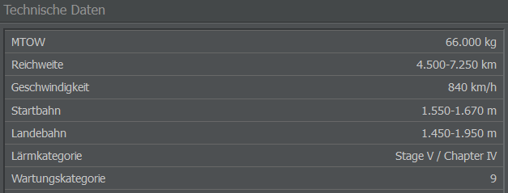

# Wartungskategorien

Jeder Flugzeugtyp in AirlineSim hat eine eigene Wartungskategorie, die angibt, mit welchen anderen Modellen er zusammen gewartet werden kann, z.B. ein Airbus A318 mit einem A319, A320 oder A321. Flugzeuge der gleichen Kategorie haben aufgrund technischer Ähnlichkeiten oft auch ähnliche Anforderungen in Bezug auf die Wartung. Welcher Kategorie ein Flugzeug angehört, könnt ihr überprüfen, indem ihr einen Blick auf dessen Datenblatt werft (Abschnitt “Technische Daten”).

Während sich ein A320 und ein A318 kaum unterscheiden, ist eine Boeing 737 ein völlig anderes Flugzeug mit anderen Anforderungen. Die Wartungskategorien spiegeln also den Verlust an Wartungsproduktivität wider, der entsteht, wenn man eine Flotte mit technisch unterschiedlichen Flugzeugtypen aufbaut. Deshalb ist es wichtig, die Anzahl der vorhandenen Wartungskategorien im Auge zu behalten.

Die ersten drei Wartungskategorien sind "kostenlos", d. h. ihr zahlt eine Pauschalgebühr von 100% der Basis-Wartungskosten. Die vierte Kategorie erhöht die Wartungskosten um 15%, die fünfte um weitere 15% auf 130%, und so weiter. Dieser Wert bezieht sich auf all eure Flugzeuge.

Gekaufte und verleaste Flugzeuge werden bei der Berechnung der Wartungskategorien nicht berücksichtigt.
