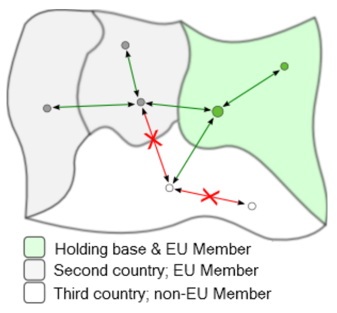
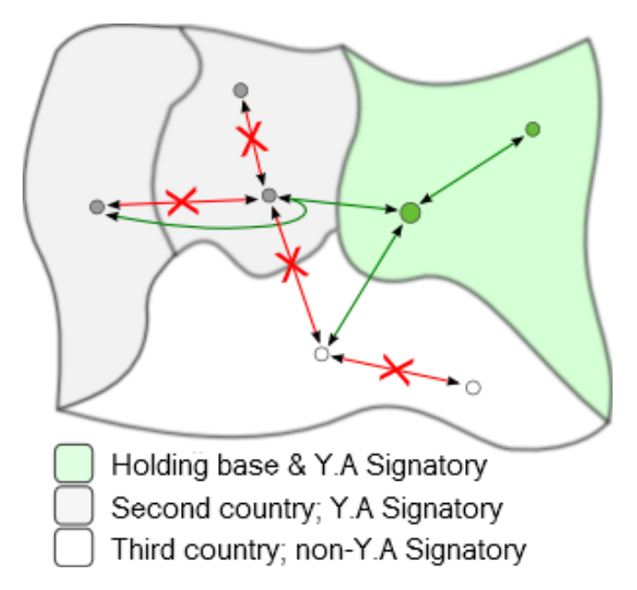

# Verkehrsrechte

Wie ihr sicher schnell feststellt, treten eure Fluggesellschaften in AirlineSim primär als nationale, nicht globale Einheiten auf. Luftverkehrsabkommen zwischen einzelnen Ländern regeln die Beförderung von Passagieren in der realen Welt und auch AirlineSim bildet dies, wenn auch in leicht vereinfachter Form, ab.

## Was sind Verkehrsrechte?

Unter Verkehrsrechten verstehen wir die Regeln, die bestimmen, ob ihr Passagiere zwischen zwei Zielen befördern könnt. Eure Rechte, einen bestimmten Markt zu bedienen, werden durch das Land bestimmt, in dem sich eure Holding befindet. Bei Tochtergesellschaften richten sich die Rechte in der Regel ebenfalls nach dem Sitz der Holding (oder nach der Gesamtzahl der gehaltenen Aktien, wenn eure Fluggesellschaft ein börsennotiertes Unternehmen ist).


**Beispiel** 
Wenn eure Holding ihren Sitz in Manila hat, darf auch die Tochtergesellschaft Inlandsflüge zwischen zwei beliebigen Flughäfen auf den Philippinen durchführen, jedoch beispielsweise keine Inlandsflüge in China anbieten.


## Moment - ich kann Flüge in China doch problemlos hinzufügen!

Selbst wenn euer Betrieb auf den Philippinen angesiedelt ist, hindert das Spiel unsere hypothetische Fluggesellschaft nicht daran, Inlandsflüge in China zu planen; ihr könntet ja beispielsweise vorhaben, dass das Flugzeug auf dem Rückflug von einem anderen Flughafen abfliegt. Allerdings werden solche Flüge keine Passagierbuchungen erhalten.

## Wohin kann ich denn fliegen?

Gute Frage - die Antwort hängt davon ab, wo sich euer Betrieb befindet. Die folgenden Regeln sind allgemeingültig und gelten für Betriebe mit Sitz in allen Ländern:

* Im Inland (d. h. zwischen zwei Punkten im selben Land) kann jede Airline Fluggäste befördern, solange die Holding in diesem Land ihren Sitz hat.

* Auf internationalen Strecken kann jede Airline Fluggäste zwischen einem beliebigen Punkt im Land des Betriebssitzes und einem beliebigen Punkt in einem anderen Land befördern.

* Zudem kann jede Airline Fluggäste  im internationalen Verkehr zwischen einem beliebigen Ort in einem Land und einem beliebigen Ort in einem anderen Land befördern, wenn die Reise einen Zwischenstopp (mindestens einen Start und eine Landung) in dem Land beinhaltet, in dem der Betrieb seinen Sitz hat.

Zusätzlich zu diesen allgemeinen Regeln gibt es einige Sonderfälle:

* **Europäische Union**: Jede Airline mit Sitz in der Europäischen Union kann Fluggäste zwischen zwei beliebigen Punkten innerhalb der EU auf jeder beliebigen Strecke befördern. Mit anderen Worten: Der Binnenmarkt der EU fungiert als ein großes, virtuelles Land. Wichtig: Diese Regel gilt nicht für Flüge, die außerhalb der EU beginnen oder enden - solche Flüge müssen in dem Land beginnen oder enden, in dem die Holding ihren Sitz hat.

* **Australien und Neuseeland**: In ähnlicher Weise kann jede Airline mit Sitz in Australien oder Neuseeland Fluggäste zwischen zwei beliebigen Punkten innerhalb Australiens und Neuseelands befördern. Auch hier gilt die Regel nicht für Flüge, die außerhalb Australiens und Neuseelands beginnen oder enden.

* **Yamoussoukro-Entscheidung**: Jede Airline, deren Betriebssitz in einem Land liegt, das Vertragspartei der Yamoussoukro-Entscheidung ist, kann Fluggäste zwischen einem zweiten und einem dritten Land befördern, wenn der betreffende Flug die Fortsetzung eines Fluges aus dem Herkunftsland des Betriebs ist (Verwendung der Via-Funktion des Spiels).

## EU-Abkommen & Oceanic Open Skies

## Yamoussoukro-Entscheidung & Caricom 5th Freedom

## Was ist mit Frachtflügen?

Der globale Luftfrachtmarkt ist vollkommen frei, da der Umgang mit Fracht im Spiel oft etwas herausfordernder ist. Airlines können Fracht also zwischen zwei beliebigen Punkten auf der ganzen Welt befördern, unabhängig davon, wo ihr Betriebssitz liegt (sofern es keine politischen Beschränkungen gibt).

## Was ist, wenn ich über meinen Inlandsmarkt hinauswachse?

Es gibt mehrere Länder auf der Welt, die ausländische Investitionen zulassen. Für diese Länder gelten die oben genannten Regeln wie für alle anderen, aber im Gegensatz zu Ländern, die keine ausländischen Investitionen zulassen, können ausländische Unternehmen dort Unternehmen gründen, Airlines betreiben und alle Rechte genießen, die auch inländischen Unternehmen gewährt werden.


**Info**  
Ob ein Land ausländische Investitionen zulässt oder nicht, hängt von der Spielwelt ab. Im Länder-Menü des Datenbank-Tabs findet ihr eine Übersicht aller vorhandenen Länder. Mit Klick auf ein Land könnt ihr dessen Informationsseite aufrufen und im Abschnitt "Politische Informationen" auf der rechten Seite nachsehen, ob das Land investitionsoffen ist oder nicht.


Hier findet ihr eine Übersicht über die verschiedenen Listen investitionsoffener Länder, die im Spiel verwendet werden. Neue Spielwelten verwenden derzeit die Liste C.

| Land | Liste A | Liste B | Liste C |
| :-- | :-- | :-- | :-- |
| Angola | enhalten | enhalten | enhalten |
| Argentinien | enhalten | enhalten | nicht enhalten |
| Aserbaidschan | enhalten | enhalten | enhalten |
| Bahamas | enhalten | enhalten | enhalten |
| Barbados | enhalten | enhalten | enhalten |
| Benin | enhalten | enhalten | enhalten |
| Costa Rica | enhalten | enhalten | nicht enhalten |
| Djibouti | enhalten | enhalten | enhalten |
| Dominica | enhalten | enhalten | enhalten |
| Dominikanische Republik | enhalten | enhalten | nicht enhalten |
| Ecuador | enhalten | enhalten | nicht enhalten |
| Elfenbeinkueste | enhalten | enhalten | enhalten |
| Eswatini | enhalten | enhalten | enhalten |
| Gambia | enhalten | enhalten | enhalten |
| Georgien | enhalten | enhalten | enhalten |
| Grenada | enhalten | enhalten | enhalten |
| Guatemala | enhalten | enhalten | enhalten |
| Guinea-Bissau | enhalten | enhalten | enhalten |
| Honduras | enhalten | enhalten | enhalten |
| Irak | enhalten | enhalten | enhalten |
| Kambodscha | enhalten | enhalten | enhalten |
| Kamerun | enhalten | enhalten | enhalten |
| Kasachstan | enhalten | enhalten | nicht enhalten |
| Kenia | enhalten | enhalten | nicht enhalten |
| Kirgistan | enhalten | enhalten | enhalten |
| Kolumbien | enhalten | enhalten | nicht enhalten |
| Kuwait | enhalten | enhalten | enhalten |
| Laos | enhalten | enhalten | enhalten |
| Libanon* | enhalten | enhalten | enhalten |
| Moldawien | enhalten | enhalten | enhalten |
| Mongolei | enhalten | enhalten | enhalten |
| Neuseeland | enhalten | nicht enhalten | nicht enhalten |
| Niger | enhalten | enhalten | enhalten |
| Pakistan | enhalten | enhalten | nicht enhalten |
| Panama | enhalten | enhalten | nicht enhalten |
| Papua-Neuguinea | enhalten | enhalten | enhalten |
| Paraguay | enhalten | enhalten | enhalten |
| Qatar | enhalten | enhalten | nicht enhalten |
| Salomonen | enhalten | enhalten | enhalten |
| Sambia | enhalten | enhalten | enhalten |
| Samoa | enhalten | enhalten | enhalten |
| Sao Tome und Principe | enhalten | enhalten | enhalten |
| Senegal | enhalten | enhalten | enhalten |
| Sierra Leone | enhalten | enhalten | enhalten |
| Somalia | enhalten | enhalten | enhalten |
| St. Kitts und Nevis | enhalten | enhalten | enhalten |
| St. Lucia | enhalten | enhalten | nicht enhalten |
| St. Vincent | enhalten | enhalten | enhalten |
| Sudan | enhalten | enhalten | enhalten |
| Tansania | enhalten | enhalten | nicht enhalten |
| Togo | enhalten | enhalten | enhalten |
| Tonga | enhalten | enhalten | enhalten |
| Trinidad und Tobago | enhalten | enhalten | enhalten |
| Tschad | enhalten | enhalten | enhalten |
| Tuvalu | enhalten | enhalten | enhalten |
| Uganda | enhalten | enhalten | enhalten |
| Ukraine | enhalten | enhalten | nicht enhalten |
| Usbekistan | enhalten | enhalten | enhalten |

*gilt nicht für Holdings mit Sitz in Israel

## Verbotene Routen

Es gibt bestimmte Länderpaare, zwischen denen aus politischen Gründen keine Reisen zugelassen sind. Auch Flüge innerhalb der gleichen Stadt sind im Spiel verboten. Eine Liste aller Beschränkungen findet ihr im Menü “Verbotene Routen” (Datenbank-Tab).

Wie bei Inlandsflügen in fremden Ländern können Flüge auf verbotenen Routen zwar eingeplant werden, die Flugzeuge werden aber auch hier leer bleiben.


**Info**  
Auf unserer Spielwelt Devau gibt es keine Beschränkungen zwischen Flughäfen, da die Spielwelt eine spezielle Konfiguration ohne Verkehrsbünde verwendet.

