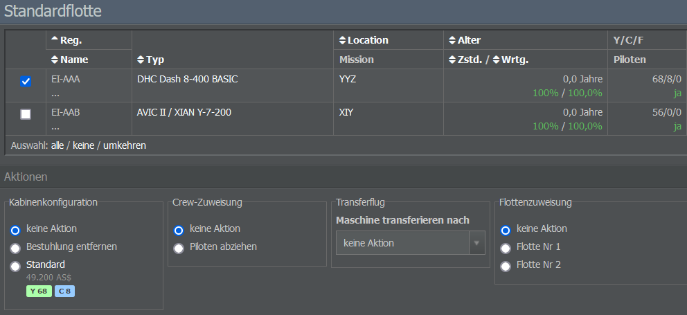

# Kabinen- und Crew-Zuweisung

Nachdem ihr die Kabinen eingerichtet habt und eure Crew eingestellt wurde, könnt ihr diese nun eurem Flugzeug zuweisen.

Geht hierfür zum Operations-Tab, klickt auf “Flottenverwaltung” und wählt die Flotte aus, die das gewünschte Flugzeug enthält. Im Moment ist das wahrscheinlich die Standardflotte, zu der alle gekauften und geleasten Flugzeuge hinzugefügt werden.

Wählt nun das betreffende Flugzeug aus, indem ihr die kleine Box links davon anklickt. Dadurch erhaltet ihr Zugriff auf das Menü “Aktionen”, in dem ihr Kabine und Besatzung festlegen könnt. Eine Kabinenkonfiguration kann mehreren Flugzeugen der gleichen Modellvariante gleichzeitig zugewiesen werden. Auch hier gilt wieder eine Ausnahme für Frachtmaschinen.

Ist im Abschnitt “Crew-Zuweisung” die Option “keine Aktion” ausgewählt, bedeutet das, dass die Cockpitbesatzung bereits zugewiesen wurde. Denkt daran, dass ihr Piloten manuell einstellen könnt, Kabinenbesatzungen aber bei Bedarf automatisch rekrutiert werden.

Genau wie bei den Kabinen könnt ihr die Einstellungen für eure Besatzung mehreren Flugzeugen gleichzeitig zuweisen. Bitte beachtet, dass es ohne eine verknüpfte Kabinenkonfiguration nicht möglich ist, eine Kabinenbesatzung zuzuweisen.
