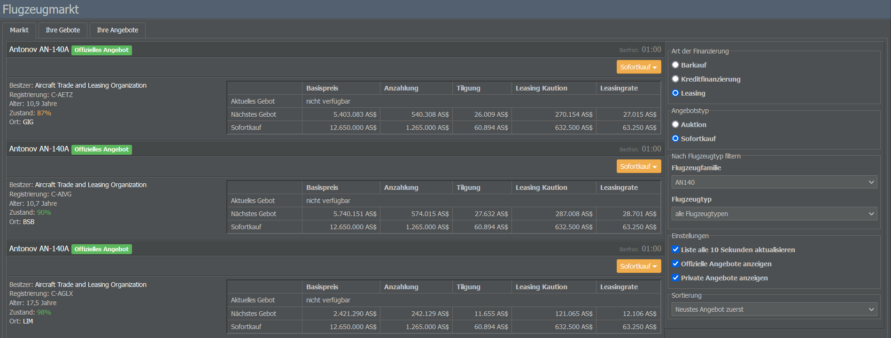

# Aufbau der Flotte

Um eure Airline startklar zu machen, schauen wir uns nun an, wie ihr eure ersten Flugzeuge leasen oder kaufen könnt. Aufgrund der großen Auswahl an verfügbaren Maschinen solltet ihr euch zunächst überlegen, welcher Flugzeugtyp am besten zu eurem Betrieb passt!

## Auswahl der Flugzeugtypen
    

 
Zunächst kann es hilfreich sein, über die geplanten Zielflughäfen eurer Airline nachzudenken. Mit ein paar möglichen Routen im Hinterkopf solltet ihr euch bereits ein besseres Bild von eurer zukünftigen Flotte machen können.

### Inlandsrouten

Inlandsstrecken und Flüge zu kleineren Regionalflughäfen versorgen euren Hub mit Transfer-Passagieren und sind in der Regel nicht länger als 1.000 km. Bedient ihr diese Routen mit kleineren Turboprops wie der Dash 8, werdet ihr feststellen, dass sie langsamer sind als Jets, was bei kurzen Strecken aber vernachlässigt werden kann. Außerdem brauchen größere Flugzeuge mehr Zeit zum Be- und Entladen - und wenn Zeit keine Rolle spielt, dann eben Geld.

Bitte bedenkt, dass kleinere Flugzeuge zwar billig sein können, auf Strecken mit hoher Verkehrsdichte wegen ihrer Größe aber im Nachteil sind. Manchmal können begrenzte Slots wichtiger sein als Einsparungen beim Treibstoff!

### Routen mittlerer Länge

Die meisten Flugzeuge eignen sich gut für Strecken zwischen 1.000 und 2.000 km. Denkbar wären hier zum Beispiel eine Boeing 737 oder ein Modell der Airbus 318-321-Familie. Beide bieten mehrere Typen mit unterschiedlichen Nutzlasten und Reichweiten an. Möchtet ihr vor allem Treibstoff sparen, kommt beispielsweise eine 737-700 BGW infrage, die auf Mittelstrecken einen sehr niedrigen Verbrauch hat.

Sobald ihr die Crew einstellt, werdet ihr feststellen, dass ein Pilot sowohl einen A318 als auch einen A320 fliegen kann. Dasselbe gilt für den Ingenieur, der die Wartung des Flugzeugs übernimmt.

### Langstreckenflüge

Als neue Airline ist es nicht ratsam, mit dem Betrieb von Langstreckenflügen zu beginnen, denn in der Regel stehen euch zu Beginn nur 10 Millionen AS$ zur Verfügung. Mit nur zwei (großen und teuren) Flugzeugen und einem Streckennetz, das aus vier Zielen besteht, kann es schwer sein, eine rentable Fluggesellschaft zu betreiben.

Stattdessen könntet ihr zunächst Kurz- und Mittelstreckenflüge anbieten. Das Startkapital sollte für 1 oder 2 mittelgroße Jets, 3 oder 4 Turboprop-Flugzeuge sowie eine kleine Finanzreserve reichen. Jedes Flugzeug kann dann 3 oder 4 Hin- und Rückflüge pro Tag durchführen, sodass ihr von Anfang an ein kleines Streckennetz aufbauen könnt.

### Neue vs. gebrauchte Flugzeuge

Mit den geplanten Routen im Hinterkopf könnt ihr überlegen, ob ihr eure Flotte mit neuen oder gebrauchten Flugzeugen ausstatten wollt. Im Allgemeinen empfiehlt es sich, als neue Airline mit gebrauchten Flugzeugen zu beginnen. Diese haben den Vorteil, dass sie direkt verfügbar und zudem meist recht günstig sind.

Jedoch haben auch neue Maschinen ihre Vorzüge. Anbei eine Auflistung der wichtigsten Unterscheidungsmerkmale:

* **Kraftstoffverbrauch / Wartung**: Neue Flugzeuge verbrauchen in der Regel weniger Treibstoff und lassen sich günstiger warten als ältere Modelle.

* **Präferenz der Passagiere**: Ältere Flugzeuge (besonders Modelle, die es schon länger als 20 Jahre gibt) sind meist nicht sehr beliebt bei Passagieren. Mit neuen Flugzeugen lassen sich oft mehr Tickets verkaufen, außerdem könnt ihr höhere Preise verlangen. (Das Alter ist jedoch nicht der einzige Faktor: Im Allgemeinen bevorzugen Fluggäste Jets gegenüber Propellermaschinen und große Flugzeuge gegenüber kleineren Flugzeugen.)

* **Flugzeugproduktion**: Achtet beim Kauf darauf, ob ein Flugzeug noch in Produktion ist. Der Erwerb von Flugzeugen, die nur in kleinen Stückzahlen produziert wurden, kann sich später negativ auf die Kommunalität eurer Flotte auswirken.

* **Lieferzeiten**: Wenn ihr nicht gerade das Startkapital von 10 Millionen AS$ ausnutzt, werden neue Flugzeuge vom Hersteller möglicherweise nicht sofort geliefert, da die Produktion je nach Flugzeugtyp zwischen 6 und 42 Stunden dauert. Gebrauchte Flugzeuge können hingegen sofort verfügbar sein. (Wenn ihr mehrere neue Flugzeuge aus einer Produktionslinie bestellt, werden die Bestellungen eurem Orderbuch hinzugefügt. Dieses wird von anderen Unternehmen nicht beeinflusst, außer von denen, die zu eurer Holding gehören. Das Lieferdatum wird in der Flottenübersicht und im Orderbuch angezeigt. Dieses seht ihr, wenn ihr auf der Seite des Flugzeugs zum Abschnitt Betreiber' navigiert.

* **Preis**: Gebrauchte Flugzeuge sind billiger zu kaufen und zu leasen - je nach Alter des Flugzeugs manchmal sogar deutlich.

## Maschinenevaluierung

### Nachschlagen von Flugzeugen

Nachdem ihr euch ein besseres Bild von den möglichen Flugzeugtypen gemacht habt, könnt ihr über das Menü Flugzeughersteller (Management-Tab) weitere Details zu den einzelnen Modellen nachschauen. Hier seht ihr alle verfügbaren Flugzeugtypen, gruppiert nach Hersteller.

Wählt ihr einen Typ aus, öffnet sich eine Seite mit den zugehörigen Varianten des Flugzeugs. Hier findet ihr bereits einige allgemeine Daten, etwa zur Geschwindigkeit, Reichweite und maximalen Passagierzahl des Modells. Wollt ihr noch mehr erfahren, klickt einfach auf eine der Varianten - hier erhaltet ihr eine umfassende Übersicht mit allen relevanten Daten. 

Schauen wir uns einige der dort aufgelisteten Daten mal im Detail an:

* **Passagiere (max.)**: Die maximale Passagierkapazität des Flugzeugs. Diese kann nur über eine Kabine mit einer einzigen Klasse und einfachen Sitzen erreicht werden. Möchtet ihr weitere Klassen oder eine luxuriöse Bestuhlung anbieten, nimmt das Flugzeug weniger Passagiere auf. Überlegt euch gut, wie groß euer Flugzeug sein muss: Für einen Flug zwischen zwei kleinen Städten braucht ihr wahrscheinlich keinen A380. Wenn ihr euch nicht sicher seid, könnt ihr jederzeit schauen, welche Flugzeugtypen von konkurrierenden Airlines eingesetzt werden.

* **Reichweite**: Der niedrigere Wert gibt die Reichweite an, die bei voller Nutzlast erreicht werden kann. Der höhere Wert zeigt die maximale Reichweite an, die nur mit minimaler Beladung erreichbar ist. Mithilfe des Performance-Check-Tools könnt ihr die Nutzlast-Reichweite-Kurve für eine bestimmte Strecke einsehen, darauf kommen wir aber gleich noch zu sprechen.

* **Startbahn / Landebahn**: Die Länge der Landebahn, die das Flugzeug benötigt. Der kleinere Wert zeigt die minimal benötigte Länge für Start bzw. Landung; der höhere Wert ist bei einem Start oder einer Landung mit voller Ladung erforderlich.

* **Lärmkategorie**: Dieser Wert gibt den Pegel der Lärmemission eines Flugzeugs an und reicht von I (sehr laut) bis V (sehr leise). Lautere Flugzeuge müssen höhere Bodengebühren zahlen und dürfen auf bestimmten Flughäfen nicht eingesetzt werden.

* **Wartungskategorie**: Für Flugzeuge derselben Kategorie gelten ähnliche Anforderungen an die Wartung. Umfasst eine Flotte unterschiedliche Kategorien, kann die Wartung teuer werden: Sobald eure Flotte Flugzeuge aus mehr als 3 Kategorien enthält, kostet die Wartung für jede zusätzliche Kategorie 15% mehr.

### Performance-Check-Tool

Wenn ihr testen wollt, wie sich ein Flugzeug auf einer bestimmten Strecke verhält, hilft euch das Performance-Check-Tool weiter. Dieses findet ihr im Abschnitt Technische Daten auf dem Datenblatt des ausgewählten Flugzeugs.

Das Tool zeigt euch alle relevanten Informationen in Bezug auf eine bestimmten Strecke, zum Beispiel

* technische Beschränkungen (benötigte Landebahnlängen, Flugstrecke, Routenbeschränkungen),

* Angaben zum Treibstoffverbrauch und zur maximalen Nutzlast,

* Flug- und Turnaround-Zeiten sowie

* Flugsicherungs- und Landegebühren.

So könnt ihr überprüfen, ob die geplanten Ziele für euer Flugzeug erreichbar sind und z.B. ausreichende Pistenlängen zur Verfügung stehen. Denkt jedoch daran, dass Flugzeuge auf längeren Strecken mehr Treibstoff benötigen und daher nicht so viele Passagiere mitnehmen können.

Apropos Treibstoff: Der Treibstoffverbrauch verhält sich nicht linear - es kostet viel Kraft, ein großes, schweres Flugzeug in die Lüfte zu heben, aber nicht so viel, es dort zu halten. Deshalb sind Flugzeuge, die für lange Flüge geeignet sind, möglicherweise nicht mehr so effizient, wenn die Reichweite gering ist.

### Flugzeugtypen im Vergleich

Wenn ihr verschiedene Flugzeugtypen auf einmal vergleichen möchtet, klickt einfach auf den Link unterhalb des Performance-Check-Tools. Dort könnt ihr die Details von bis zu 4 Flugzeugtypen gleichzeitig einsehen.

Wenn ihr eine unbegrenzte Anzahl von Flugzeugtypen auf einer ausgewählten Route vergleichen wollt, hilft euch die Maschinenevaluierung im Operations-Tab weiter. Hier könnt ihr den Treibstoffverbrauch, die Anzahl der verfügbaren Sitze sowie die Kosten der Strecke überprüfen.

Achtet jedoch auf die angezeigte Anzahl der Flüge: Wenn das Tool z.B. anzeigt, dass ein Flugzeug nur 28 Flüge pro Woche (2 Hin- und Rückflüge pro Tag) durchführen kann, kann es aber trotzdem sein, dass ihr noch einen dritten (und kürzeren) Flug einschieben könnt, etwa durch die Wahl eines zeiteffizienten Wartungsdienstleisters.

# Erwerb von Flugzeugen

Nachdem ihr euch für einen Flugzeugtyp entschieden habt, ist es an der Zeit, eure erste Maschine zu erwerben!

Auf der Infoseite des gewählten Modells habt ihr die Möglichkeit, neue Flugzeuge zu bestellen (sofern der Flugzeugtyp noch in Produktion ist) oder Angebote für gebrauchte Flugzeuge zu prüfen.

## Bestellung neuer Maschinen

Wenn ihr ein neues Flugzeug bestellen möchtet, gebt im Feld Neubestellung einfach die gewünschte Bestellmenge ein und klickt auf Angebot anzeigen. Auf der folgenden Seite habt ihr dann die Wahl zwischen verschiedenen Zahlungsoptionen:

* Bei der Eigenfinanzierung von Flugzeugen kommt ihr direkt für den vollen Preis der Maschine(n) auf.

* Wählt ihr die Leasing-Option, fällt neben einer Depotzahlung auch eine wöchentliche Leasinggebühr an. Um diese Option wahrzunehmen, muss euer Unternehmen über eine ausreichende Kreditwürdigkeit verfügen. Könnt ihr die wöchentliche Gebühr nicht zahlen, wird das Flugzeug automatisch zurückgegeben.

* Die Kreditfinanzierung ermöglicht es euch, ein Flugzeug vollständig oder teilweise über einen Kredit zu bezahlen. Das Darlehen und die Zinsen müssen zu den üblichen Bedingungen des Spiels zurückgezahlt werden. Auch diese Zahlungsmethode hängt von eurer Kreditwürdigkeit ab. Alle verfügbaren Finanzierungspläne werden automatisch angeboten.

Da ihr gerade euren ersten Betrieb gegründet habt, seid ihr mit einem Startkapital von 10 Millionen AS$ ausgestattet, das es euch ermöglicht, geleaste Flugzeuge sofort liefern zu lassen. Sobald dieses Budget überschritten wird, müsst ihr warten, da die Flugzeuge nacheinander ausgeliefert werden. Die Produktionszeiten können variieren und sind auf dem Datenblatt des Flugzeugs angegeben.

## Bestellung gebrauchter Flugzeuge

Möchtet ihr gebrauchte Maschinen bestellen, wählt auf der Infoseite des Flugzeugs einfach die Option Angebote für Gebrauchtmaschinen. Dies führt euch zum Flugzeugmarkt, auf dem euch alle verfügbaren Gebrauchtflugzeuge angezeigt werden.

Flugzeuge vom Gebrauchtmarkt könnt ihr entweder über einen Sofortkauf erwerben oder über eine Auktion. Als Zahlungsmethode stehen euch auch hier Bargeld, Kredite und Leasing zur Verfügung. Auch wenn es etwas mehr Zeit in Anspruch nehmen kann, ist es oft ratsam, ein Gebot für eine Auktion abzugeben, da ihr Flugzeuge auf diesem Weg meist viel günstiger erwerben könnt.

Wichtig
Gebt ihr im Rahmen einer Auktion ein Gebot ab, bleibt euer Geld gebunden, bis die Auktion beendet ist. Denkt daran, dass der Auktions-Timer jedes Mal zurückgesetzt wird, wenn ein weiteres Gebot abgegeben wird.

Auf dem Markt wird jedes Flugzeug zusammen mit zusätzlichen Informationen aufgeführt:

* **Besitzer**: Hier seht ihr, wem das Flugzeug gehört und von wem ihr es leasen oder kaufen werdet. Oft handelt es sich dabei um die Aircraft Trade and Leasing Organization, ein vom Spiel betriebenes Unternehmen.
* **Registrierung**: Der Registrierungscode des Flugzeugs.
* **Alter**: Das Alter des Flugzeugs. Dieses kommt besonders bei der Wartung zum Tragen, da ältere Flugzeuge einen höheren Wartungsaufwand haben. Dafür sind sie im Erwerb meist günstiger.
* **Zustand**: Der optimale Zustand eines Flugzeugs liegt bei etwa 100 %, jedoch spielt der Wert in der Regel keine Rolle, da er nach dem Kauf der Maschine erhöht werden kann.
* **Ort**: Hier wird der aktuelle Standort des Flugzeugs angegeben. Denkt daran, dass das Flugzeug zunächst zu eurem Betriebsstandort überführt werden muss.

## Kaufen oder leasen?

Die meisten neuen Unternehmen beginnen ihre Tätigkeit mit geleasten Flugzeugen. Mit Ausnahme von sehr kleinen oder alten Maschinen ist ein direkter Kauf für Start-Ups oft nicht finanzierbar. Außerdem bietet euch Leasing die Flexibilität, Flugzeuge zurückzugeben, die sich für eure Routen als ungeeignet erweisen. Beim Kauf eines Flugzeugs spart ihr hingegen die wöchentliche Leasinggebühr. Die Bank wird euch ohne Probleme einen Kredit gewähren, wenn ihr über Vermögenswerte (in diesem Fall Flugzeuge) verfügt, die das Risiko abdecken.

## Beendigung eines Leasingvertrags

Sowohl für euch als auch den Leasinggeber besteht die Möglichkeit, den Leasingvertrag jederzeit zu kündigen. Wenn ihr einen Leasingvertrag kündigen möchtet, geht einfach zur Flottenverwaltung im Operations-Tab, navigiert zum betreffenden Flugzeug und klickt auf das kleine Buch-Symbol mit der Aufschrift Vertragsdetails.

Bitte beachtet: Das Flugzeug wird an den Leasinggeber zurückgegeben, sobald die nächste wöchentliche Rate fällig ist. Ihr erhaltet die Kaution zurück und müsst die letzte Leasingrate zahlen.

Alle Flüge, die nach der Kündigungsfrist geplant sind, werden storniert. Außerdem werden Stornogebühren für alle gebuchten Passagiere / Frachteinheiten berechnet. Piloten und Flugbegleiter bleiben als überflüssiges Personal erhalten, bis ihr sie umschult oder entlasst.
