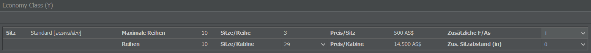
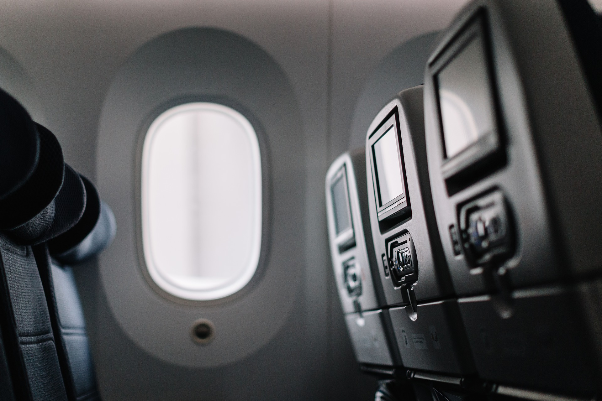

# Kabinenkonfiguration

Bevor ihr euch in die Lüfte schwingt, müssen wir euer Flugzeug noch mit einer Kabine ausstatten und die Sitzanordnung konfigurieren - unabhängig davon, ob ihr neue oder gebrauchte Maschinen besitzt.


**Info**  
Dieser Schritt entfällt, wenn ihr ein Frachtflugzeug betreiben wollt, denn in all euren neuen Flugzeugen ist bereits eine Standardkonfiguration installiert (wenn auch nicht die beste).


## Verwendung des Kabineneditors

Im Untermenü “Kabinenkonfigurationen” des Commercial-Tabs findet ihr eine Übersicht eurer bisher erstellten Konfigurationen sowie die Möglichkeit, eine neue zu erstellen. Gebt hierfür einfach im Menü auf der rechten Seite einen Namen ein, wählt den Flugzeugtyp, für den die Kabine gestaltet werden soll, und klickt auf “Neue Konfiguration anlegen”.

Die Seite des Kabineneditors bietet eine Reihe an Informationen, etwa zum Flugzeugtyp, zur Passagierkapazität oder zum Konfigurationsstatus. Wichtig: Vergesst nie, eure Kabine über die Schaltfläche oben rechts zu speichern, sonst müsst ihr wieder von vorne beginnen!

Die Erstellung der Kabine findet im Tab “Hauptdeck” statt. Auf der linken Seite des Editors seht ihr das leere Deck eures Flugzeugs. Um mit der Konfiguration zu beginnen, müsst ihr über das Drop-Down-Menü zunächst eine Klasse hinzufügen (Economy, Business oder First). Ihr könnt die Klassen je nach Belieben wählen, aber bedenkt, dass für große Flugzeuge normalerweise ein Drei-Klassen-Setup verwendet wird. Wenn ein Flugzeug zwei Decks hat, könnt ihr beide Decks separat konfigurieren (Hauptdeck und Oberdeck).

Sobald die Klassen eingerichtet sind, könnt ihr jede Klasse mit Sitzen ausstatten und zusätzliche Flugbegleiterinnen und Flugbegleiter einsetzen:

* **Auswahl der Sitze**: Neben “Sitz” habt ihr die Möglichkeit, für die jeweilige Klasse eine andere Art von Sitzen auszuwählen. Bessere Sitze führen zu einer höheren Bewertung, sind aber meist teurer und benötigen mehr Platz, wodurch die maximal mögliche Anzahl an Passagieren sinkt. Es ist immer ein Kompromiss zwischen Qualität und Effizienz: Wenn ihr die einzige Airline auf einer Strecke seid, könnt ihr probieren, so viele Sitze wie möglich anzubieten; wenn es auf einer Strecke viel Konkurrenz gibt, ist es besser, bequemere Sitze anzubieten.

* **Anzahl der Sitze**: Die Anzahl an Sitzplätzen könnt ihr über “Sitze/Kabine” konfigurieren. Bleibt der Wert bei 0, wird die Klasse in der Kabinenkonfiguration nicht verwendet. Die grüne Schaltfläche “top up” könnt ihr verwenden, um den verbleibenden Platz des Decks mit Sitzen für die Klasse aufzufüllen, die ihr gerade bearbeitet.

* **Zusätzlicher Sitzabstand**: Wenn ihr euren Passagieren etwas mehr Beinfreiheit bieten möchtet, braucht ihr keine Sitzreihen zu entfernen - erhöht einfach den Wert “Zus. Sitzabstand (in)”!

* **Zusätzliche F / As**: Hier könnt ihr jede Klasse mit zusätzlichen Flugbegleiterinnen und Flugbegleitern ausstatten. Zwar sollte bereits ein Grundbestand an Personal vorliegen, jedoch könnt ihr über diesen Menüpunkt weitere Crewmitglieder zuweisen, um die Bewertungen zu erhöhen. Tipp: Flugzeuge mit weniger als 20 Sitzplätzen brauchen nicht unbedingt einen Flugbegleiter. Standardmäßig ist ein Flugbegleiter für 50 Passagiere pro Klasse zuständig. Mehr Flugbegleiter haben einen positiven Einfluss auf die Bewertung eurer Flüge.

Wenn ihr euch nicht sicher seid, wie sich die aktuelle Konfiguration auf die Bewertung eurer Passagiere auswirkt, speichert sie einfach ab und wechselt zum Tab “Bewertungen”. Und denkt daran: Jeder Flugzeugtyp benötigt eine eigene Kabinenkonfiguration!

## Tipps für die Konfiguration

Hier noch ein paar allgemeine Ratschläge zur Konfiguration eurer Kabinen:

* **Ein(e) Flugbegleiter(in) pro Klasse**: Jede Klasse braucht mindestens eine Flugbegleiterin oder eine Flugbegleiter. Selbst wenn ihr nur zwei Sitze in der ersten Klasse einbaut, müsst ihr der Klasse dennoch eine Flugbegleiterin oder einen Flugbegleiter zuweisen. Bedenkt dabei, dass euer Personal in 8-Stunden-Schichten arbeitet. Wenn ihr also 20 Stunden am Tag fliegt, entspricht eine Flugbegleiterin  / ein Flugbegleiter mehreren Mitarbeitenden bei der Gehaltsabrechnung.

* **Zusätzliche F / As**: Die Anzahl der zusätzlichen Flugbegleiterinnen und Flugbegleiter ist euch überlassen, aber die Passagiere wissen diese Aufmerksamkeit zu schätzen. Eine bessere Bewertung kann die zusätzlichen Gehälter wert sein.

* **Economy vs. Business**: Da die Business Class in der Regel über größere Sitze, besseren Service und weniger Passagiere pro Flugbegleiter(in) verfügt, können zwei Economy-Passagiere rentabler sein als ein Gast in der Business Class. Denkt also daran, die Kosten bei der Einrichtung der Kabine zu berücksichtigen.

* **First Class**: Wenn ihr auf einigen Strecken Schwierigkeiten habt, die erste Klasse zu füllen, könnt ihr versuchen, sie nur auf Langstreckenflügen ab 2.000 km anzubieten oder sie in einigen Flugzeugen sogar ganz wegzulassen.

* **Überprüfen der Konfiguration**: Denkt daran, eure fertige Konfiguration nochmal zu überprüfen, bevor ihr sie anwendet. Sobald wir die Kabine im nächsten Schritt eurem Flugzeug zuweisen, könnt ihr nicht einmal mehr Flugbegleiter(innen) hinzufügen, ohne das Flugzeug komplett umzurüsten.

* **Austauschen der Kabine**: Wenn ihr die Kabinenkonfiguration eines Flugzeugs ändert, wird die neue Konfiguration nach 3 Tagen verwendet.

## Was erwarten die Passagiere?

Die Erwartung der Passagiere hängt von eurer Route sowie eurer Marketingstrategie ab. 

Wenn ihr eine Billigfluggesellschaft betreiben wollt, stattet eure Flugzeuge mit schmaleren Sitzen aus und verkauft günstigere Tickets. Wenn ihr euch eher im Mittelfeld bewegt, könnt ihr etwas bessere Sitze verwenden. Die meisten Flugzeuge sind zu 80 % mit Economy- und zu 20 % mit Business Class-Sitzen ausgestattet, aber es steht euch natürlich frei, die Sitze nach Belieben zu verteilen.

Auf Kurzstrecken sollten die Passagiere mit einer einfachen Bestuhlung auskommen. Auf Mittelstreckenflügen könnt ihr einige Klassen mit besseren Sitzen ausstatten. Wenn Passagiere knapp sind und der Wettbewerb hart ist, könnt ihr versuchen, bessere Sitze für Economy-Passagiere zu verwenden.
