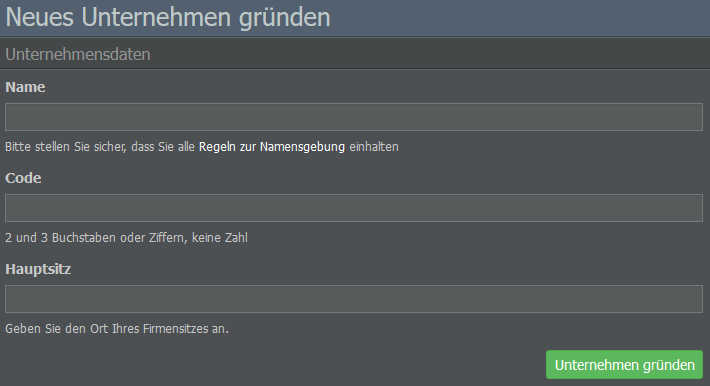

# Firmengründung

## Planung der Unternehmensstruktur

Nach der Erstellung eures AirlineSim-Kontos und der Auswahl einer Spielwelt kann es zunächst hilfreich sein, die Struktur eures Unternehmens zu planen - insbesondere wenn der Server [Börsengänge (IPOs)]() unterstützt.

Zwar kann die erste Holding bereits für den regulären Flugbetrieb verwendet werden, für einen Börsengang eignet sie sich jedoch nicht. Möchtet ihr mit eurer Firma an die Börse gehen, müsst ihr zuerst ein Tochterunternehmen gründen. 

[Hier]() erfahrt ihr mehr über die Unterschiede zwischen Holdings und Tochtergesellschaften.

## Namensfindung

Jetzt, da ihr eine bessere Vorstellung vom Aufbau eures Unternehmens habt, kann es auch schon mit der Firmengründung losgehen! Klickt dafür einfach auf den blauen Balken mit der Aufschrift “Noch keine Airline?”, der erscheint, sobald ihr die Spielwelt aufruft. Auf der folgenden Seite könnt ihr dann einen Namen für das neue Unternehmen wählen. Achtet dabei bitte auf die Regeln zur Namensgebung.

Neben dem Namen könnt ihr auch einen Code für eure Airline vergeben. Der Code muss zwei oder drei Buchstaben oder Ziffern enthalten, sollte aber keine Zahl sein. Falls eine bestimmte Kombination schon vergeben ist, erscheint eine Warnung. Bitte beachtet, dass der Code im Gegensatz zum Namen später nicht mehr geändert werden kann.

## Der Firmenhauptsitz

Als Nächstes sucht ihr den Hauptsitz des Unternehmens aus. Denkt daran, dass das Land eures Firmensitzes Einfluss auf die Verkehrsrechte hat, die für eure Holding und ihre Tochtergesellschaften gelten! Auch der Aufbau eurer Flotte kann vom Hauptsitz beeinflusst werden: Gründet ihr eine Airline an einem abgelegenen Ort, benötigt ihr große und teure Flugzeuge, um Verbindungen zu eurem Hub aufzubauen, es sei denn, ihr beschränkt euch auf regionale Strecken.

Am Anfang ist es empfehlenswert, ein Land mit wenig Konkurrenz zu wählen, damit sich die Flugzeuge leichter füllen lassen. Seid ihr euch nicht sicher, wie die Marktsituation in einem bestimmten Land aussieht, könnt ihr euch die Bewertungen und allgemeinen Aktivitäten der dort ansässigen Unternehmen anschauen.

Was die Stadt angeht, kann es sinnvoll sein, die Hauptstadt eines Landes zu wählen, da diese meist ein beliebtes Ziel für Passagiere ist. Tretet ihr einer Spielwelt bei, die bereits seit einiger Zeit läuft, kann es zudem nicht schaden, einen Blick auf die verfügbaren Flughafenslots eurer gewünschten Stadt zu werfen.

{}
**Info**  
Die Slot-Verteilung eines bestimmten Flughafens findet ihr, wenn ihr dessen Namen in die Suchleiste am oberen Bildschirmrand eingebt, die Seite des Flughafens aufruft und zum Slotanzeige-Tab wechselt.
{}

Tauchen in der Slotanzeige viele orangefarbene und rote Felder auf, solltet ihr überlegen, ob ihr euch einen anderen Hub sucht, da Slots für Landungen und Starts benötigt werden und eine wichtige Rolle bei der Erstellung eures Flugplans spielen.

Um euch die Entscheidung etwas zu erleichtern, findet ihr hier einige Beispiele für verschiedene Länder und ihre potenziellen Eigenschaften als Hub-Standorte.

### Spanien

Durch die Mitgliedschaft in der EU steht spanischen Firmen ganz Europa als Binnenmarkt zur Verfügung, sodass Passagiere zwischen zwei beliebigen Flughäfen innerhalb der EU befördert werden können (siehe [Verkehrsrechte]()). Das einzige Problem: Jede andere europäische Airline hat denselben Vorteil. Ein europäischer Firmensitz bietet somit zwar die Chance, mehrere Hubs zu eröffnen und eine hohe Anzahl an Passagieren zu erreichen, allerdings trefft ihr hier dementsprechend auch auf mehr Konkurrenz.

### USA

Ein weiterer Großmarkt, der sich für die Einrichtung mehrerer Hubs eignet. Da es sich bei den USA um ein Land handelt, könnt ihr von jedem US-Flughafen aus internationale Ziele bedienen. Wie in der EU ist auch hier meist mit mehr Wettbewerb zu rechnen.

### Mexiko

Mexiko bietet einen anständigen Binnenmarkt, da es viele Flughäfen gibt und nur mexikanische Airlines das Recht haben, Passagiere zwischen diesen zu befördern. Auf internationalen Strecken werdet ihr zwar mit ausländischen Airlines konkurrieren müssen, eure Inlandsstrecken dürften aber besser geschützt sein. Im Vergleich zu den USA solltet ihr somit zwar auf weniger Konkurrenz stoßen, allerdings ist der mexikanische Binnenmarkt auch viel kleiner.

### Pakistan

Pakistan ist ein Beispiel für ein Land, das für ausländische Investitionen offen sein kann. Vielleicht denkt ihr zunächst, ihr hättet ein Land mit gutem Binnenmarkt und wenig regionaler Konkurrenz gefunden - ist das Land jedoch investitionsoffen, kann jede Airline der Welt dort eine Tochtergesellschaft gründen. Was anfangs wie ein ruhiger Ort schien, kann sich somit schnell zu einem wettbewerbsintensiven Land entwickeln, sobald große Airlines beginnen, dort zu expandieren.

{}
**Info**  
Ob ein Land ausländische Investitionen akzeptiert oder nicht, hängt von der Spielwelt ab. Was genau für welches Land gilt, findet ihr heraus, indem ihr im Datenbank-Tab zum Abschnitt Länder navigiert, ein Land auswählt und schaut, was bei "Politischen Informationen" vermerkt ist.
{}

## Erstellen von Holdings und Tochtergesellschaften

Wenn ihr mit dem Namen und dem Hauptsitz eures Unternehmens zufrieden seid, könnt ihr auf Unternehmen gründen klicken. Herzlichen Glückwunsch, ihr habt soeben eure erste Firma erstellt!

Wenn ihr ein weiteres Unternehmen gründen möchtet, wechselt einfach zum Dropdown-Menü, das euch links unter dem Namen eurer Firma angezeigt wird und wählt "Neues Unternehmen gründen".

Auf der folgenden Seite könnt ihr dann angeben, ob eine weitere Holding oder eine Tochtergesellschaft eurer bestehenden Holding eingerichtet werden soll. 

{}
**Wichtig**  
Bitte beachtet: Nicht jede Spielwelt unterstützt das Erstellen mehrerer Holdings. Schaut euch im Zweifelsfall nochmal die Konfiguration der Welt an, z. B. hier oder auf unserem [Blog](https://www.airlinesim.aero/blog/de/). Sind mehrere Holdings erlaubt, denkt außerdem bitte daran, dass die Kooperation zwischen euren Holdings nicht zulässig ist.
{}

Wenn ihr eine Tochtergesellschaft gründet, müsst ihr entscheiden, wie viel Startkapital sie von der Holding erhalten soll - der Mindestbetrag liegt bei 3 Millionen AS$. Überlegt euch gut, wie viel ihr investieren möchtet, denn ihr werdet nach der Gründung keine Möglichkeit mehr haben, Geld von der Holding an das Tochterunternehmen zu transferieren (und umgekehrt), mit der Ausnahme von Dividenden, die nach einem Börsengang an eure Holding und externe Investorinnen und Investoren gezahlt werden.

Zusätzlich zur Höhe des Startkapitals solltet ihr bedenken, dass das Land eurer Holding die Verkehrsrechte der Tochtergesellschaften bestimmt: Befindet sich der Hub der Tochtergesellschaft im gleichen Land wie die Holding, genießt ihr volle Verkehrsrechte, andernfalls können diese eingeschränkt sein.

