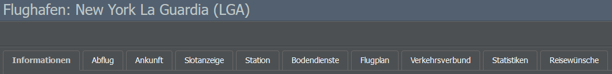
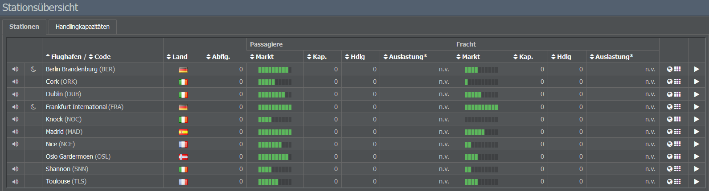

# Erstellung von Routen

Nun, da ihr euer erstes Flugzeug erworben habt, können wir mit der Planung der Flugrouten beginnen! Nach den vorigen Schritten habt ihr vielleicht schon eine grobe Idee, wo es hingehen soll, daher widmen wir uns jetzt den Details.

## Suche nach Flughafeninformationen

Wenn ihr euch für einen bestimmten Flughafen interessiert, könnt ihr nach ihm suchen, indem ihr dessen Namen oder IATA-Code in die Suchleiste am oberen Bildschirmrand eingebt. Auf der Informationsseite des Flughafens findet ihr viele Details, zunächst konzentrieren wir uns aber nur auf den Abschnitt “Informationen".

Hier seht ihr Angaben zur Länge der Start- und Landebahn, der Größe des Flughafens, seinen Slots (Anzahl der Flüge, die pro 5-Minuten-Fenster stattfinden können), der Mindesttransferzeit, Nachtflugverboten, Lärmschutzbeschränkungen und zur Nachfrage.

Da sich die Nachfrage auf eure Verbindungen auswirkt, schauen wir uns nun an, wie ihr diese bei der Routenplanung berücksichtigen könnt!

## Berücksichtigung der Nachfrage

Die Nachfrage an einem Flughafen wird durch zwei grüne Balken dargestellt: Ein Balken für die Passagiernachfrage und einer für die Frachtnachfrage. Natürlich fliegen zwischen zwei großen Städten mehr Passagiere als zwischen zwei kleineren, daher solltet ihr die Nachfrage bei der Erstellung eurer Routen berücksichtigen.

### Inlandsnachfrage

Es gibt immer Fluggäste, die in die Hauptstadt ihres Landes fliegen wollen. Deshalb ist es ratsam, eine Hauptstadt als Drehkreuz / Hub zu wählen und die Inlandsstrecken mit euren internationalen Flügen zu verbinden.

Ein gutes Inlandsnetz hat mehrere Vorteile: Es verschafft euch Umsteigepassagiere für die internationalen Strecken und macht euch zu einem attraktiven Interlining-Partner. Außerdem kann ein solches Netz in einigen Ländern recht profitabel sein, da der Inlandsmarkt besser geschützt ist.

### Reale Nachfrage

Oft spiegeln sich Nachfragewerte aus dem echten Leben im Spiel wider: Zwischen Spanien und Lateinamerika sowie dem Vereinigten Königreich und Indien / Australien bestehen immer noch alte Beziehungen, Österreich hatte viele Verbindungen zu ehemals kommunistischen Ländern und die kleinen Kanarischen Inseln ziehen Tausende von Touristen an.

Wenn ihr verschiedene Routen vergleicht, könnt ihr das zu eurem Vorteil nutzen! Hilfreich können dabei Websites wie [FlightStats](http://www.flightstats.com) sein, auf denen ihr Informationen über echte Flüge erhaltet.

## Bestehende Routen im Spiel

Abgesehen von der Nachfrage kann es auch nützlich sein, einen Blick auf die bestehenden Routen im Spiel zu werfen, vor allem, wenn ihr einer Spielwelt beitretet, die schon eine Weile läuft. Wenn mehrere Unternehmen Flüge zwischen zwei Flughäfen anbieten, besteht eine gute Chance, dass ihr dort noch einen zusätzlichen Flug unter bekommt.

## Aus dem Hub einen Hub machen

Wir haben uns bereits die Vorteile eines guten Inlandnetzes angeschaut, daher folgen nun noch ein paar allgemeine Ratschläge zur Erstellung von Flugverbindungen zu und von eurem Hub.

Zum Einen ist es empfehlenswert, Routen in verschiedene Richtungen einzurichten, da die Passagiere zu eurem Hub reisen und von dort aus Anschlussflüge nehmen werden. Informiert euch vorher aber über die Mindesttransferzeit des Flughafens, um sicherzustellen, dass die Passagiere die Anschlussflüge auch erreichen können, denkt aber auch daran, dass Reisende nicht länger als 8 Stunden auf einen Umsteigeflug warten werden.

Wenn eure Flüge in Wellen ankommen und abfliegen, könnt ihr unzählige Anschlussmöglichkeiten schaffen und somit unabhängig von der Größe eures gewählten Landes ein hervorragendes internationales Netz aufbauen!

## Vergrößerung der Reichweite

Bei der Gestaltung von Flugrouten kann es hilfreich sein, die Reichweite eurer Flugzeuge zu prüfen. Jedes Flugzeug kann bei voller Ladung eine bestimmte Strecke zurücklegen. Soll es weiter fliegen, muss es mehr Treibstoff mitnehmen, wodurch weniger Kapazität für Passagiere bleibt. Wenn ihr die Reichweite erhöhen wollt, rüstet das Flugzeug mit besseren Sitzen aus. Dadurch erhaltet ihr eine bessere Bewertung im Online Reservation System (ORS) und könnt trotzdem mit voller Ladung fliegen (d.h. mit weniger Passagieren zu einem höheren Ticketpreis).

## Nutzung der geografischen Lage

Zu guter Letzt solltet ihr darüber nachdenken, wie eure geografische Lage die Routenwahl beeinflusst. Sie kann ein einschränkender Faktor sein, euch aber auch Vorteile verschaffen: Seid ihr zum Beispiel im Mittleren Osten ansässig, können eure Routen Europa und Asien verbinden. Eine Fluggesellschaft in Mexiko kann mit mittelgroßen Jets wie der 737 die meisten Teile der USA und halb Südamerika erreichen. In Afrika gibt es nicht so viele große Flughäfen, aber mehrere afrikanische Länder haben das Yamoussoukro-Abkommen unterzeichnet, das Via-Flüge interessant macht (siehe see [Verkehrsrechte]()).

## Stationen eröffnen

Wenn ihr mit euren geplanten Routen zufrieden seid, könnt ihr sie im Spiel einrichten, indem ihr Stationen an den gewünschten Flughäfen eröffnet - wie das geht, erfahrt ihr hier!

Eure erste Station wurde bereits am Ort eures Firmensitzes eröffnet. Um eine neue Station zu eröffnen, navigiert einfach zur Seite des gewünschten Flughafens und klickt auf die grüne Schaltfläche “Station eröffnen”. Eine Übersicht über alle Flughäfen (und somit möglichen Stationen) eines Landes erhaltet ihr auf dessen Informationsseite, die ihr über die Suchleiste aufrufen könnt.

Eine weitere Möglichkeit zur Eröffnung von Stationen findet ihr im Untermenü “Stationen” (Operations-Tab). Gebt hierzu einfach den Namen oder IATA-Code des Flughafens auf der rechten Seite des Fensters ein und klickt auf den Knopf “Station eröffnen”. Bitte beachtet, dass ihr kein Terminal an einem Flughafen bauen müsst, um Passagiere abzufertigen, da vorausgesetzt wird, dass öffentliche Einrichtungen bereits vorhanden sind.

Das Öffnen oder Schließen einer Station kostet nichts, solange sie nicht aktiv genutzt wird.

Allerdings fallen Personalkosten für die Abfertigung der Passagiere an, sobald ihr Flüge zum Flughafen einplant. Die Mitarbeitenden werden automatisch je nach Anzahl der Passagiere eingestellt, die ihr an der Station voraussichtlich abfertigen werdet.

* **Stationsmanager**: Derzeit nicht in Gebrauch, werden nicht eingestellt.
* **Check-In**: Check-In-Personal kümmert sich um die Passagierabfertigung. Wird nicht benötigt oder eingestellt, wenn der Flughafen nur für Fracht genutzt wird.
* **Ramp Agents**: Koordinieren die Abfertigung der eigentlichen Flugzeuge am Boden.
* **Frachtdisposition**: Kümmert sich um die Frachtabfertigung. Wird nicht benötigt oder eingestellt, wenn der Flughafen keine Fracht abfertigt.

Wenn ihr die Zahl der abgefertigten Passagiere oder Fracht so weit reduziert, dass weniger Personal benötigt wird, wird Personal für andere Stationen frei.

Verfügbare Mitarbeitende können entweder entlassen werden (allerdings müsst ihr dann eine Abfindung zahlen) oder dazu verwendet werden, andere Stationen zu eröffnen, falls diese später zusätzliches Personal benötigen. Dies geschieht automatisch: Untätiges Personal wird dorthin versetzt, wo es gebraucht wird, bevor neue Mitarbeitende eingestellt werden.

