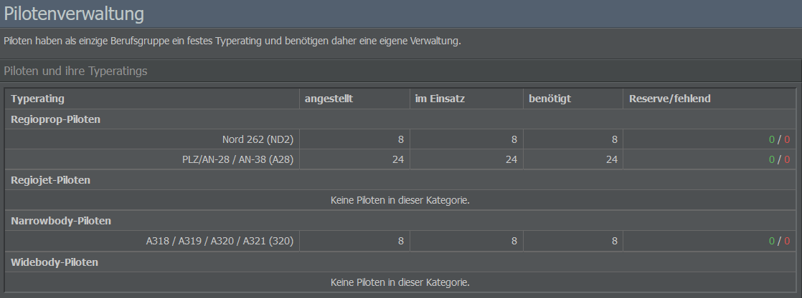
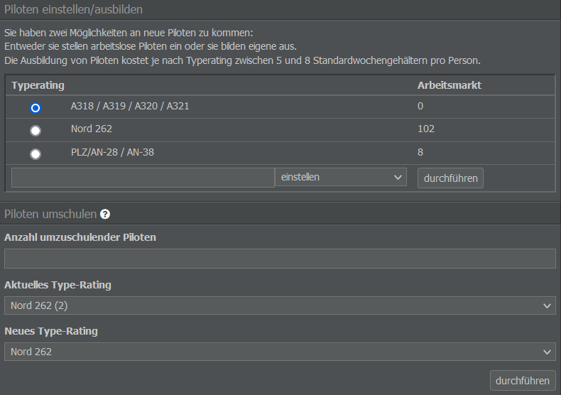

# Personalverwaltung

Eure Routenplanung steht? Dann können wir uns jetzt dem Personal zuwenden!

## Einstellung von Piloten

Ein Flugzeug braucht Piloten, um zu fliegen, also sollten diese zuerst eingestellt oder ausgebildet werden. Einige Besatzungsmitglieder werden zwar bereits standardmäßig hinzugefügt, wenn ihr Piloten aber manuell einstellen möchtet, zeigen wir euch hier, wie das geht.

Wählt dafür im Management-Tab das Untermenü “Crew Management”. Auf der linken Seite seht ihr eine Liste der beschäftigten und benötigten Piloten, gruppiert nach Flugzeugkategorie. Da eure Piloten nicht den ganzen Tag arbeiten können, ist die Anzahl der benötigten Piloten höher als tatsächlich für einen Flug erforderlich. Wenn das Flugzeug beispielsweise 20 Stunden pro Tag fliegt, benötigt ihr drei Crews, um es zu betreiben, und eine vierte Besatzung, um Piloten im Krankheitsfall oder im Urlaub zu ersetzen.

Die grünen Ziffern in der Spalte “Reserve/fehlend” stehen für die Anzahl der Reservepiloten, während die roten Werte angeben, wie viele Piloten noch hinzugefügt werden müssen. Beachtet dabei, dass ein Flugzeug (mit Ausnahme einiger Modelle) normalerweise einen Piloten und einen Kopiloten benötigt.

Die aufgelisteten Flugzeugkategorien sind in Regioprops, Regiojets, Narrowbody- und Widebody-Maschinen unterteilt. Sie geben an, welchen Flugzeugtyp ein Pilot bedienen darf und sind auch auf der Seite “Flugzeughersteller” (Management-Tab) zu finden.

Um den richtigen Piloten für euren Flugzeugtyp zu finden, werft einen Blick auf das Menü weiter rechts: Hier könnt ihr Piloten über den Arbeitsmarkt einstellen oder neue Piloten ausbilden. Beide Optionen stellen euch sofort Piloten zur Verfügung, allerdings kostet die Ausbildung eines Piloten je nach Flugzeugkategorie das 5- bis 8-fache des Wochengehalts.

Wenn ihr aufgrund eines Flugzeugverkaufs oder eines auslaufenden Leasingvertrags über beschäftigte, aber nicht arbeitende Piloten verfügt, könnt ihr diese auch auf einen anderen Flugzeugtyp umschulen. Die Kosten für die Umschulung sind deutlich geringer als die Ausbildung neuer Piloten, da davon ausgegangen wird, dass das vorhandene Personal über allgemeine Flugerfahrung verfügt.

## Personal verwalten

Einen allgemeinen Überblick über euer Personal findet ihr im Management-Tab unter “Personalverwaltung”. Hier seht ihr die Anzahl der Mitarbeitenden, ihren Beschäftigungsstatus, ihre Stimmung und Details zu ihrem Gehalt.

Sortiert ist das Personal nach Position (Piloten, Kabinencrew, Verwaltungspersonal und so weiter). Mitarbeitende, die keine Piloten sind, werden (falls nötig) automatisch vom System eingestellt. Das Gehalt könnt ihr kontrollieren, indem ihr den gewünschten Wert in das Gehaltsfeld eingebt und auf “ändern” klickt.

Beachtet bitte, dass das System nur notwendiges Personal einstellt und nicht entlässt, falls ihr es nicht mehr braucht. Hierzu müsst ihr manuell die gewünschte Anzahl an Crewmitgliedern in das Feld “Personal entlassen” eingeben und eure Auswahl mit "entlassen" bestätigen.


**Wichtig**
Die Entlassung von Personal ist nicht kostenlos - ihr müsst eine einmalige Abfindung in Höhe von mehreren Wochen des Default-Gehalts zahlen. Es lohnt sich also, darüber nachzudenken, ob ihr die Entscheidung zur Entlassung von Personal in Hinblick auf kurze oder lange Zeiträume getroffen habt.

