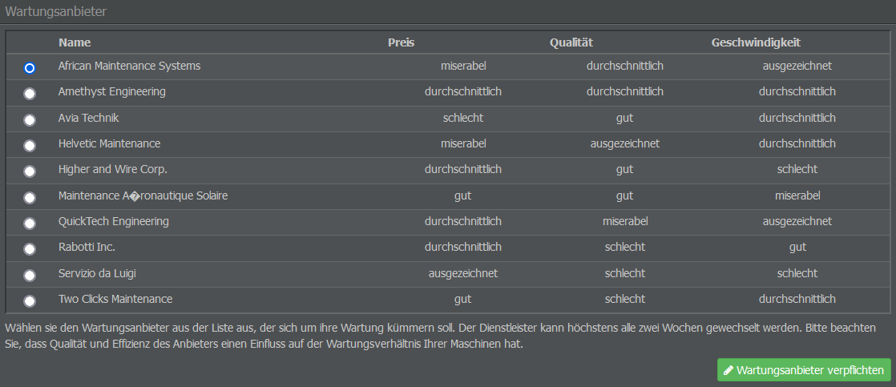

# Wartung

## Wartung buchen

Okay, ihr habt ein Flugzeug, eine erste Routenplanung und Service, Personal sowie die Kabinenkonfiguration stehen auch - Zeit abzuheben? Noch nicht ganz, denn ihr braucht noch einen Wartungsanbieter! Denn ohne Reparaturen wird euer Flugzeug nicht sehr lange fliegen...

Im Menü “Wartung” (Operations-Tab) habt ihr die Möglichkeit, eine Firma mit der Wartung eures Flugzeugs zu beauftragen. Jede der Optionen hat bestimmte Vor- und Nachteile, da die Anbieter in Bezug auf Preis, Qualität und Geschwindigkeit der Wartung unterschiedlich abschneiden.

* **Preis**: Dieser Wert steht für die relativen Kosten, die aufkommen, wenn die gleiche Menge an Wartungsarbeiten an einem Flugzeug durchgeführt wird.
* **Qualität**: Hier wird der Wartungsstandard angegeben. Seid vorsichtig: Ein Anbieter von minderwertiger Qualität wird euer Flugzeug möglicherweise nie zu 100 % instand setzen.
* **Effizienz**: Dieser Wert gibt den Umfang der Wartungsarbeiten an, die in einer bestimmten Zeitspanne durchgeführt werden: Ein effizienter Anbieter erledigt mehr Arbeit in kürzerer Zeit als ein ineffizienter. Dennoch kann es sein, dass sich der Preis nicht lohnt, vor allem wenn euer Flugzeug länger am Boden bleibt.


**Wichtig**
Wenn ihr euch einmal für einen Wartungsbetrieb entschieden habt, könnt ihr ihn zwei Wochen lang nicht mehr wechseln.


Bei der Auswahl eines Wartungsanbieters ist es empfehlenswert, nicht zuerst auf den Preis zu achten. Wählt stattdessen den Anbieter, der am besten zu euren Betriebsplänen passt.

Ihr könnt die Wartungsfirma auch später auswählen, allerdings macht es Sinn, die Entscheidung vor der Erstellung der Flugpläne zu treffen. Ein Anbieterwechsel danach beeinflusst die Zeit, die euer Flugzeug in der Luft verbringen kann und bestimmt, wie lange es pro Tag am Boden bleiben muss, sodass ihr eure Flugpläne möglicherweise anpassen müsst.

## Zusätzliche Tipps

Anbei noch ein paar Ratschläge zur Wartung und wie ihr sie in euren Flugplan (den wir im nächsten Schritt erstellen) integrieren könnt.

* **Mindestabstand im Flugplan**: Wenn ihr möchtet, dass zwischen euren Flügen Wartungsarbeiten stattfinden, muss euer Flugplan für mindestens 120 Minuten (inkl. Turnaround-Zeiten) auf dem Boden bleiben. Bei einer Bodenzeit von 119 Minuten und weniger wird keine Wartung durchgeführt.

* **Preis, Qualität oder Effizienz?**: Symmetrische Flugpläne mit täglichen Wartungsfenstern ermöglichen es euch, einen effizienten und kostengünstigen Wartungsdienstleister zu wählen. Bei asymmetrischen Flugplänen sind für euch wahrscheinlich eher Firmen interessant, die eine qualitativ hochwertige Wartung anbieten, um so der Verschlechterung des Flugzeugzustands entgegenzuwirken.

* **Eigene Flugzeuge**: Wenn ihr Flugzeuge besitzt, könnt ihr eure Flugpläne weniger eng gestalten. Stattdessen könnt ihr Platz für Anschlussflüge lassen. Manchmal kann es sich lohnen, einen billigeren Anbieter zu wählen und Abstriche bei der Qualität und / oder Effizienz zu machen, um die Wartungskosten pro Flug zu senken. Klingt seltsam? Nein! Ein Beispiel für diese Strategie ist die Fluggesellschaft Allegiant Air.

* **Alter des Flugzeugs**: Das Alter eures Flugzeugs hat keinen Einfluss auf die Dauer der Wartungsarbeiten, wohl aber auf die Kosten. Je älter das Flugzeug ist, desto mehr Ersatzteile werden bei der Wartung verbraucht, da Ausfälle und Verschleiß ihren Tribut fordern.

