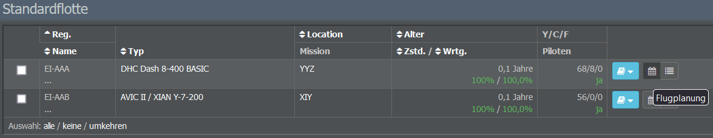

# Flugplanung

Nach der Auswahl eines Wartungsunternehmens ist es nun endlich an der Zeit, euer Flugzeug in Betrieb zu nehmen! Je nach eurem Standort, den Zielen eurer Airline und der vorhandenen Konkurrenz kann das recht einfach oder etwas kompliziert sein.

In diesem Guide geht es vor allem darum, einen einfachen Flugplan zu erstellen, aber viele der fortgeschritteneren Konzepte sollten nach dem Lesen weitgehend selbstverständlich sein.

## Vorbereitung des Flugplans

Bevor wir loslegen, solltet ihr euch überlegen, wie ihr euren Flugplan einrichten wollt. Schauen wir, was es zu beachten gibt!

### Rentabel fliegen

Wenn ihr ein Flugzeug least, müsst ihr die wöchentliche Leasingrate plus die Gehälter für Piloten und Kabinencrew zahlen - auch wenn es nicht in der Luft ist.

Wenn euer Flugzeug einen Hin- und Rückflug pro Tag macht (von A nach B und B nach A), entsprechen die Leasingkosten pro Flug den wöchentlichen Leasingkosten geteilt durch 14. Wenn das Flugzeug drei Hin- und Rückflüge pro Tag durchführt, entsprechen die Leasingkosten pro Flug den wöchentlichen Leasingkosten geteilt durch 42. Um rentabel zu bleiben, muss eure Flotte also so oft wie möglich fliegen.

### Wartungsverhältnisse

Im Abschnitt “Maschineninfo” auf der Flugplanungsseite (zu der wir gleich kommen) seht ihr das Wartungsverhältnis eures Flugzeugs. Dieser Wert zeigt das Verhältnis von Wartung und Flug an und kann als Indikator für die Effizienz des Flugzeugs angesehen werden. Generell gilt: Je höher das Wartungsverhältnis, desto weniger Geld könnt ihr mit dem Flugzeug verdienen.

In Bezug auf Flugpläne und Wartung gibt es einige Dinge zu beachten: Zunächst einmal wird die Wartung automatisch geplant. Dies wird durch einen hellblauen Hintergrund im Flugplan angezeigt. Wartung wird an jedem beliebigen Flughafen durchgeführt, solange das Flugzeug am Boden ist. Um die Reparaturen erfolgreich durchführen zu können, muss zwischen zwei Flügen ein Abstand von mindestens 2 Stunden liegen.

Sind für ein Flugzeug keine Flüge eingeplant, liegt das Wartungsverhältnis bei 100%. Nach der Planung des ersten Rückfluges werdet ihr feststellen, dass der Wert steigt, allerdings könnt ihr ihn durch die Planung weiterer Flüge wieder auf 100% senken.


**Wichtig** 
Ein Wartungsverhältnis unter 100% bedeutet, dass der Flugplan dem Reparatur-Team nicht genügend Zeit für die Wartung lässt, was zu einer täglichen Verschlechterung des Flugzeugzustands führt. Fällt die Quote unter 50%, erhält das Flugzeug ein Flugverbot und darf bis zur Reparatur keine Flüge mehr durchführen. Gebuchte Flüge werden storniert und die Passagiere erhalten eine Rückerstattung.


Um das zu verhindern, solltet ihr wöchentliche Wartungsfenster einplanen (je nach Alter, Modell und Flugplan des Flugzeugs). Für Kurz- und Mittelstreckenflüge solltet ihr tägliche Wartungsfenster vorsehen. Passagiere wissen ein gut gewartetes Flugzeug zu schätzen, sodass ihr auch bessere Bewertungen und mehr Buchungen erhaltet.

Wie oben erwähnt, werden Wartungsarbeiten an jedem Flughafen durchgeführt, nicht nur an eurem Hub. Es kann jedoch sinnvoll sein, die Zeit für Wartungsarbeiten an eurem Hub einzuplanen. Auf diese Weise haben die Passagiere genug Zeit, einen Anschlussflug zu erreichen (insofern alle Flugzeuge mehr oder weniger zur gleichen Zeit ankommen und etwa zwei Stunden später wieder abfliegen). Wenn eure restlichen Flüge ankommen, lasst die Flugzeuge am besten nur für die Mindesttransferzeit am Boden.

### Mindesttransferzeiten & Turnarounds

Jeder Flughafen, der Transfers anbietet, hat eine Mindesttransferzeit, die ihr auf der Informationsseite des Flughafens überprüfen könnt. Dies ist die Mindestzeit, die Fluggäste benötigen, um einen Anschlussflug zu erreichen. Die Passagiere verlassen das Flugzeug, sobald es gelandet ist (meist eine halbe Stunde, bevor das Flugzeug für den nächsten Flug bereit ist).

Wenn ihr euch euren Flugplan später anseht, werdet ihr merken, dass er sowohl Flug- als auch Turnaroundzeiten anzeigt. Die Turnaroundzeit umfasst alle Aktivitäten, die stattfinden, nachdem ein Flugzeug angekommen ist und bevor es wieder abflugbereit ist. Die genaue Dauer für eine bestimmte Strecke könnt ihr dem Performance-Check-Tool entnehmen.


**Info**  
Unvollständige Turnarounds aufgrund von Zeitmangel zwischen den Flügen führen zu Verzögerungen in eurem Flugbetrieb. Lasst ihr etwas mehr Puffer zwischen den Flügen ist euer Geschäft zudem weniger anfällig für Verspätungen, die durch zufällige Störungen im Flug- und Bodenbetrieb verursacht werden.


### Das Puzzle zusammensetzen

Unter Berücksichtigung der Kosten, Wartungsarbeiten sowie Transfer- bzw. Turnaroundzeiten könnt ihr jetzt euren ersten Flugplan zusammenstellen.

Verwendet das Performance-Check-Tool, um die Flugdauer eurer gewünschten Verbindungen zu ermitteln und verteilt die Flüge dann so auf eure Flugzeuge, dass das Wartungsverhältnis jeder Maschine möglichst nahe bei 100% liegt. Beträgt der Wert mehr als 200%, verschwendet das Flugzeug wertvolle Zeit am Boden.

Sobald ihr mit eurem Plan zufrieden seid, können wir ihn im Spiel einrichten!

## Einrichtung der ersten Flugverbindung

Um euren ersten Flug zu erstellen, klickt zunächst auf das Menü “Flottenverwaltung” im Operations-Tab und wählt die Flotte aus, der euer gewünschtes Flugzeug zugeordnet ist. Wenn ihr die Flottenzuordnung nicht geändert habt, findet ihr das Flugzeug in der Standardflotte.

Jedes Flugzeug ist mit drei Symbolen aufgelistet: Das kleine Buch auf der linken Seite zeigt die Vertragsdetails der Maschine an (beispielsweise den zugehörigen Leasingvertrag), das zweite Symbol führt euch zur Flugplanung und das dritte Symbol zeigt die aktuellen Flüge des Flugzeugs an.

Über das Symbol für die Flugplanung gelangt ihr zu eurem leeren Flugplan. Hier könnt ihr die erste Flugnummer anlegen.

 

So fügt ihr einen neuen Flug hinzu:

* Gebt eine neue Flugnummer ein (ohne den Airline-Code).
* Wählt einen Flughafen und einen Zeitpunkt für den Abflug.
* Legt ein Preisniveau und ein Serviceprofil für den Flug fest. (Ihr könnt es auch bei den Standardeinstellungen belassen, wenn ihr Preise und Service lieber über das Inventory-Menü im Commercial-Tab verwalten möchtet).
* Wählt den Zielflughafen.
* Klickt auf “Neue Flugnummer anlegen”.


**Info** 
Wenn der Start- oder Zielflughafen eurer Wahl nicht aufgeführt ist, stellt sicher, dass ihr eine Station an diesem Flughafen eröffnet habt.


Nachdem ihr die neue Flugnummer angelegt habt, erscheint der Bereich “Flugplanung”.

 

Hier wird euch für jeden Wochentag mitgeteilt, ob die gewünschte Verbindung möglich ist oder nicht. Wenn nicht, seht ihr ein rotes Kreuz. In diesem Fall könnt ihr versuchen, die Abflugzeit zu ändern. Damit ein Flug erfolgreich eingeplant werden kann, müssen alle Felder mit grünen Häkchen versehen sein.

Standardmäßig werden die Flüge für jeden Tag der Woche geplant (ihr könnt dies in den Spieleinstellungen ändern). Wenn ihr nicht täglich fliegen wollt (oder aufgrund von Slot-Problemen nicht könnt), könnt ihr jeden Tag einzeln an- oder abwählen.

Sobald alle Häkchen grün sind, klickt auf “Planungsdaten übernehmen”, um den Flug zu erstellen und eurem Flugzeug zuzuweisen.

## Planung des Rückflugs

Nachdem ihr euren Hinflug gespeichert habt, könnt ihr ihn im Flugplan (unter dem Abschnitt zur Flugplanung) anklicken, um Details zur Flugnummer anzuzeigen. Hier habt ihr nochmal die Möglichkeit, die Preise und den Bordservice zu bearbeiten, entweder für den ausgewählten Flug oder für die gesamte Strecke.

Ihr werdet auch sehen, dass der Flugplan eine Reihe alarmierend roter Kästchen anzeigt, aber keine Sorge - das liegt daran, dass wir bisher nur eine Flugrichtung geplant haben. Ohne einen Rückflug sitzt das Flugzeug am Zielflughafen fest und kann möglicherweise keine weiteren Flüge durchführen.

Ihr müsst jedoch nicht sofort zum Startflughafen zurückkehren, Rundflüge wie von Flughafen A nach B nach C nach A sind ebenfalls möglich.

Standardmäßig ist das Menü zur Einrichtung der Flugnummer nun bereits mit einer neuen Flugnummer, dem Flughafenpaar für den Rückflug und einem neuen Zeitvorschlag auf Basis des vorherigen Fluges ausgefüllt. Selbstverständlich könnt ihr diese Einstellungen ändern, wenn ihr einen anderen Zielort oder eine frühere / spätere Zeit auswählen möchtet.

 

Wenn ihr mit den Einstellungen zufrieden seid, klickt einfach auf “Neue Flugnummer anlegen” und schon habt ihr einen Rückflug angelegt!

Wie zuvor erscheint das Menü zur Flugplanung. Wenn alle Felder mit grünen Häkchen versehen sind, könnt ihr die Planungsdaten übernehmen.


**Wichtig** 
Wie bereits erwähnt, solltet ihr darauf achten, dass zwischen euren Flügen ein ausreichendes Zeitfenster liegt. Ist das Flugzeug zum Zeitpunkt des geplanten Abflugs noch nicht bereit, wird der Flug rot und im Abschnitt “Zeitfenster” erscheinen rote Kreuze. Passt eure Abflugzeiten daher immer entsprechend an, um Überschneidungen zu vermeiden.


Sobald ihr den Rückflug erfolgreich eingeplant habt, werden die Flüge gelb. Das bedeutet, dass der Plan korrekt erstellt wurde und dass keine Flüge fehlen oder Fehler enthalten.

## Aktivierung des Flugplans

Wenn ihr mit euren geplanten Routen zufrieden seid, ist es an der Zeit, dem Online Reservation System (ORS) zu erlauben, euren Flügen Passagiere und Fracht hinzuzufügen.

Erinnert ihr euch an die gelben Flüge im Flugplan? Das bedeutet, dass ihr die Slots erfolgreich blockiert habt, aber noch niemand die Verbindungen buchen kann. Um Buchungen zu erhalten, müssen eure Flüge zuerst aktiviert werden!


**Wichtig**  
Ohne Aktivierung werden die Flüge nach ein paar Tagen gelöscht, um eine Blockierung von Slots zu verhindern.


Die Aktivierung eures Flugplans könnt ihr im Dropdown-Menü “Flugplanaktion auswählen” unterhalb des Flugplans vornehmen. Hier könnt ihr auswählen, ob der Flugplan sofort freigegeben werden soll oder mit einer Verzögerung von drei Tagen.

Die Auswahl einer Verzögerung ist sinnvoll, um Probleme beim Ändern bestehender Flugpläne zu vermeiden. Bereits gebuchte Flüge des alten Flugplans werden somit erst abgeschlossen, bevor der neue Flugplan im ORS auftaucht. Zudem kann eine Verzögerung hilfreich sein, wenn ihr nicht wisst, ob euer Flugzeug innerhalb eines Tages schon ausgebucht sein wird.

Sobald ihr euch für eine der Optionen entschieden habt, färben sich eure Flüge grün. Glückwunsch, euer erster Flugplan wurde erfolgreich aktiviert!

## Übertragung von Flugzeugen

Eure Flüge erscheinen frühestens 30 Minuten nach Aktivierung des Flugplans. Die erste tatsächliche Verbindung erfolgt frühestens 24 Stunden, nachdem das System die Flugpläne erhalten hat. Über das kleine Symbol ganz rechts neben einem Flugzeug in der Flottenverwaltung erhaltet ihr eine Liste aller Flüge, die für Passagiere oder Fracht gebucht werden können.

Um diese Flüge durchführen zu können, muss sich das Flugzeug am ersten Abflughafen auf der Liste befinden. Steht euer Flugzeug an einem anderen Ort, müsst ihr mithilfe des Menüs “Transferflug” auf der Flugplanungsseite einen Transferflug hinzufügen.

 

Hier könnt ihr den gewünschten Flughafen auswählen. Das Flugzeug wird dann an den neuen Zielort verlegt und der Transferflug erscheint in der Liste - Slots müsst ihr dafür nicht reservieren. Nach erfolgreichem Abschluss des Transfers verschwindet der Flug wieder. Beachtet dabei, dass Transferflüge kostenlos sind, aber eine gewisse Zeit benötigen, um durchgeführt zu werden.

Anstatt einen Transfer zu buchen, könnt ihr auch alle Flüge stornieren, die nicht am richtigen Platz sind. Es fallen keine Stornogebühren an, solange die Flüge leer sind. Wenn ihr jedoch Flüge storniert, für die bereits Buchungen vorliegen, müsst ihr die Tickets erstatten.

## Warten auf die ersten Fluggäste

Gut gemacht - jetzt sind eure Flüge bereit für die ersten Passagiere!

Ihr könnt nun entweder weitere Flüge für andere Flugzeuge planen oder warten, bis sich eure Flugzeuge füllen. Entsprechend der Ticketnachfrage führt jeder Flughafen einmal pro Tag die Buchungen für die verfügbaren Strecken durch. Die genaue Uhrzeit findet ihr auf der Informationsseite des Flughafens im Abschnitt "Aufkommensupdate".

Die Tickets werden bis zu drei Tage im Voraus gebucht, sodass ihr erst zum Zeitpunkt des Abflugs feststellen könnt, wie viele Passagiere / Frachteinheiten tatsächlich gebucht wurden. Wenn euer Flugzeug abhebt, werden alle Einnahmen und Ausgaben für den Flug eurem Konto gutgeschrieben. Die Wartung wird bezahlt, sobald sie erledigt ist, während die Kosten für Personal, Leasingverträge und Darlehen wöchentlich abgezogen werden.
