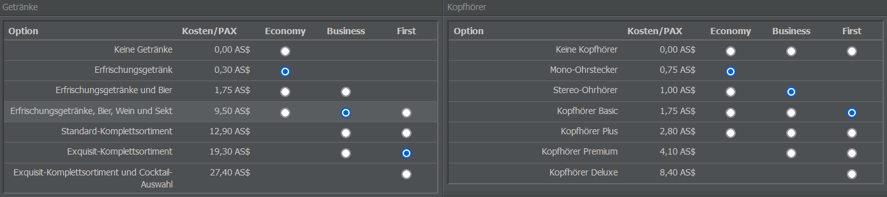

# Festlegung von Serviceprofilen

## Kekse oder Kaviar?

Erinnert ihr euch noch an die Zeit, als auf jedem Flug kostenlose Getränke und eine Zeitung angeboten wurden? Das kostete die Airlines zwar nicht viel, aber Passagiere wussten den Service zu schätzen.

Auch unsere virtuellen Fluggäste wollen verwöhnt werden! Zum Glück ist ein guter Bordservice - Getränke, Mahlzeiten, Zeitungen usw. - nicht so teuer, und die höhere Bewertung ist es auf jeden Fall wert.

Business- und First Class-Passagiere sind schwieriger zufriedenzustellen, aber wenn man schon First Class-Sitze anbietet, warum nicht auch einen First Class-Service? Es lohnt sich nicht, große Sitze einzubauen und billige Tickets zu verkaufen, weil die Passagiere den Service nicht mögen.

Natürlich sind Serviceprofile nicht zwingend erforderlich. Wenn ihr euer Flugzeug mit Sitzen und Flugpersonal ausgestattet habt, ist es bereit zum Abflug. Allerdings macht ein guter Bordservice Flüge zu einem bestimmten Preispunkt für Passagiere attraktiver.

## Erstellen und Zuweisen von Serviceprofilen

Die Einrichtung von Serviceprofilen könnt ihr im Commercial-Tab unter “Serviceprofile” vornehmen. Auf der rechten Seite findet ihr das Menü “Neues Profil anlegen” - hier könnt ihr einen Namen für das Serviceprofil vergeben und es über “Profil anlegen” erstellen.

Auf der folgenden Seite könnt ihr festlegen, welchen Bordservice ihr in jeder Klasse (Business, Economy, First) anbieten möchtet. Die verfügbaren Optionen sind unterteilt in ein gastronomisches Angebot, das Getränke, Snacks, ein Hauptgericht und ein weiteres Gericht umfasst, und einen Non-Food-Bereich, in dem ihr das Angebot an Kopfhörern, Essensverpackungen, Zeitungen und Bordmagazinen festlegen könnt.

Auf der rechten Seite des Fensters werden euch die Kosten angezeigt, die durch eure ausgewählten Serviceoptionen entstehen. Im Tab “Passagierbewertung” seht ihr außerdem, wie eure Auswahl die Bewertungen der Fluggäste beeinflusst.

Eine Formel für die besten und günstigsten Einstellungen gibt es nicht. Die Wahl des Bordservices hängt von eurem Geschäftskonzept ab: Wenn ihr eine Billigfluglinie betreiben wollt, werden eure Passagiere wahrscheinlich nicht auf Rosen gebettet sein, daher solltet ihr euer Firmenmodell bei der Einrichtung von Serviceprofilen stets im Auge behalten.

Wenn ihr fertig seid, könnt ihr zurück zur Übersicht gehen und eines der verfügbaren Serviceprofile als Standard festlegen. Dadurch wird es automatisch auf alle neuen Flüge angewendet, die ihr erstellt, vorausgesetzt, es gelten keine Entfernungsbeschränkungen für sie.

{}
**Info**  
Einige Mahlzeiten erfordern Flüge mit einer Reichweite von mindestens 800 oder 1.500 km. Wenn euer Standard-Serviceprofil eines dieser Profile enthält, wird es nicht auf kürzere Flüge angewendet, sodass diese Strecken kein Serviceprofil erhalten. Es kann also hilfreich sein, verschiedene Serviceprofile für Kurz- und Langstreckenflüge zu erstellen.
{}

Ihr könnt Serviceprofile auch manuell zuweisen, zum Beispiel bei der Erstellung von Flugnummern oder auf der Inventory-Seite im Commercial-Tab.
