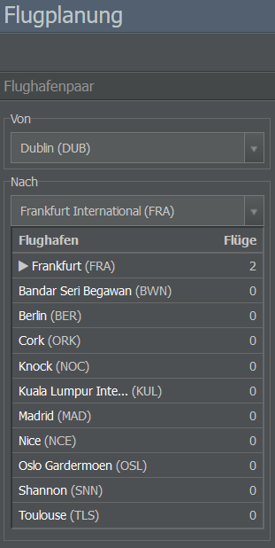
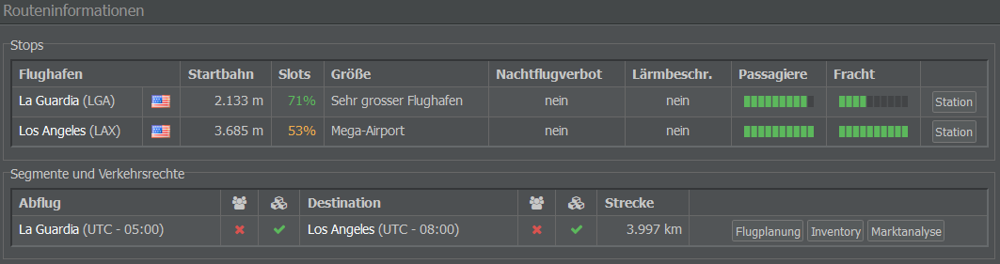
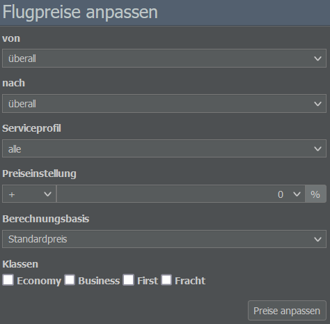
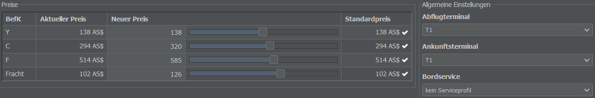
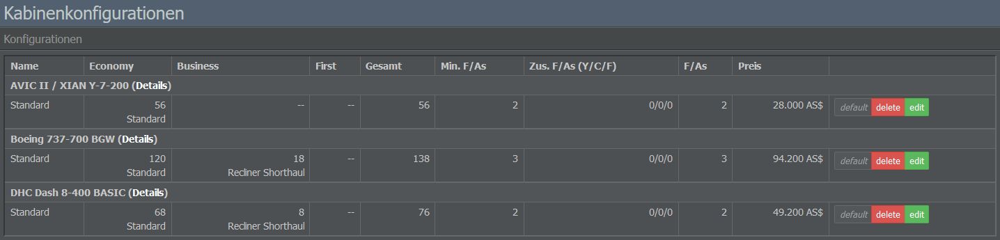
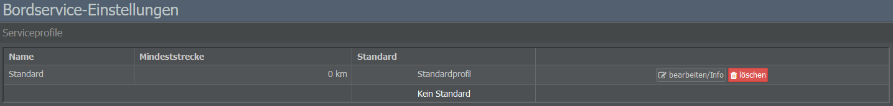
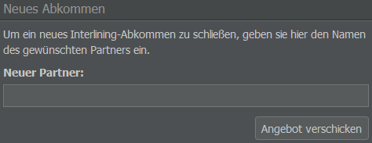
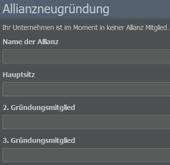

# Commercial-Tab

Das Menü des Commercial-Tabs besteht aus den Abschnitten Network Planning, Sales & Distribution, Product & Customer Service sowie Business Development.

## Network Planning

### Flugplanung

Auf dieser Seite könnt ihr die Flugpläne für eine bestimmte Strecke verwalten. Nach der Auswahl eines Flughafenpaares auf der linken Seite erhaltet ihr Informationen über zugehörige Flugnummern und Produktbewertungen.

Im Textfeld unterhalb des Seitentitels könnt ihr schnell zu einem anderen Flughafenpaar wechseln. Der Code muss das Format AAABBB haben, wobei AAA und BBB die IATA-Flughafencodes der jeweiligen Flughäfen sind.

### Flugnummern

In der Flugnummernverwaltung könnt ihr die Flugnummern eurer Airline einsehen, sie gruppieren oder neue erstellen. Wenn ihr eine neue Flugnummer anlegen möchtet, wählt einfach im Menü auf der linken Seite einen Start- und einen Zielort aus. Flugstrecken können auch eine Zwischenlandung (“technical stop”) enthalten, wodurch ein Via-Flug entsteht. Der Zwischenstopp kann im entsprechenden Abschnitt hinzugefügt werden.

### Routen-Evaluierung

Das Tool Routen-Evaluierung liefert Informationen zu einer von euch gewählten Strecke. Gebt ihr auf der linken Seite einen Start- und einen Zielort ein, erhaltet ihr Details zu Start- und Landebahnlängen, Slotverfügbarkeit, Flughafengröße, Lärmbeschränkungen, Nachfrage und Streckendistanz. Auch hier habt ihr die Möglichkeit, eine neue Flugnummer anzulegen.

### Marktanalyse

Diese Seite bietet euch einen Überblick zur aktuellen Marktsituation für das ausgewählte Flughafenpaar und zeigt aktuell buchbare Flüge, Sitzplatzkapazitäten, Preisentwicklungen sowie die Marktanteile der konkurrierenden Fluggesellschaften an.

Der Bereich “Marktanteile” stellt den Marktanteil an Passagier- und Frachtverkehr dar, den ihr und die anderen Airlines kontrolliert. Oberhalb des Diagramms könnt ihr zwischen den Daten verschiedener Kalenderwochen umschalten.


**Info**  
Der Hauptzweck der Seite Marktanalyse besteht darin, die Konkurrenz im Auge zu behalten und neue Märkte zu bewerten. Um eure eigene Auslastung zu überwachen, könnt ihr die Seite [Inventory](#inventory) or [Load Monitoring](#load-monitoring) verwenden.


Bitte beachtet, dass die Verfügbarkeitswerte anderer Airlines (Tabelle “Aktuelle Verfügbarkeit”) bis 9 gehen: Ist die Restkapazität des jeweiligen Fluges und der Klasse höher als 9, wird 9 angezeigt. Andernfalls stellt der Wert die tatsächliche Restkapazität dar.

Im Textfeld unterhalb des Seitentitels könnt ihr schnell zu einem anderen Flughafenpaar wechseln. Der Code muss das Format AAABBB haben, wobei AAA und BBB die IATA-Flughafencodes der jeweiligen Flughäfen sind.

## Sales & Distribution

### Flugpreise

Über das Menü “Flugpreise” könnt ihr eure Ticketpreise anpassen. Wählt einfach eine Strecke, ein Serviceprofil und eine Klasse, gebt den Prozentsatz der Preisänderung ein und klickt auf “Preise anpassen”. Als Berechnungsbasis für die Preisänderung könnt ihr entweder den Standardpreis oder den aktuellen Preis wählen. Bitte beachtet, dass euer Preis zwischen 50% und 200% des Standardpreises liegen muss.

### Inventory

Das Inventory-System verwaltet und kontrolliert die verfügbaren Kapazitäten, die eine Airline zum Verkauf anbietet. Auf dieser Seite könnt ihr die Auslastungen überprüfen, Preise, Terminals und Serviceprofile aktualisieren, Details zu Kapazitäten und Buchungen abrufen und historische Auslastungs- und Preisdaten für ein ausgewähltes Flughafenpaar einsehen.

Ihr könnt das Textfeld unterhalb des Seitentitels verwenden, um schnell zu einem anderen Flughafenpaar zu wechseln. Der Code muss das Format AAABBB haben, wobei AAA und BBB die IATA-Flughafencodes der jeweiligen Flughäfen sind.

### Auslastungsüberwachung

Diese Seite hilft euch, die Auslastung eurer Flüge im Auge zu behalten. Ihr könnt die Daten für eine bestimmte Zeitspanne, Strecke, Flotte und Flugnummerngruppe überprüfen. Das Tool erstellt eine Liste der zutreffenden Flugnummern und zeigt deren Preis und Auslastungsfaktor pro Klasse an.

## Product & Customer Service

### Kabinenkonfigurationen

In diesem Abschnitt könnt ihr die Kabinenkonfigurationen eurer Flugzeuge verwalten.

Die vorhandenen Konfigurationen werden nach Flugzeugtyp aufgelistet und zeigen die Anzahl der Sitze pro Klasse, die Gesamtzahl der Sitze, die Anzahl der Flugbegleiter (F / As) und den Preis der Konfiguration. Außerdem habt ihr hier die Möglichkeit, eine Konfiguration als Standardprofil festzulegen, zu bearbeiten oder zu löschen.

Ihr könnt so viele Konfigurationen erstellen, wie ihr möchtet. Um eine neue Kabine einzurichten, wählt im Menü auf der rechten Seite einfach einen Namen und den gewünschten Flugzeugtyp aus. Dies kann für jeden im Spiel verfügbaren Flugzeugtyp erfolgen.

### Serviceprofile

Hier könnt ihr den Bordservice verwalten, der auf euren Flügen angeboten wird.

Um die Food- und Non-Food-Services eurer Airline zu konfigurieren, könnt ihr im Menü auf der rechten Seite ein neues Serviceprofil anlegen. Auf der linken Seite erhaltet ihr eine Übersicht der  bestehenden Serviceprofile sowie die Möglichkeit, diese zu bearbeiten oder als Standardprofile festzulegen.

## Business Development

### Interlining

Im Menü “Interlining” könnt ihr Interlining-Vereinbarungen mit anderen Unternehmen einrichten. Gebt hierfür den Namen eurer Partner-Firma in das Feld auf der rechten Seite ein und klickt auf “Angebot verschicken.”

Denkt daran, dass auch der administrative Aufwand für die Pflege eures eigenen Netzwerks nicht umsonst ist. Im Bereich “Eigenes Netzwerk” könnt ihr daher wählen, ob ihr einen Netzwerkservice und die damit verbundenen Kosten unterhalten wollt oder nicht. Beachtet dabei, dass Letzteres auf unbeliebten Routen zu einem Rückgang der Nachfrage führen kann.

### Neue Allianz

Um eine Allianz zu gründen, werden drei Gründungsmitglieder benötigt - ihr selbst und zwei weitere Personen. Im Menü zur Allianzneugründung könnt ihr den Namen der Allianz, ihren Hauptsitz und die Namen der Gründungsmitglieder eingeben. Eine Allianz wird gegründet, sobald alle Gründungsmitglieder zugestimmt haben.

