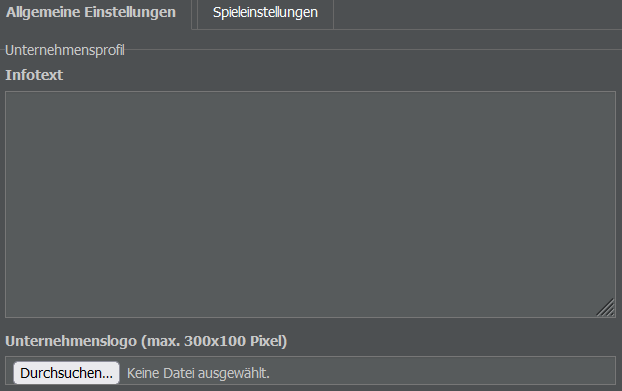
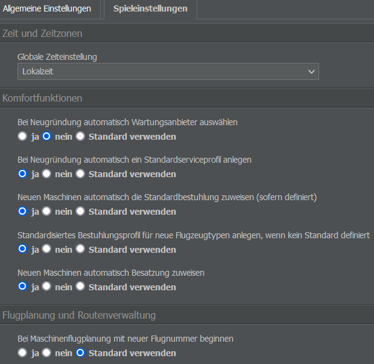
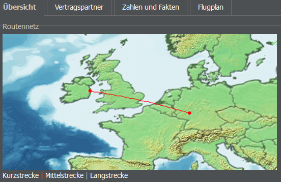

# Firmenübersicht

Wenn ihr den Mauszeiger über den Namen eures Unternehmens oben links auf dem Bildschirm bewegt, erhaltet ihr verschiedene Optionen zu eurer Firma.

## Übersicht

Das Dashboard ist in sieben Abschnitte (auch Widgets genannt) unterteilt - Unternehmen, anstehende Termine, Notizblock, Aktien, Finanzrating, Image und Tochterunternehmen - und ist daher praktisch, wenn ihr schnell Informationen zu eurer Firma abrufen wollt.

### Unternehmen

Das Widget “Unternehmen” zeigt das Logo (falls ihr eins hochgeladen habt) sowie die wichtigsten Informationen zu eurer Firma an (Name, Code, Hauptsitz, Land, Airline-Rating, Flottengröße und Anzahl der Angestellten). Mit einem Klick auf “Infoseite” gelangt ihr zur [Unternehmensseite der Firma](#unternehmen-1).

### Anstehende Termine

Dieses Widget zeigt euch die festen Ausgaben und Einnahmen der nächsten drei Tage (basierend auf Verträgen und vergangenen Ereignissen wie Flugzeugauslieferungen). Der Wochenabschluss ist der Zeitpunkt, an dem die finanzielle Periode zurückgesetzt wird und die Angestellten bezahlt werden.


**Info**
Diese Ereignisse gehören nicht zu den direkten Kosten eines Fluges. Um die Liste zu erweitern, klickt auf “Alle Termine ansehen” oder öffnet das Menü “Cash Flow” im Management-Tab.


### Notizblock

In diesem Abschnitt könnt ihr Notizen zu eurem Unternehmen machen. Die Notizen sind sichtbar, solange ihr bei AirlineSim angemeldet seid. Um eine Notiz hinzuzufügen oder zu bearbeiten, reicht ein Doppelklick. Die Notiz wird nur euch angezeigt - andere Spielerinnen und Spieler können sie nicht sehen.

### Aktie

Hat euer Unternehmen ein [Initial Public Offering (IPO)]() durchgeführt, zeigt das Aktien-Widget Informationen wie den Aktienkurs und einen Überblick der Aktionärinnen und Aktionäre an. Wenn ihr auf “Informationen zum Börsengang” klickt, gelangt ihr auf eine Seite mit weiteren Details (die auch über das Menü “Unternehmensfinanzierung” im Management-Tab aufgerufen werden kann).

### Finanzrating

Dieser Abschnitt zeigt eine vereinfachte Version der wirtschaftlichen Situation eurer Firma: Der Cash Flow gibt an, wie viel Geld die Airline verdient; der Wert Umsatzrendite stellt die Höhe des Gewinns dar, den ihr im Verhältnis zu den Einnahmen erzielt. Alle aufgeführten Faktoren werden in einer Gesamtbewertung zusammengefasst.

### Image

In diesem Abschnitt geht es um das aktuelle Image eurer Firma in Bezug auf die drei Buchungsklassen (Economy, Business, First) und Fracht. Je mehr grüne Balken, desto beliebter euer Produkt. Um den Überblick zu behalten, könnt ihr sowohl das aktuelle als auch das Image der letzten Woche und den Gesamttrend sehen.

### Tochterunternehmen

Hier findet ihr eine Liste aller Tochtergesellschaften, die ihr als Hauptaktionär*in kontrolliert. Weitere Details zu den Aktien könnt ihr auch auf der Seite “Töchter & Portfolio” im Management-Tab einsehen.

## Allgemeine Einstellungen

Wenn ihr direkt unter dem Menüpunkt “Übersicht” auf “Einstellungen” klickt, könnt ihr folgende Details bearbeiten:

### Infotext

Dies ist der Text, den andere Benutzer*innen sehen, wenn sie die Übersichtsseite eurer Firma aufrufen. Meist finden sich hier Informationen in Bezug auf Interlining oder zu bestimmten Meilensteinen des Unternehmens.

### Unternehmenslogo

Hier könnt ihr ein Logo für euer Unternehmen hochladen. Das Logo wird in der Firmenübersicht erscheinen und hat einen rein kosmetischen Zweck. Die Datei muss eine Größe von 300 x 100 Pixeln haben. Wenn ihr das Logo löschen möchtet, klickt einfach auf das kleine Mülleimersymbol.

### Kleines Logo

Ihr könnt zudem eine kleinere Version eures Logos hinzufügen, die im gesamten Spiel angezeigt wird (z. B. auf Ankunfts- und Abflugtafeln). Dieses Bild muss eine Größe von 120 x 23 Pixeln haben. Bitte stellt sicher, dass es auch unseren Logo-Richtlinien entspricht (verfügbar unter Datenbank > Namensregeln in jeder Spielwelt) und bedenkt, dass das Design vom Moderationsteam genehmigt werden muss, bevor es aktiviert wird.

## Spieleinstellungen

Neben den allgemeinen Einstellungen findet ihr eine weitere Registerkarte mit Spieleinstellungen. Hier könnt ihr einige der globalen Einstellungen überschreiben und das Spiel so an eure persönlichen Präferenzen anpassen. Ein ähnliches Menü findet ihr im Einstellungen-Tab oben rechts auf dem Bildschirm.

### Zeit und Zeitzonen

Hier könnt ihr wählen, ob die Zeiten in AirlineSim als Hubzeit, Lokalzeit oder UTC angezeigt werden sollen. Die Auswahl wirkt sich auf alle angezeigten Zeiten im Spiel aus, z. B. auf Slots, Flugpläne und den Finanzplan.

### Komfortfunktionen

Über die Komfortfunktionen könnt ihr festlegen, ob das Spiel bestimmte Aufgaben automatisch erledigen soll. Dazu gehören beispielsweise

* die Auswahl eines Wartungsanbieters, wenn ein neues Unternehmen gegründet wird,
* die Erstellung eines Default-Serviceprofils bei der Gründung eines neuen Unternehmens,
* Zuweisung einer Default-Sitzkonfiguration für neue Flugzeuge (nur wenn eine solche definiert wurde),
* Anlegen einer Standard-Sitzplatzkonfiguration, wenn kein Default festgelegt wurde
* und die Zuweisung von Besatzungsmitgliedern zu neuen Flugzeugen.

Da sich diese Einstellungen auf das Spielgeschehen auswirken, empfiehlt es sich, sie nach eigenem Ermessen anzupassen.

### Flugplanung und Routenverwaltung

In diesem Abschnitt könnt ihr Details zu Flugnummern und -planung, Boardingmethoden, Fracht und Gepäck sowie einige andere Optionen festlegen.

### Benachrichtigungen

Hier könnt ihr festlegen, welche In-Game-Benachrichtigungen ihr von AirlineSim erhalten wollt.

### Systemeinstellungen

In diesem Menü könnt ihr auswählen, ob ihr E-Mail-Benachrichtigungen erhalten möchtet, wenn euch jemand eine Nachricht im Spiel schickt.

### Benutzeroberfläche

Im Abschnitt zur Benutzeroberfläche könnt ihr die visuelle Darstellung des Spiels anpassen, indem ihr zwischen einem dunklen, hellen oder klassischen Farbschema wählt. Neben einigen anderen Optionen steht euch hier zudem die Möglichkeit zur Verfügung, Anpassungen zur Zugänglichkeit für Farbenblinde vorzunehmen.

## Unternehmen einrichten und auflösen

Unterhalb der Einstellungen habt ihr die Möglichkeit, ein neues Unternehmen zu gründen oder ein bestehendes zu liquidieren.


**Warning**
Achtung: Wenn ihr euch für eine Liquidation entscheidet, werden alle Daten des Unternehmens unwiderruflich gelöscht. Alle Assets werden verkauft, Gebäude werden abgerissen, bestehende Minderheitsbeteiligungen gehen an AirlineSim und Mehrheitsbeteiligungen führen zur Löschung des Tochterunternehmens. Aktionär*innen erhalten die verbleibenden Werte geteilt durch ihren Anteil.


Bitte beachtet, dass ein Reset nur für Holdings (d. h. Unternehmen, die direkt zu eurem Konto gehören) möglich ist.

## Unternehmen

Die Seite Unternehmen bietet euch Informationen zu einer Firma eurer Wahl. Aufrufen könnt ihr sie über den Link “Infoseite” auf dem Dashboard eurer eigenen Firma oder indem ihr den Firmennamen in die Suchleiste eingebt.

### Übersicht

Dieser Bereich zeigt die wichtigsten Details wie Name, Hub und Rating des Unternehmens sowie Streckennetz, Flotte, Tochtergesellschaften, veröffentlichte Informationen, Statistiken und News. Die Seite bietet auch eine Meldefunktion, über die ihr den Support kontaktieren könnt, falls ein Unternehmen die Spielregeln nicht einhält.

### Vertragspartner

In diesem Tab findet ihr Informationen über die vorhandenen Geschäftsbeziehungen der Firma (z. B. Leasingpartner).

### Zahlen und Fakten

Der Abschnitt “Zahlen und Fakten” bietet euch eine Zusammenfassung der Unternehmensstatistiken, z. B. die Anzahl der durchgeführten Flüge und der angeflogenen Flughäfen. Wenn ihr Anteile an der Firma haltet, könnt ihr hier zudem Werte wie den erzielten Umsatz einsehen.

### Flugplan

Auf dieser Seite sind alle Flüge des Unternehmens nach Abflug- und Ankunftsflughäfen sortiert. Die Flugzeiten können als Hubzeit, Lokalzeit oder UTC angezeigt werden.
