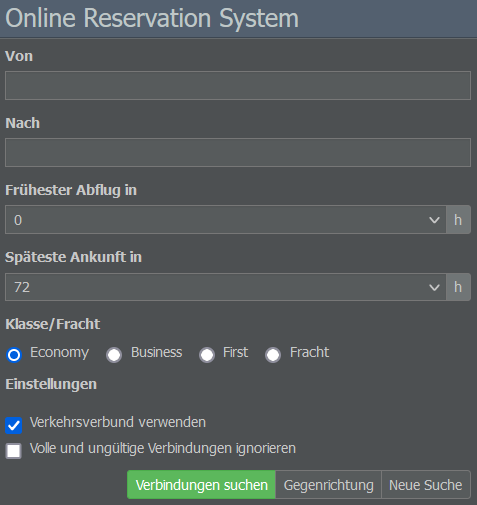

# Datenbank-Tab

Über die Registerkarte Datenbank könnt ihr auf wichtige Spielressourcen wie verschiedene Verzeichnisse, das Online Reservation System (ORS) und die Spielregeln zugreifen.

## Verzeichnisse

### Länder

In diesem Bereich findet ihr eine Liste aller im Spiel verfügbaren Länder. Wählt ihr ein Land aus, gelangt ihr zu dessen Informationsseite, auf der ihr Details zu den unterzeichneten Verträgen, der Möglichkeit für ausländische Investments und den Flughäfen einsehen könnt.

### Unternehmen

Hier könnt ihr alle Unternehmen einsehen, die in eurer Spielwelt registriert sind. Wenn ihr auf einen Buchstaben klickt, öffnet sich eine Liste der Unternehmen mit passenden Anfangsbuchstaben, die jeweils deren Code, Allianz und Hauptsitz anzeigt. Wählt ihr eine Firma aus dieser Liste aus, werdet ihr zu deren Unternehmensseite weitergeleitet.

### Allianzen

In diesem Menü erhaltet ihr eine Übersicht der auf eurer Spielwelt vorhandenen Allianzen. Jeder Listeneintrag zeigt den Namen, Hauptsitz und Status der Allianz an. Klickt ihr auf eine bestimmte Allianz, gelangt ihr zu ihrer Informationsseite, wo ihr die Möglichkeit habt, euch als Mitglied zu bewerben.

## Andere Ressourcen

### Flottenlisten

Über dieses Menü könnt ihr euch für jedes Land eine Liste der registrierten Unternehmen und der zugehörigen Flotten anzeigen lassen.

### Statistiken

Auf dieser Seite findet ihr eine Auswahl an statistischen Informationen über die Spielwelt. Zu den allgemeinen Statistiken gehören Werte wie die Anzahl der Unternehmen oder der Flüge pro Woche. Im Menü “Wöchentliche Kapazitäten” erhaltet ihr eine Auflistung der transportierten Passagier- und Frachtmengen. Der Bereicht “Detailstatistiken” enthält Links zu verschiedenen Ranglisten.

### Online Reservation System

Das [Online Reservation System (ORS)](), eine der Kernfunktionen des Spiels, generiert täglich eine Vielzahl von Verbindungen und verteilt die Passagiere auf die vorhandenen Flüge.

Über das Menü könnt ihr nach verfügbaren Verbindungen suchen. Gebt hierfür einfach einen Abflug- und Zielort, die früheste Abflug- bzw. späteste Ankunftszeit sowie die Art des Payloads (Economy, Business, First oder Fracht) ein.

Die Suchergebnisse werden mit Datum, Abflug- und Ankunftszeit, zusätzlichen Zwischenstopps, Flugnummer, Preis und der Bewertung aufgelistet. Außerdem könnt ihr sehen, ob ein Flug bereits ausgebucht ist oder noch nicht.

## Spielregeln

In diesem Abschnitt könnt ihr die allgemeinen Regeln, die Namens- und Logorichtlinien sowie die verbotenen Routen nachschlagen. Diese beziehen sich auf Länder- oder Flughafenpaare, die im Spiel nicht beflogen werden dürfen, in der Regel aufgrund politischer Beschränkungen in der realen Welt oder des Verbots von innerstädtischen Flügen im Spiel.
