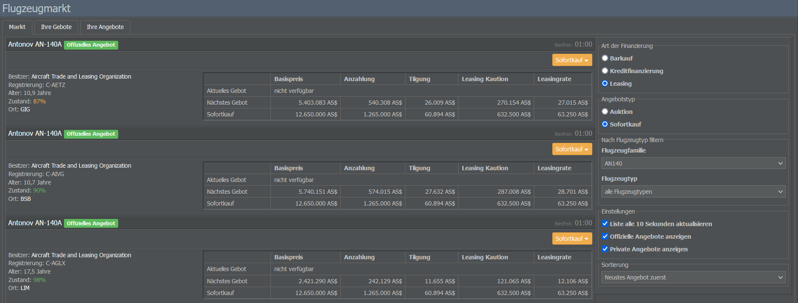
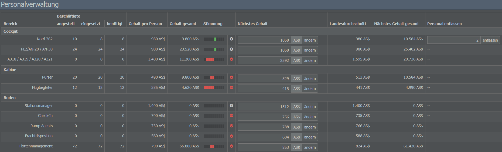
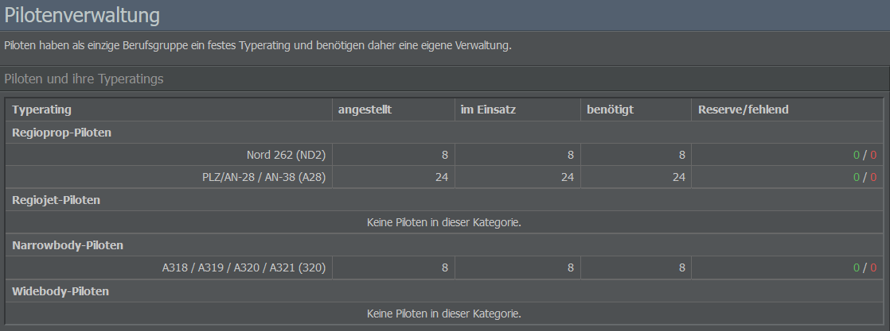
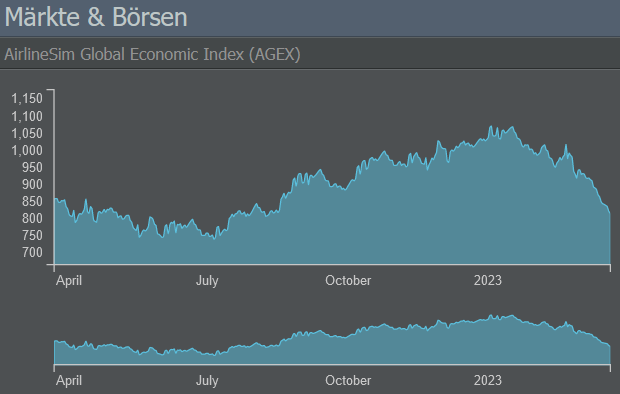
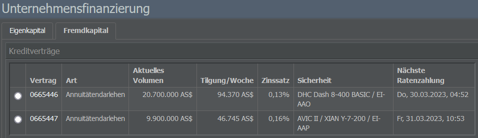
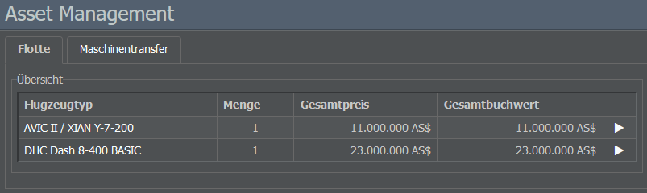

# Management-Tab

Das Management-Menü setzt sich aus den Abschnitten Einkauf, Human Resources, Investments und Finance zusammen.

## Einkauf

### Flugzeughersteller

Auf dieser Seite seht ihr eine Liste aller verfügbaren Flugzeugtypen, gruppiert nach Hersteller und Kategorie (Props, Regio Jets, Narrow- und Wide-Bodies). Wenn ihr auf ein Flugzeugmodell klickt, erhaltet ihr eine Übersicht der zugehörigen Varianten sowie einige allgemeine Informationen wie deren Kapazitäten, Geschwindigkeit und Reichweite.

Wählt ihr eine der Varianten aus, öffnet sich das Datenblatt des Flugzeugs, das alle relevanten Details des Modells enthält (z. B. den Neupreis, Produktionszeitraum und -rate sowie die Routenbeschränkungen, Nutzlast, Reichweite, Lärm- und Wartungskategorie, Performance usw.). Außerdem könnt ihr hier Leasing- / Kaufoptionen neuer Flugzeuge prüfen oder Angebote für gebrauchte Flugzeuge einsehen (falls vorhanden).

### Flugzeugmarkt

Wenn ihr auf der Suche nach gebrauchten Flugzeugen seid (oder vielleicht selbst eins verkaufen möchtet), ist der Flugzeugmarkt die richtige Adresse. Die verfügbaren Flugzeuge können hier nach Finanzierungsart (Barzahlung, Kredit oder Leasing), Angebotstyp (Auktion oder Sofortkauf) sowie nach Flugzeugfamilie und -typ gefiltert werden.

Jedes Angebot enthält wichtige Informationen wie die Besitzerinnen bzw. Besitzer des Flugzeugs, Alter und Zustand des Modells sowie die verfügbaren Zahlungsoptionen. Einen Überblick zu euren platzierten Geboten bzw. Inseraten findet ihr auf den Registerkarten “Ihre Gebote” und “Ihre Angebote”.

## Human Resources

### Personalverwaltung

Mit Hilfe dieses Menüs könnt ihr euer angestelltes Personal überprüfen und verwalten. Die Seite gruppiert die Angestellten nach ihrer Position (Flug-, Kabinen- und Bodenpersonal) und bietet Einblicke zu ihrem Beschäftigungsstatus, ihrer Stimmung sowie Details zu ihrer Gehaltsabrechnung.

Mit Ausnahme der Pilotinnen und Piloten werden alle Crew-Mitglieder bei Bedarf automatisch eingestellt. Ihr könnt jedoch ihre Gehälter ändern, indem ihr den gewünschten Betrag in das Textfeld der Spalte “Nächstes Gehalt” eingebt. Seid jedoch vorsichtig: Die Gehälter, die ihr zahlt, wirken sich auf die Freundlichkeit und Kundenorientierung eurer Angestellten und letztlich auch auf das Image eures Unternehmens aus.

Möchtet ihr Personal entlassen, gebt die Anzahl der Angestellten in die Spalte “Personal entlassen” ein.


**Wichtig**
Wenn ihr Arbeitsverträge kündigt, müsst ihr eine Abfindung in Höhe von mehreren Wochen des ausstehenden Gehalts zahlen.


### Crew Management

Auf dieser Seite könnt ihr eure Pilotinnen und Piloten verwalten. Im linken Abschnitt seht ihr eine Liste der derzeit beschäftigten und benötigten Pilotinnen und Piloten für jede Flugzeugkategorie (Regioprops, Regiojets, Narrow- und Widebodies). Die grüne Zahl zeigt die Anzahl der Reservepilotinnen und -piloten, der rote Wert gibt an, wie viele Pilotinnen und Piloten ihr noch benötigt. Bestellte und noch nicht ausgelieferte Flugzeuge sind in dieser Liste nicht enthalten.

Die Flugzeugkategorien zeigen euch, welchen Flugzeugtyp eine Pilotin bzw. ein Pilot bedienen darf. Wenn ihr die richtige Pilotin bzw. den richtigen Piloten für ein bestimmtes Modell finden möchtet, verwendet das Menü auf der rechten Seite. Hier könnt ihr arbeitslose Pilotinnen und Piloten einstellen oder neue ausbilden. Denkt daran, dass die Ausbildung das 5- bis 8-fache eines Wochengehalts kostet (je nach Flugzeugkategorie).

Wenn ihr über arbeitslose Pilotinnen und Piloten verfügt, könnt ihr diese über das Menü unten rechts auf einen anderen Flugzeugtyp umschulen. Die Kosten für die Umschulung sind wesentlich geringer als die Ausbildung neuer Pilotinnen und Piloten, da das vorhandene Personal in der Regel über eine gewisse Flugerfahrung verfügt.

## Investments

### Märkte & Börsen

Die Seite Märkte & Börsen zeigt die Entwicklung des AirlineSim Global Economic Index (AGEX) sowie der Treibstoffpreise im Spiel.

Außerdem findet ihr hier eine Liste der verschiedenen Börsen und Indizes. Beachtet bitte, dass der Inhalt dieser Seite variieren kann, je nachdem, ob eure Spielwelt [Börsengänge (IPOs)]() unterstützt oder nicht.

### Töchter & Portfolio

Wenn ihr Anteile an anderen Unternehmen erworben habt, werden diese hier zusammen mit Informationen wie Ratings und Buchwerten aufgelistet.

### Orderliste

Hier findet ihr eine Auflistung eurer Kauf- und Verkauforders für Aktien sowie eurer Beteiligungen an Börsengängen.

## Finance

### Unternehmensfinanzierung

In diesem Menü erhaltet ihr Informationen zum Eigenkapital sowie den Schulden eures Unternehmens. Auf der Registerkarte “Eigenkapital” findet ihr Details zu Anteilseignerinnen bzw. Anteilseignern und Börsengängen (falls die Spielwelt [IPOs]() erlaubt), während die Seite “Fremdkapital” eure bestehenden Kreditverträge sowie Informationen zur Aufnahme neuer Kredite anzeigt.

### Accounting

Der Seite zur Buchhaltung ist in drei Tabs unterteilt: Die Gewinn- und Verlustrechnung, die Bilanz und das Bankkonto.

In der Gewinn- und Verlustrechnung werden alle Einnahmen und Ausgaben eures Unternehmens sowie das Endergebnis aufgeführt. Um euch einen besseren Einblick in eure aktuelle finanzielle Situation zu ermöglichen, werden die Daten in die folgenden Kennzahlen unterteilt:

* **EBITDA**: Gewinn vor Zinsen, Steuern, Abschreibungen auf Sachanlagen und Abschreibungen auf immaterielle Vermögensgegenstände (Englisch: Earnings before interest, taxes, depreciation and amortization). In AirlineSim sind darin alle Aufwendungen aus dem regulären Betrieb enthalten, während eher kalkulatorische Kosten wie die Abschreibungen auf Flugzeuge oder reine Finanzkennzahlen wie die Kapitalkosten nicht berücksichtigt werden. Es gibt auch den “Bereinigten EBITDA”, der zudem alle irregulären Posten ausschließt.

* **EBIT**: Ergebnis vor Zinsen und Steuern (Englisch: Earnings before interest and taxes). Es wird auch als “Operatives Ergebnis” bezeichnet, da es auch den Wertverlust der für den Firmenbetrieb erforderlichen Anlagen (wie Gebäude und Flugzeuge) berücksichtigt und euch eine Vorstellung davon vermittelt, wie erfolgreich das Unternehmen nach Abzug aller operativen Kosten ist.

* **EBT**: Zu guter Letzt gibt es noch den Gewinn vor Steuern (Englisch: Earnings before taxes). Da es in AirlineSim (noch) keine Steuern gibt, kann dies als Endergebnis angesehen werden. Es unterscheidet sich vom EBIT dadurch, dass es auch die Kapitalkosten (z. B. Zinsen) oder Erträge aus Anlagengeschäften (z. B. Aktienhandel) hinzurechnet oder abzieht. Daher wird der Wert auch als Ergebnis der gewöhnlichen Geschäftstätigkeit bezeichnet.

Die Bilanz beinhaltet zwei Tabellen: Oben findet ihr die Gewinn- und Verlustrechnung, die aus einem Aufwands- und einem Ertragsteil besteht. Beide zeigen die jeweiligen Konten (z. B. Gebühren für Flugzeughandling oder Leasingerlöse) und die dazugehörigen Bilanzwerte. Darunter seht ihr die Aktiva (z. B. Gebäude oder Flugzeuge) und Passiva (z. B. Eigenkapital oder Darlehen) eures Unternehmens.

Die Registerkarte Bankkonto listet eure Einnahmen und Ausgaben zusammen mit Datum, Uhrzeit und Wert auf.

### Cash Flow

Auf dieser Seite findet ihr eine Übersicht über den Finanzplan eures Unternehmens, in dem alle Einnahmen und Ausgaben aufgeführt sind, die im Zusammenhang mit Verträgen stehen, z. B.

* Leasingzahlungen,
* Zahlungen für private Handlingservices,
* Darlehenszahlungen,
* Personalgehälter (Wochenabschluss)
* und Dividenden (im Falle eines erfolgreichen [Börsengangs]()).

Die Liste enthält auch das nächste Datum und die nächste Uhrzeit für eine Zahlung. Wird sie in der nächsten Periode fortgesetzt, wird nur die erste Zahlung angezeigt. Einnahmen und Ausgaben im Zusammenhang mit Flügen und Wartungsarbeiten werden hier nicht aufgeführt, da sie nach Erbringung der Leistungen gezahlt werden und nicht mit einem festen Betrag oder einer festen Uhrzeit verbunden sind.

### Asset Management

Die Seite Asset Management ist in zwei Bereiche unterteilt: Eine Registerkarte zur Flotte, die eure erworbenen Flugzeuge anzeigt und es euch ermöglicht, sie zu verkaufen oder zu verleasen (indem ihr auf das grüne Buchsymbol neben einem Modell klickt), und eine Registerkarte zum Maschinentransfer, die es euch ermöglicht, Flugzeuge von eurem aktuellen Unternehmen auf eine andere Tochtergesellschaft eurer Holding zu übertragen.

### Leasing

Im Bereich “Geleaste Maschinen” erhaltet ihr einen Überblick über eure geleasten Flugzeuge zusammen mit deren Alter, Leasinggeber, Abrechnungsterminen und Leasingraten. Zudem habt ihr hier die Möglichkeit, Leasingverträge zu kündigen. In der Registerkarte “Verleaste Maschinen” könnt ihr die von euch verleasten Flugzeuge einsehen.
