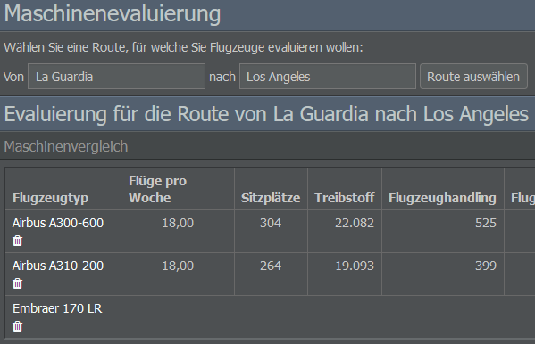

# Operations-Tab

Der Operations-Tab ist in Flug- und Bodenbetrieb unterteilt.

## Flight Operations

### Flottenverwaltung

Auf der Seite Flottenmanagement werden eure erworbenen Flugzeuge angezeigt. Ihr könnt sie organisieren, indem ihr sie verschiedenen Flotten zuordnet.

Eine neue Flotte kann über die Schaltfläche “Flotte anlegen” oben rechts erstellt werden. Auf der linken Seite findet ihr eine Liste eurer bestehenden Flotten sowie die Option, diese zu löschen. Wenn eine Flotte gelöscht wird, werden alle ihre Flugzeuge auf die Standardflotte übertragen.

Wenn ihr das Kästchen neben einem Flugzeugmodell anklickt, öffnet sich das Menü "Aktionen". Hier könnt ihr Kabinenkonfigurationen und Besatzungen zuweisen, einen Transferflug einrichten, die Flottenzugehörigkeit festlegen und den Flugplan freigeben, sperren oder löschen.

Über das grüne oder blaue Buchsymbol neben einem Flugzeug könnt ihr dessen Vertrag einsehen oder es, falls gewünscht, zum Verkauf oder zur Vermietung anbieten. Das nebenstehende Kalendersymbol führt euch zur Flugplanungsseite und das Symbol ganz rechts zeigt die bereits geplanten Flüge an.

### Maschinenevaluierung

Mit diesem Tool könnt ihr verschiedene Flugzeuge auf einer von euch gewählten Strecke vergleichen und sie so hinsichtlich ihrer Effizienz bewerten. Die resultierende Liste zeigt die möglichen Flüge pro Woche, die verfügbaren Sitzplätze, den Treibstoffverbrauch, die Fixkosten, die Kosten pro Sitzplatz und - am wichtigsten - den Gewinn / Verlust bei verschiedenen Auslastungen. Ihr könnt die Bewertungsparameter wie das Alter des Flugzeugs, die Serviceklasse, die Sitzplätze und den Preis unten rechts anpassen.

### Wartung

Auf dieser Seite könnt ihr einen Wartungsbetrieb für eure Flotte auswählen. Die Liste auf der rechten Seite zeigt alle verfügbaren Dienstleister und ihre jeweiligen Leistungen in Bezug auf Preis, Qualität und Effizienz. Denkt daran, dass ein neuer Wartungsdienstleister nur alle zwei Wochen eingestellt werden kann und dass sich Qualität und Effizienz auf das Wartungsverhältnis eures Flugzeugs auswirken.

### Operations Control

Die Seite Operations Control zeigt eine Zeitleiste der von euch durchgeführten Flüge, sortiert nach Flugzeugtyp. Die Flotte und Zeitspanne könnt ihr auswählen, indem ihr die 
gewünschten Werte in die Felder auf der linken Seite eingebt.

## Ground Operations

### Stationen

Auf dieser Seite erhaltet ihr einen Überblick zu den Stationen eurer Airline. Dieser beinhaltet Details zu deren Lärm- und Nachtflugbeschränkungen, der Passagier- und Frachtnachfrage, den Kapazitäten sowie den abgefertigten Loads. Für einen besseren Überblick könnt ihr die Stationen auf der rechten Seite nach Ländern filtern.

Jede Station in der Liste wird mit Links zu ihrer Auslastungsstatistik, eurem Flugplan sowie zur Informationsseite der Station aufgeführt. Über das Menü auf der rechten Seite könnt ihr neue Stationen eröffnen.

Im Textfeld unter dem Seitentitel könnt ihr schnell nach einer bestimmten Station suchen. Gebt dafür einfach den Namen oder den Code der Station ein und schon werdet ihr zur Informationsseite der Station weitergeleitet.

### Gebäude

Diese Seite zeigt die Gebäude und Serviceverträge eurer Fluggesellschaft an.

