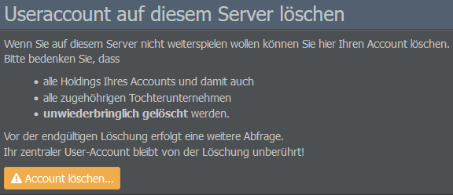

# Einstellungen

## Account

### Ihr Profil

Dieser Abschnitt enthält Angaben wie den Usernamen, den Status (Testphase / Premium) sowie die Liste der Holdings und Unternehmen in der Spielwelt.

### Ihre Holdings

Auf dieser Seite werden euer täglicher Credit-Verbrauch sowie der aktuelle Kontostand angezeigt. Auf der rechten Seite seht ihr außerdem eine Liste eurer aktiven Holdings.

### Einstellungen / Spielwelten

Über diesen Menüpunkt gelangt ihr zurück zum Dashboard der Accountverwaltung, das euch auch angezeigt wird, wenn ihr euch über die [AirlineSim-Website](https://www.airlinesim.aero/de/) einloggt. Hier könnt ihr die verfügbaren Spielwelten sehen, Credits kaufen und Accounteinstellungen wie E-Mail-Adresse, Passwort und Benachrichtigungen anpassen.

## Spielwelt

### Einstellungen

Die Einstellungen, die hier angezeigt werden, ähneln den Optionen, die ihr in den Spieleinstellungen findet. In diesem Menü könnt ihr zudem eine Sprache für die Benutzeroberfläche bzw. E-Mail-Benachrichtigungen auswählen und festlegen, ob euer Onlinestatus mit anderen geteilt werden soll oder nicht.

### Spielwelt deaktivieren

Über diese Option könnt ihr euer Konto aus der Spielwelt entfernen.


**Wichtig** 
Dadurch werden alle Holdings und Tochtergesellschaften eures Kontos unwiderruflich gelöscht. Bitte lest daher die Informationen auf der Seite sorgfältig durch, bevor ihr fortfahrt. Euer zentrales Benutzerkonto bleibt hiervon unberührt.

