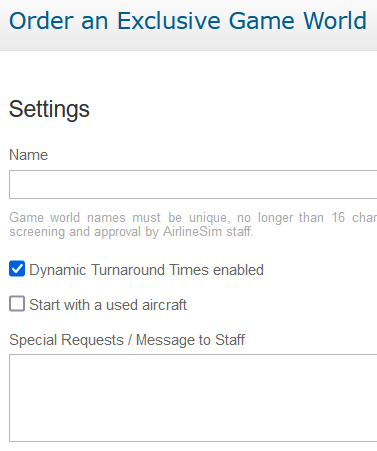

# Game Worlds

After logging into your account, the Dashboard will show a variety of game worlds for you to choose from. The amount of game worlds that you can join isn't limited, so feel free to try out as many as you like. Keep in mind that [credits]() will be deducted from your account for every active game world.

## Short-Term Game Worlds

As the name suggests, short-term game worlds have a limited runtime and usually last for about 8 to 10 months before starting over in a new iteration. You can find out which worlds are currently available in the table below.


**Info**  
Short-term game worlds consume 4 credits per day for your first holding and 2 credits per day for every additional holding.


## Long-Term Game Worlds

On the other hand, long-term game worlds run continuously with no specific end date. The currently active servers can be found in the table down below as well.


**Info**  
Long-term game worlds consume 6 credits per day for your first holding and 4 credits per day for every additional holding.


## Detailed Configurations

Here is a list of all currently available short-term and long-term game worlds along with some of their configuration details. Please remember that even if a game world allows having multiple holdings, you must only use one account (more information on that can be found in our game rules).

### Short-Term Game Worlds

| Game World | Opened | Ends | First Holding | Additional Holding | Standard pricing formula | Turnarounds | ORS Version | Remarks |
| :-- | :-- | :-- | :-- | :-- | :-- | :-- | :-- | :-- |
| Bleriot IV | Sep 2022 | 22 May 2023 | 4 credits | 2 credits | Ver. 3 | dynamic | Ver. 2 | only current aircraft, standard slots |
| Domination V | Mar 2023 | 20 Nov 2023 | 4 credits | -- | Ver. 3 | dynamic | Ver. 2 | all countries open for investment, doubled starting funds, single slots |
| Otto IX | Aug 2022 | 18 Apr 2023 | 4 credits | 2 credits | Ver. 3 | dynamic | Ver. 2 | only current aircraft, double slots |
| Yeager VII | Dec 2022 | 21 Aug 2023 | 4 credits | 2 credits | Ver. 3 | dynamic | Ver. 2 | only current aircraft, standard slots |
| Junkers IV | Jan 2023 | 27 Sep 2023 | 4 credits | -- | Ver. 3 | dynamic | Ver. 2 | only current aircraft, standard slots |
| Quimby XIII | Nov 2022 | 29 Jul 2023 | 4 credits | 2 credits | Ver. 3 | dynamic | Ver. 2 | only current aircraft, double slots |

### Long-Term Game Worlds

| Game World | Opened | Ends | First Holding | Additional Holding | Standard pricing formula | Turnarounds | ORS Version | Remarks |
| :-- | :-- | :-- | :-- | :-- | :-- | :-- | :-- | :-- |
| Limatambo | Dec 2020 | -- | 6 credits | -- | Ver. 3 | dynamic | Ver. 2 | only current aircraft, standard slots |
| Xiguan | Dec 2018 | -- | 6 credits | -- | Ver. 3 | dynamic | Ver. 1 | only current aircraft, standard slots |
| Hoover | Dec 2017 | -- | 6 credits | -- | Ver. 3 | dynamic | Ver. 1 | only current aircraft, standard slots |
| Riem | Mar 2015 | -- | 6 credits | 4 credits | Ver. 2 | static | Ver. 1 | advanced game world due to reduced demand, IPOs possible, standard slots |
| Ellinikon | Aug 2014 | -- | 6 credits | 4 credits | Ver. 2 | static | Ver. 1 | IPOs possible, standard slots |
| Aspern | Nov 2013 | -- | 6 credits | -- | Ver. 1 | static | Ver. 1 | IPOs possible, only current aircraft, standard slots |
| Gatow | Feb 2013 | -- | 6 credits | -- | Ver. 1 | static | Ver. 1 | IPOs possible, standard slots |
| Pearls | Jun 2012 | -- | 6 credits | -- | Ver. 1 | static | Ver. 1 | IPOs possible, standard slots |
| Meigs | Mar 2012 | -- | 6 credits | -- | Ver. 1 | static | Ver. 1 | IPOs possible, standard slots |
| Stapleton | Jul 2011 | -- | 6 credits | 4 credits | Ver. 1 | static | Ver. 1 | IPOs possible, standard slots |
| Fornebu | Sep 2010 | -- | 6 credits | 4 credits | Ver. 1 | static | Ver. 1 | IPOs possible, standard slots |
| Tempelhof | Aug 2010 | -- | 6 credits | 4 credits | Ver. 1 | static | Ver. 1 | IPOs possible, standard slots |
| Croydon | Nov 2009 | -- | 6 credits | 4 credits | Ver. 1 | static | Ver. 1 | IPOs possible, standard slots |
| Nicosia | Aug 2009 | -- | 6 credits | 4 credits | Ver. 1 | static | Ver. 1 | IPOs possible, standard slots |
| Devau | Feb 2008 | -- | 6 credits | 4 credits | Ver. 1 | static | Ver. 1 | IPOs possible, standard slots |
| Idlewild | Oct 2007 | -- | 6 credits | 4 credits | Ver. 1 | static | Ver. 1 | IPOs possible, standard slots |
| Kaitak | Aug 2007 | -- | 6 credits | 4 credits | Ver. 1 | static | Ver. 1 | IPOs possible, standard slots |

## Exclusive Game Worlds

### What is an exclusive game world?

AirlineSim was created for use with public game worlds, but due to popular demand, we're also offering private game worlds that allow individual configurations.

On a technical level, exclusive game worlds are identical to their public counterparts which means that they share the same customization options and restrictions. Data changes and updates are applied normally as well. However, the settings of exclusive game worlds can be configured according to your liking!

### What exactly can I configure?

Unless stated otherwise, exclusive game worlds have a maximum capacity of 25 accounts which are specified by the game world's owner and approved by support. The number of holdings is not limited, though. The support team can also provide any amount of money to the game world's airlines, allowing them to have a faster start, for example.

Additionally, the support staff can adjust the following settings according to your wishes:

* Holding starting capital
* Amount of holdings per account
* Nighttime bans on / off
* Ground networks on / off
* Single / double slots
* Initial Public Offerings on / off
* Dynamic turnaround times on / off
* Availability of aircraft (all / only contemporary)
* Selection of aircraft types
* Used aircraft at start on / off
* Global demand for passengers and cargo (1 - 100%)
* List of countries open for foreign investment
* Anti-cheating restrictions on / off

For countries that allow foreign investment, you can choose from the lists that are in use on public game worlds or choose to make all or no countries available for foreign investment.

With anti-cheating restrictions turned off, you are free to interact with your own holdings (on the aircraft market, stock market and for interlining contracts).

### What about game rules?

The AirlineSim staff doesn't supervise game rules on exclusive game worlds, so we won't check naming or stock exchanges, for example. The owner of the game world may look after the rules to the extent that they desire, however. 

Since exclusive game worlds are technically identical to the public ones, any hard coded restrictions (e.g. pertaining to aircraft, stock exchanges or the amount of owned holdings) cannot be lifted.

### How much does it cost?

An exclusive game world costs 360€ (including VAT) per 30 days. We require a non-refundable payment in advance for the first 90 days. Rent for subsequent periods is charged on a monthly basis.

### Where can I order my own game world?

You can place your order directly by logging into your account, navigating to the Dashboard and selecting Exclusive Game Worlds.

Once your purchase has been completed, we will set up your game world within 5 business days. If you have any questions concerning your order, please contact [support](https://www.airlinesim.aero/blog/pages/support/).
