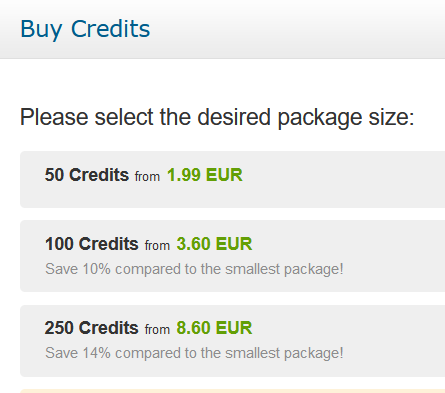

# Payment System

AirlineSim utilizes a pay-to-play payment system that requires the purchase of credits in order to access the game. By avoiding in-game purchases, this payment model serves to enhance fairness and game immersion.

This article covers everything you need to know about credits, credit consumption, prices, payment methods and the game's premium features. If you are running into problems during the payment process, please refer to our Payment FAQ.

## Credits

After signing up for AirlineSim, your account is equipped with 60 free credits that cover a trial period of about two weeks. If you want to continue playing once the trial ends and use the game's premium features, you will have to purchase credits.

The credit system is a prepaid model and thus completely flexible. Buying credits does not constitute a repeating subscription, so you can buy credits whenever you like. If you ever decide to stop playing the game, all you have to do is let your credits run out. Please note that credits can't be refunded, though.

## Credit Consumption

Once you create a holding, credits are deducted from your account on a daily basis. If you're playing on a short-term game world, your first holding costs 4 credits per day and game world. Each additional holding (if allowed) adds 2 more credits to the daily bill. In a long-term game world, your first holding consumes 6 credits per day and game world while each additional holding costs 4 extra credits.

If you are out of credits, your account's holdings and companies will be locked until you add more. Credits will still be subtracted at the normal daily rate during this period. The intention here is to prevent companies from gaining an unfair advantage by abandoning accounts and returning to them, several weeks later, having avoided paying for their growth.


**Example**  
If an account owns one holding in a short-term game world and runs out of credits, it will have a balance of -20 credits after 5 days. These must be paid before access to the game is restored.


If the credits aren't refilled after 28 days of the account balance turning negative, the airlines will be deleted in order to avoid penalizing active players. The AirlineSim account itself will remain active though. Please keep in mind that the grace period of 28 days applies to premium accounts which have previously purchased credits. For trial accounts, it takes 7 days after running out of credits until the airlines are deleted.

## Pricing

AirlineSim offers a scaled pricing model with different package sizes, which allows you to choose the right amount of credits for every situation.

The smallest package consists of 50 credits and starts at a price of 1.99€. Thus, a simple account with a daily consumption of 4 credits costs around 4.78€ per 30 days of playing.

You can also purchase larger package sizes and take advantage of bulk discounts:

* 100 credits for 3.60€ (saves 10% compared to the smallest package)
* 250 credits for 8.60€ (saves 14% compared to the smallest package)
* 500 credits for 16.60€ (saves 17% compared to the smallest package)
* 1000 credits for 31.70€ (saves 20% compared to the smallest package)
* 2000 credits for 62.40€ (saves 22% compared to the smallest package)
* 5000 credits for 149.00€ (saves 25% compared to the smallest package)

## Payment Methods & Checkout

In order to buy credits for AirlineSim, simply log into your account and click on Buy Credits. Here you can choose your desired package size, enter a voucher code and select your payment method.


**Info**  
Currently, the following payment methods can be used during checkout: Credit or Debit Card (Visa, MasterCard, American Express), PayPal, paysafecard, Online Bank Transfer and Prepayment.


Please note: Which payment methods are actually available depends on both the country you are paying from and the selected package size. If you are missing a payment method, try different package sizes.

Once your payment has been processed, the credits will be added to your account.

## Premium Game Features

The following features are not available during the trial period and are only unlocked once you upgrade your account to premium status by purchasing credits:

* Multiple holdings
* Multiple airlines in one holding
* Offering contracts (for sale, leasing out aircraft or interlining)
* Selling aircraft
* Bidding on non-official aircraft offers
* Player-owned buildings
* Personnel dismissal
* Stock exchange functions (IPOs and share trading)
* The Online Reservation System (ORS)
* Integrated flight operations control
