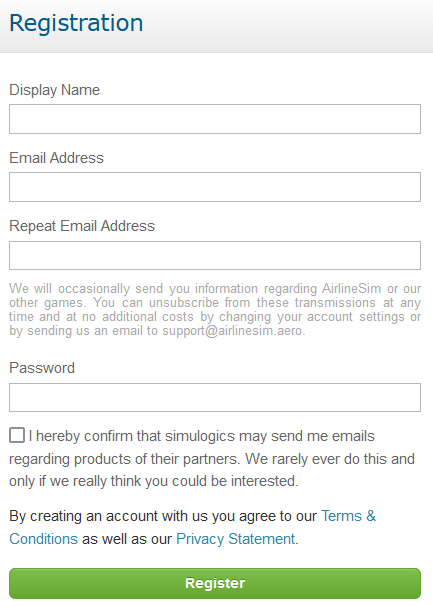

# Signing Up

Before accessing the game, you need to set up an account by selecting the Login button on the [AirlineSim website](https://www.airlinesim.aero/en/). Next, just hit Sign Up Now and choose a display name (no special characters or spaces), a valid permanent email address and a password for your account.


**Info**  
Sometimes, problems may occur when sending registration emails to Hotmail or MSN addresses. Try to use an alternative email address for registration, if possible. In case you already used a Hotmail or MSN address to register with AirlineSim, please contact [support](https://www.airlinesim.aero/blog/pages/support/).


It’s also possible to play AirlineSim by signing up using Facebook.

After accepting the Terms and Conditions and our Privacy Statement, all that's left to do is clicking on Register. Soon, you'll receive an email with a confirmation code that you need to enter in order to complete your registration. If you don't receive the confirmation email, please check your spam folder. 

Once you've been successfully logged in, you're good to go! Just remember to keep your login and account data safe. If you ever need help changing your password or email address, have a look at [Account Settings]().


**Important**  
Please note that you may only set up one account. Registering multiple acccounts is forbidden. For more information, check out our game rules.

