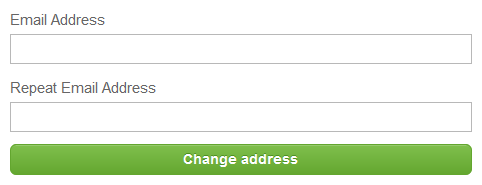

# Settings

In order to access the settings, log in via the [AirlineSim website](https://www.airlinesim.aero/en/) and select Account Settings. Here, you can adjust your account's email address, password and notifications.

## Changing an Email Address

In order to change your login email address, enter your new mail address in the required fields and click on Change Address. Since we require a valid email address, changes have to be confirmed by entering a code that will be sent to your new address.

## Updating a Password

In case you want to change your account password, simply select Request Password Reset and you will receive an email with a password reset link.

## Adjusting Notifications

In the notification settings, you are able to select which types of email notifications you want to receive from us.
