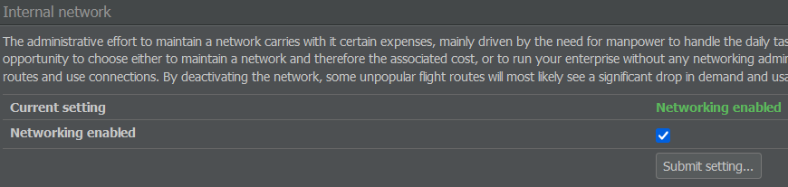

# Interlining

Another way of forming connections with other players is through interlining. This concept refers to agreements between airlines regarding passenger transfers; specifically, the ability for passengers to transfer between flights operated by airlines which have interlining agreements.

This is a pretty complicated business in reality, but a simplified model is used in AirlineSim.

## How to Get Started

In order for passenger transfers between flights operated by two different airlines to occur, an interlining contract must be signed. These contracts currently encompass the entire networks of the involved airlines - there are no restrictions regarding particular airports or routes.

To set up an interlining agreement, you can use the Interlining page, accessible from the Commercial tab, or the Send Interlining Request button on an airline's overview page.

Once you've received confirmation of the other airline's acceptance, the two route networks will be linked immediately and passengers and freight can transfer between the flights of your companies. 


**Info**  
The same transfer rules apply as would to transfers between your own flights, so you should still consider the airports' minimum transfer times and avoid letting passengers wait for more than eight hours (the maximum waiting time depends on the server, so it may be longer on future game worlds).


## Choosing a Partner

Naturally, there are some costs involved in this process. Interlining contracts may allow you to sell more tickets, but also require the employment of a number of extra network planning personnel (with a minimum of one employee per airline and contract and, if large airlines are involved, potentially many more). 

Therefore, it's worth thinking about the value of extra traffic generated versus the value of maintaining an interlining contract, particularly with a very large airline.

Before accepting an interlining agreement, it can be helpful to consider where your interlining partner is located, whether their routes fit your network and if their flights appear on the [Online Reservation System (ORS)](). Ideally, your partner communicates with you, has a good regional and international network and operates flights that get high ratings on the ORS.

Why is this important? Connected flights always get a lower rating than direct flights. If your partner's (or your) flights have low ratings, the combined flights might not even appear on the ORS. In that case, passengers will prefer other ways to fly from A to B to C.


**Example**  
Let's assume you're based in Istanbul and want an interlining partner in London. If you and your partner only fly to major European capitals, you won't gain a single passenger.

If your partner operates domestic and regional flights though, you'll get extra passengers on your flights to London who take a connecting flight to Aberdeen or Glasgow.

Vice versa, you'll get passengers who use your domestic flights from Ankara to Istanbul and then take a connecting flight to London.


Your partner's location is less important, but usually, a hub that's far away from yours offers a lot of different destinations. However, you can also form a contract with companies that use the same hub as you.

## Cancelling an Agreement

You can cancel the interlining contract at any time. In that case, it will run until the end of the accounting week in which the cancellation was requested.

## Internal Interlining

We've talked about the costs associated with interlining, however maintaining connections between your own flights isn't free either! They are handled in the same way as external connections and require a number of staff to keep them running smoothly.

The Interlining page offers an option to turn networking administration on or off by checking or unchecking the Networking Enabled box. 

Bear in mind that this will result in your passengers being unable to switch between your flights and may lead to a lower demand, particularly on marginal routes.
