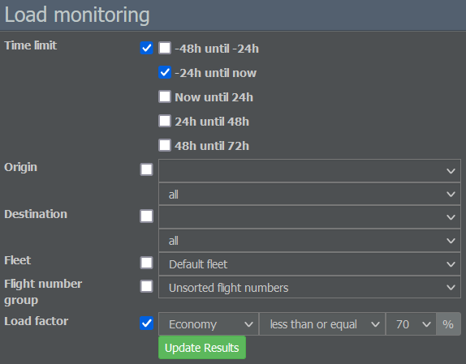

# Load Factors
                  
A plane that flies half empty loses money, so make sure to keep your planes as full as possible. If you don't have enough payload, you need another plane making profit in order to cover for the losses. However, this means that you invested money in two planes and the net result is still zero.


**Example**  
Let's say that you have a plane with 100 seats and the point where you break even is at around 70%. This means that 70 passengers will allow you to barely survive, 80 passengers will give you a 10% profit, 90 passengers will provide a 20% profit and a full plane will give you a profit of 30%. 


Every route and plane is different, but the numbers above are pretty close, so it's important to aim high. Try to keep your average load factor at around 90% or above.

You can keep an eye on your airline's performance by navigating to the Commercial tab and selecting Load Monitoring. Here, you can check loads for a time span, route, fleet and flight number group of your choice. 

If you're looking for ways to increase your load factors, you may be thinking about selling cheaper tickets. However, dropping prices doesn't always work. In the real world, low prices can attract new passengers that wouldn't fly otherwise. In the game, the number of passengers is fixed. 

So what are your options if cheaper tickets don't fill your plane?

* **Check the flight schedule**: Do your planes arrive and leave your hub in waves? Have you taken the minimum transfer times into account? Good connections usually improve your load factors.
* **Optimize your service**: Have you assigned a service profile to your flight? Few passengers will board your plane if there is no on-board service.
* **Connect with interlining partners**: If you have an interlining partner at the destination airport, make sure to connect your flights with theirs.

If the load factors still don't improve, try looking for a more profitable route. Exception: Your plane is only half full but most passengers are transfer passengers. In that case, you better lease a smaller plane to operate that route.
