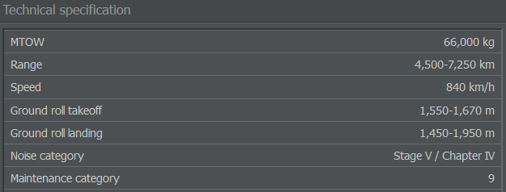

# Maintenance Categories
          
Every aircraft type in AirlineSim has a distinct maintenance category which describes its capability of being maintained together with similar types, e.g. an Airbus A318 together with an A319, A320 or A321. This refers to similar needs regarding training and equipment due to technical similarities between the planes. You can check which category an aircraft belongs to by having a look at its fact sheet.

While an A320 and an A318 do not differ much, a Boeing 737 is a wholly different plane with different requirements. So maintenance categories actually reflect a loss in maintenance productivity when diversifying one's fleet which is why it's important to keep track of how many categories your aircraft belong to.

Your first three maintenance categories are "free", meaning that you pay a flat fee of 100% base maintenance costs. The fourth category raises maintenance costs by 15%, the fifth adds another 15% to 130%, and so on. This figure refers to all of your planes.

Bought and leased out planes do not count towards your maintenance category limits.
