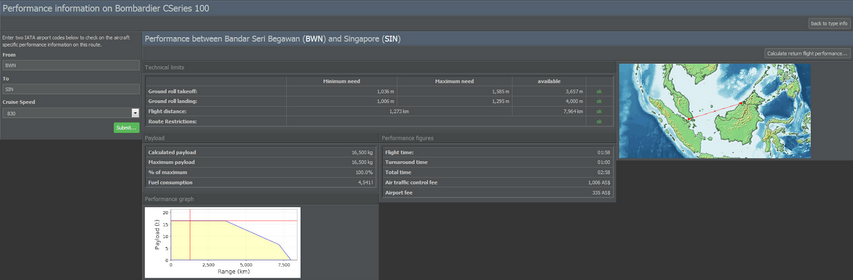
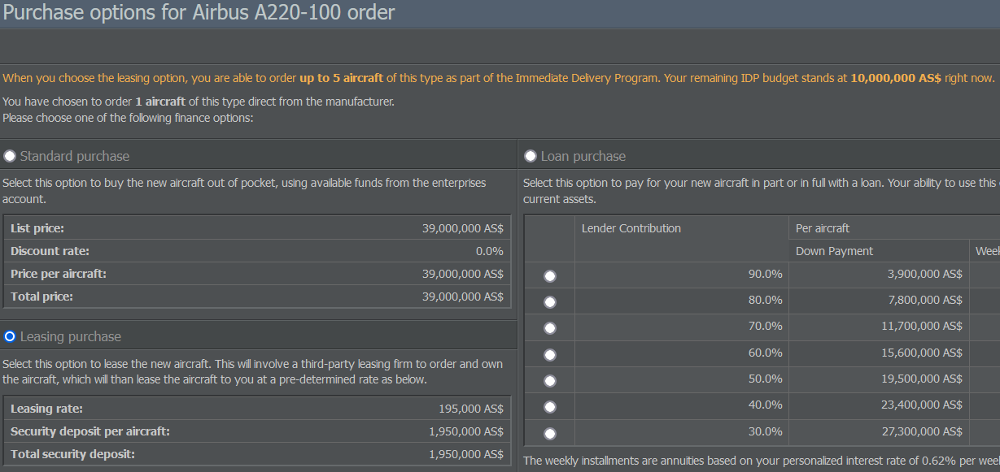

# Building Your Fleet

With your company set up, you probably want to start leasing or buying your first aircraft. Since there is a huge variety of machines to choose from, let's start by evaluating which aircraft type suits your planned operations best!

## Choosing Planes
    

 
First, it can be helpful to decide where you want your aircraft to fly to. With some possible routes in mind, you can get a better idea of what your fleet is going to look like.

### Domestic Routes

Domestic routes and flights to smaller regional airports feed transfer passengers to your hub and usually don't exceed a length of 1,000 km. If you choose to operate these routes with smaller turboprops like the Dash 8, you'll notice that they are slower than jets. This can be neglected when it comes to short distances, though. Besides, bigger planes need more time to load / unload. And if time is not an issue, money is.

Keep in mind that smaller aircraft can be cheap but at the same time at a disadvantage on high density routes due to their size. Sometimes, limited slots can be more important than saving fuel!

### Medium Routes

The majority of planes will do fine on routes between 1,000 and 2,000 km. You could go for a Boeing 737 or the Airbus 318-321 family, for example. Both offer several types with different payloads and ranges. If you want to save fuel, you could pick a 737-700 BGW as it has the lowest fuel consumption on medium range routes.

Once you hire a crew, you'll see that one pilot can operate both an A318 and an A320. The same goes for the engineer who does the aircraft's maintenance.

### Long-Haul Routes

As a new airline, it's not advised to start by operating long-haul routes. You only have 10 million AS$ to start with and it can be difficult to run a profitable airline with only two (big and expensive) planes and a network that consists of only 4 destinations.

Instead, you could begin by offering short- and medium-haul flights. Your starting capital should cover 1 or 2 medium sized jets and 3 or 4 turboprop planes, leaving you with a little reserve. Every plane can then fly 3 or 4 return trips per day, allowing you to create a small network from the start.

### New vs. Used Aircraft

With some potential routes in mind, you can also start thinking about whether you want to equip your fleet with new or used aircraft. It's generally recommended to start out with used aircraft as a new airline, both due to the limited starting funds and the immediate availability of the aircraft.

Here are a few points to consider:

* **Fuel consumption / maintenance**: New aircraft are likely to consume less fuel and are cheaper to maintain than their older counterparts.

* **Passenger preference**: Older aircraft (especially if > 20 years old) usually aren't very attractive for customers, so choosing new planes should allow you to sell more tickets and charge higher prices. However, age isn't the only factor: Generally, passengers prefer jets to props and large aircraft to smaller ones.

* **Production periods**: Remember to check if an aircraft is still in production. Buying aircraft that were only produced in small numbers may complicate your operations down the road with regards to fleet commonality.

* **Delivery times**: If you're not using your 10 million AS$ starting capital, new aircraft ordered from the manufacturer may not be delivered instantly as production takes between 6 - 42 hours, depending on the aircraft type. Used aircraft can be available immediately. (If you order several new aircraft from one production line, the orders will be added to your order book. This will not be influenced by other companies except for those belonging to your holding. The delivery date will be displayed in your fleet overview and in the order book.)

* **Price**: Used aircraft are cheaper to buy or lease - sometimes significantly so, depending on the age of the aircraft.

## Aircraft Type Evaluation

### Looking Up Aircraft

After giving the possible aircraft types some thought, you can start looking into their details by navigating to the Management tab and selecting Aircraft Manufacturers. This page shows you all the available aircraft types grouped by manufacturer.

Selecting a type opens an overview of the related aircraft variants and their general data, displaying values like speed, range and maximum passengers. If you want to know more about one of the models, just click on it and its aircraft fact sheet will give you all of the relevant specifications.

Let's look at some of the sheet's data in detail:

* **Passengers (max)**: The maximum passenger capacity of the aircraft. This can only be achieved with a one-class cabin layout using basic seats. If you want to offer more classes or luxurious seating, the aircraft will hold less passengers. Keep in mind to ask yourself how big your plane needs to be. You probably won't require an A380 to fly between two tiny cities, for example. If you’re unsure, you can always check out what the competition is doing.

* **Range**: The smaller value shows the range that you can reach with a full payload. The higher value displays the maximum range which can only be accomplished at a minimum load. You can see the payload-range graph for a specific route by using the Performance Check Tool, about which we'll talk in a second. 

* **Ground roll take off / landing**: The runway length the aircraft needs. The smaller value is the shortest possible length for take off or landing; the higher value is necessary for a fully-loaded take off or landing.

* **Noise category**: This indicates the noise emission level of an aircraft and can range from I (very noisy) to V (very quiet). Noisier aircraft pay higher ground charges and may be banned from certain airports entirely.

* **Maintenance category**: Aircraft within the same category have similar requirements regarding maintenance. Keep in mind that maintaining a diverse fleet can become expensive: Once your fleet contains aircraft from more than 3 categories, maintenance will cost an extra 15% for each added category.

### Performance Check Tool

If you want to see how an aircraft performs on a specific route, have a look at the Performance Check Tool at the bottom of the sheet's Technical Specification section. 

Here, you can find all the relevant information regarding a chosen aircraft and route, such as

* technical limitations (runway lengths, distance, route restrictions),
* details on fuel consumption and maximum payload,
* flight / turnaround times and
* air traffic control and airport fees.

This allows you to check whether your planned destinations are within the reach of your plane and provide sufficient runway lengths, for example. Be careful, though: Flying longer ranges will use more fuel, so you won't be able to carry as many passengers.

Speaking of fuel: Remember that fuel consumption is not linear - it takes a lot of effort to get a large, heavy plane off the ground, but not as much to keep it in the air once it's up, so aircraft that are suitable for long flights may not be as fitting once the range gets low.

### Comparing Aircraft Types

If you want to compare different aircraft types at once, click on the link below the Performance Check Tool. This lets you check the details of up to 4 aircraft models simultaneously.

For a comparison between an unlimited number of aircraft types on a selected route, navigate to the Operations tab and click on Aircraft Type Evaluation. Here, you can review the fuel consumption, the amount of available seats as well as the route's costs.

Keep an eye on the displayed number of flights, though: As an example, the tool may indicate that a plane can only carry out 28 flights per week (2 return flights per day), but you may be able to squeeze in a third (and shorter) flight (if you chose a more time efficient maintenance contractor, for instance).

## Acquiring Aircraft

Now that you've decided on an aircraft type, it's time to acquire your first machine!

The aircraft fact sheet of your chosen model gives you the option to order new aircraft (if they are still in production) or to check out used aircraft offers.

### Ordering New Aircraft

If you want to order new aircraft, just enter the desired amount and hit Request Quotation. On the following page, you'll have the choice between various payment options:

* **Purchasing aircraft** directly by paying the full price right away.

* **Leasing aircraft** by putting down a security deposit and paying a weekly fee to the lessor. If you choose this option, your company must have an adequate credit rating. If you can't pay the weekly fee, the aircraft will be returned automatically. 

* Making a **loan purchase** by financing the aircraft fully or in part through a credit. The loan and the interest must be paid back according to the game's standard conditions. This payment method depends on your credit rating as well. All available plans will be automatically offered.

As you've just founded your first holding, you are equipped with a starting capital of 10 million AS$ that allows you to have aircraft delivered instantly if you lease them. Once you exceed this budget, you will have to wait some time as the aircraft will be delivered one after another. Production times can vary and are displayed on the aircraft fact sheet.

### Ordering Used Aircraft

If you want to order used machines, select Check Out Used Aircraft Offers at the top right of the aircraft fact sheet. This will lead you to the Aircraft Market page which displays all the used aircraft that can be acquired.

The used market allows you to make an immediate purchase or place a bid using either cash, a credit or leasing as your financing type. Even though it may take a while, bidding is often advised as it is usually much cheaper.


**Important**  
If you place a bid, your money will remain tied up until the auction is finished. Keep in mind that the auction timer resets every time another bid is placed.


Each aircraft on the market is listed with additional information:

* **Owner**: This shows you who owns the aircraft and who you will be leasing or buying it from. Oftentimes it will be the Aircraft Trade and Leasing Organization, a company run by the game itself.
* **Registration**: The registration code of the aircraft.
* **Age**: The age of an aircraft is important since older planes have higher maintenance but tend to be cheaper.
* **Condition**: The optimal condition of an aircraft lies at around 100% but usually doesn't matter as it can be increased once the machine is purchased.
* **Location**: This shows the current location of the aircraft. Keep in mind that you will need to transfer it to your base of operations.

### Buying or Leasing?

Most new companies begin their operations with leased aircraft. With the exception of very small or old machines, a direct purchase is often not financially viable for beginners. Additionally, leasing provides you with the flexibility to return aircraft you may find unsuitable for your routes.

In the end, it's up to you: You could start an airline using leased planes or you could buy your own planes and avoid the weekly leasing fee. The bank will easily give you a loan if you have assets (in this case planes) to cover the risk.

### Terminating a Lease

Both you and the lessor have the ability to cancel the leasing contract at any time. If you wish to cancel a lease, go to the Operations tab and choose Fleet Management, navigate to the aircraft in question and click on the small book icon saying Contract Details.

Please note: The aircraft will be returned to the lessor once the next weekly installment is due. You will receive your bond back and will be charged the final lease installment.

Any flights scheduled after the termination period will be canceled and cancellation fees will be charged for any passengers / cargo booked.
Pilots and flight attendants will remain as redundant personnel until you retrain / reuse them or lay them off.
