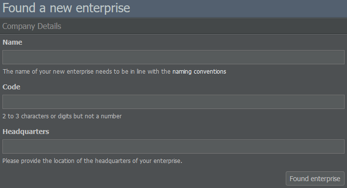
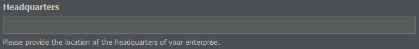

# Company Setup

## Planning the Company Structure

After creating your AirlineSim account and picking a game world, it can be helpful to think about how you want to structure your company, especially if the world supports IPOs. 

While you can use the first holding you establish as a regular airline, you won't be able to perform a stock market launch with it. In case you're interested in starting an IPO, you need to create another enterprise as the daughter of your existing holding. The subsidiary can then be traded on the stock market once you go public. 

Click here to find out more about the differences between holdings and subsidiaries.

## Naming Your Enterprise

Now that you have a general idea of your company's structure, let's set it up in the game!

All you have to do is click on the blue bar saying No Airline Yet? at the top of your screen and enter a name for your new enterprise on the following page. Make sure to follow the naming conventions in order to keep the game enjoyable for everyone.

You will also be prompted to enter a code for your company. The code must contain two or three letters or digits but shouldn't be a number. Since it can't be used by another enterprise, the interface will show a warning if a code is already taken.

## Choosing a Country

Next, let's determine your airline's headquarters. Keep in mind that the country you pick will influence the traffic rights that apply to your enterprise, so choose carefully. It may also affect your aircraft fleet: If you start an airline in a remote location, you will need big and expensive planes to connect your hub to the world unless you don’t mind limiting yourself to more regional routes. 

In the beginning, it's recommendable to select a country with little competition so that your planes are easier to fill. If you're unsure about the situation in a specific country, review some of its existing companies by checking their ratings and general activity in the game. In regards to the city, it can be helpful to select a country's capital as it is usually a popular destination for passengers.

When joining a game world that has already been running for some time, it can't hurt to take a look at the available slots of your desired airport. 


**Airport Slots**  
You can look up the slot distribution for a specific airport by typing its name into the game's search bar and navigating to the Slots tab of the airport's info page.


If you see a lot of orange and red, you may want to find another hub since slots are needed for landing and take off and play an important role in creating your flight schedule.

To help you with your decision, here are a few examples of different countries and their potential characteristics as hub locations.

### Spain

As a member of the EU, all of Europe is your domestic market, meaning you can transport passengers between any two airports within the EU (see Traffic Rights). The only issue: Every other European airline has the same advantage. All in all, Europe is a good place if you plan on creating several hubs, want loads of passengers and don't mind the hard competition.

### USA

Another huge market, big enough to create several hubs. As it is one country, you can fly to international destinations from every US airport. But, like in the EU, the competition can be quite strong.

### Mexico

Mexico provides a decent domestic market as it has many airports and only Mexican airlines can transport passengers between them. You will face competition from foreign airlines on your international routes but your domestic routes should be more protected. Obviously, the domestic market is much smaller compared to the US.

### Pakistan

This is an example for a country that can be open to foreign investors. At first, you may think you found a country with a good domestic market and little local competition.

However, if it's open to investors, every airline in the world can use it to create a subsidiary. What seemed like a quiet place in the beginning may become more competitive as big airlines start looking for places to expand their business.


**Info**  
Whether or not a country accepts foreign investments depends on the game world. You can check by navigating to the Countries section of the Database tab, selecting a country and reviewing what it says under Unrestricted Market Access.


## Creating Holdings and Subsidiaries

Once you're happy with your company's name and headquarters, you can click on Found Enterprise. Congrats, you've just launched your first business!

If you want to create another enterprise, just hover over the drop-down menu that has your airline's name on it and select Create New Enterprise. 

Next, you can specify if you want to found another holding or if you'd like create a subsidiary of your existing holding.


**Multiple Holdings**  
Please note: Not every game world supports running multiple holdings. In doubt, check out the world's configuration here or on our blog. If multiple holdings are allowed, keep in mind that cooperation between them is forbidden by our game rules.


When setting up a subsidiary, you have to decide how much starting capital it will receive from your holding, the minimum being 3 million AS$. Consider how much you want to invest as you will not have the opportunity to transfer any more money from the holding to the company or vice versa, except through a dividend paid to your holding and outside investors after an IPO.

Apart from the starting capital, keep in mind that the country of your holding determines the traffic rights of its subsidiaries: If the hub of your daughter company is located in the same country as the holding, you will have full traffic rights, otherwise they may be limited. 
