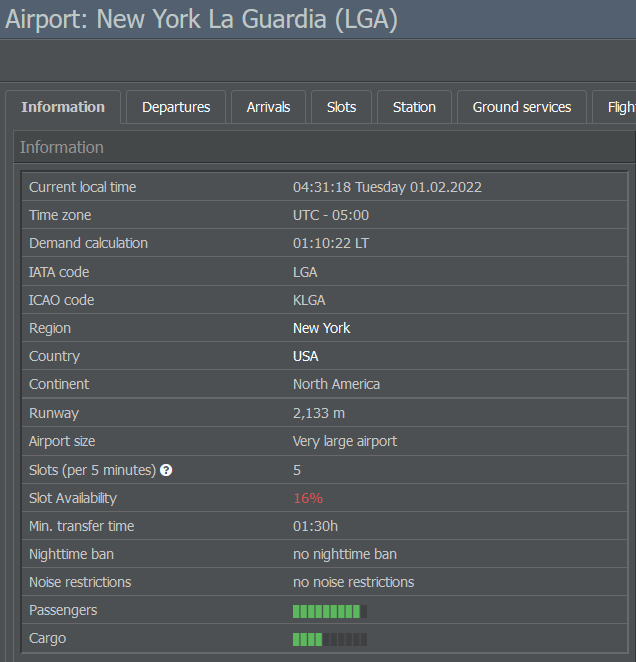

# Creating Routes

You've successfully acquired your first aircraft, so let's start planning your airline's routes! After the previous steps, you might already have a rough idea of where you want to fly, but now we'll have a look at the details.

## Finding Airport Information

If you're interested in a specific airport, you can search for it by typing its name or IATA code into the bar at the top of the screen. The airport's page offers lots of details, but for now, we'll focus on the Information tab.

Here, you can find data such as the airport's runway length, size, slots (the amount of flights that can take place per 5 minute window), minimum transfer time, nighttime bans, noise restrictions and demand.

As the demand affects your connections, let's see how you can take it into account during the route creation process!

## Considering Demand

An airport's demand is displayed by two green bars: One indicating passenger demand, the other representing cargo demand. Naturally, more passengers will fly between two major cities than between two smaller ones, so keep the demand levels in mind when planning your routes. It can also be helpful to consider domestic and real life demand.

### Domestic Demand

You will always find passengers wanting to fly to the capital of their country, which is why it's advised to select a capital city as your hub and connect your domestic routes with your international flights.

A good domestic network has several advantages: It provides you with transfer passengers for your international routes and it makes you an attractive interlining partner. Additionally, it can be quite profitable in some countries as the domestic market is more protected.

### Real Life Demand

In many cases, real life demand is reflected in the game: Old ties still exist between Spain and Latin America or the UK and India or Australia. Austria had many connections with former communist countries and the small Canary Islands attract thousands of tourists. 

When comparing different routes, you can use this to your advantage! Check out sites like [FlightStats](http://www.flightstats.com) to get information on real flights.

## Checking Existing In-Game Routes

Apart from the demand, it can be useful to have a look at the existing in-game routes, especially when you join a game world that has been running for a while. If several companies offer multiple flights between two airports, there is a good chance that you can squeeze in an extra flight.

## Turning Your Hub Into a Hub

We already discussed the advantages of having a good domestic network, but here's some general advice on creating connections to and from your hub.

First off, try to set up routes in different directions as passengers will travel to your hub and take connecting flights. Check out the airport's minimum transfer time to make sure that passengers can actually catch them, but keep in mind that they won't wait more than 8 hours for a transfer flight either.

If your flights arrive and depart in waves, you can create countless possible connections. No matter how small your base country is, you can build an excellent international network!

## Extending the Range

When deciding on routes, it can help to check the range of your aircraft. Each plane can fly a certain distance with a full load. It can fly further, but then it'll carry more fuel and less passengers. If you want to extend the range, equip your plane with better seats. This will get you a higher rating on the Online Reservation System (ORS) and you'll still be able to fly a full load (i.e. less passengers at a higher ticket price).

## Using Your Geographical Position

Last but not least, think about how your geographical position influences your choice of routes. While it can be a limiting factor, it also gives you advantages: If you are based in the Middle East, for example, your routes can connect Europe and Asia. An airline in Mexico can reach most parts of the US and half of South America with medium sized jets like the 737. Africa doesn't have that many major airports, but several African countries have signed the Yamoussoukro agreement which makes via-flights interesting (see Traffic Rights for more information). 

## Opening Stations

With all of these factors in mind, you can determine your airline's routes. Once you're happy with them, let's set them up in the game by opening stations at your desired airports!

Your first station is already open at the location where your enterprise is based. To open a new station, simply navigate to an airport's page and click on the Open Station button. You can also look up a country to see its list of airports and set up a station from there.

Another option is to click on the Operations tab and select Stations. In the Open New Station panel on the right side, you can enter the station's exact name or IATA code and hit Open Station. Please note that you don't have to build a terminal at an airport to handle passengers - it is assumed that public facilities already exist.

Opening or closing a station doesn't cost anything as long as it's not actively being used. 

However, there are staffing costs involved in handling passengers once you start scheduling flights to the airport, with the employees in question being hired automatically based on the number of passengers you expect to handle at the station.

* Station Managers: Currently not in use, won't be hired.
* Check-In Agents: Take care of passenger handling. Will not be needed or hired if the airport is only used for cargo.
* Ramp Agents: Coordinate the handling of the actual aircraft on the ground.
* Cargo Controllers: Take care of the cargo handling. Will not be needed or hired if the airport does not handle cargo.

If you reduce the handled amount of passengers or cargo to the point where staffing demands are reduced, personnel will become available for other stations.

Available employees can either be fired (although you'll have to pay them a settlement) or used to open up other stations in case they require additional personnel later on. This is done automatically - idle staff will be moved wherever it's needed before new people are hired.
