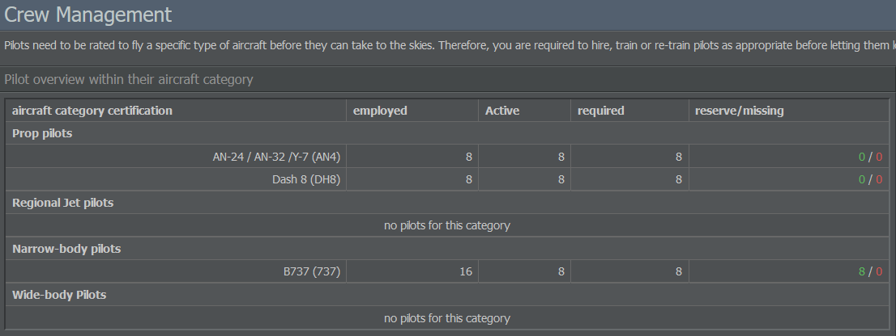
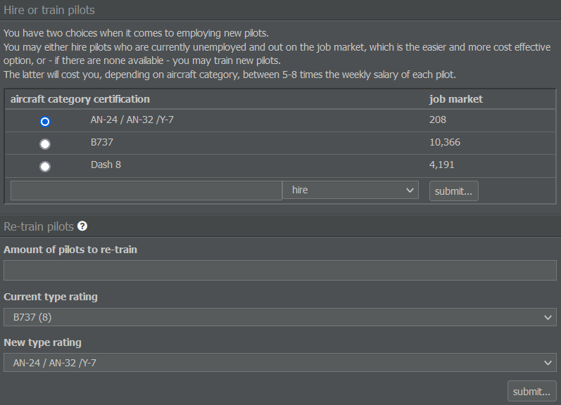

# Hiring Staff

With the routes set up, let's move on to your staff!

## Employing Pilots

An aircraft needs pilots to fly, so we have to hire or train them first. Some crew members will already be added by default, but let's find out how to employ pilots manually.

First, select the Management tab and go to Crew Management. On the left, you'll see a list of the employed and required pilots, grouped together by aircraft category. As pilots can't work the whole day, the number of required pilots is higher than actually necessary for a flight. For example, if your plane flies 20 hours per day, you need three crews to operate it and a fourth crew to replace pilots on sick leave or holiday. 

The green number towards the right displays the amount of reserve pilots whereas the red value shows how many pilots still need to be added. Keep in mind that, with the exception of some models, an aircraft typically requires a pilot and copilot.

The listed aircraft categories are divided into props, regional jets, narrow- and wide-body machines. They indicate which type of plane a pilot is allowed to operate and can also be found on the Aircraft Manufacturers page.

In order to find the right pilot for your aircraft type, have a look at the menu on the right: Here, you can hire unemployed pilots from the job market or train new ones. Both options will provide you with pilots immediately. However, training a pilot will cost 5 to 8 times the weekly salary depending on the aircraft category.

If you have employed but non-working pilots available due to an aircraft sale or the end of a lease, you can also choose to re-train them to operate another type of aircraft. The costs for re-training are significantly lower than training new pilots as it is assumed that existing staff have general flying experience.

## Managing Staff

In case you're looking for a general overview of your employees, click on Personnel Management in the Management tab. Here you'll see the number of staff members, their employment status, mood and payroll details.

The list groups employees by their position: Pilots, cabin crew, administrative personnel and so on. Personnel other than pilots are hired by the system automatically if they are required; however, you can control their wages by typing the desired value into the salary field and pressing Adjust.

Bear in mind that the automated system only hires necessary personnel - it doesn't fire them if you don't need them anymore. In order to discharge crew members, enter the desired number of employees into the field in the Redundant Personnel column and select Lay-Off.


**Important**  
Firing personnel isn't free - you will have to make a one-off redundancy payment equal to several weeks of default salary, so it's worth thinking about whether your reasons for dismissing staff involve short or long periods of time.

