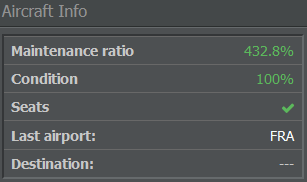
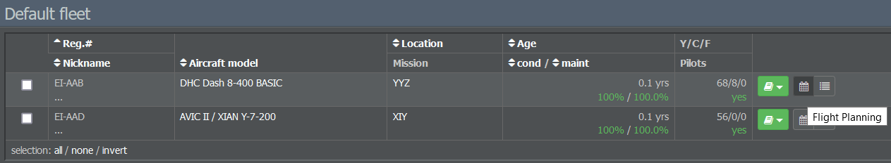
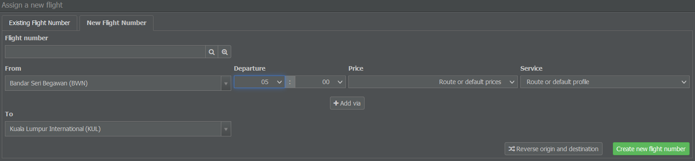
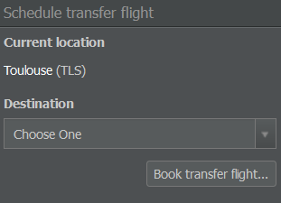
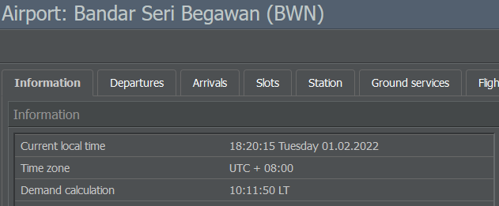

# Scheduling Flights

With the maintenance provider ready to go, it's finally time to get your aircraft flying! This can be quite simple or a bit complicated, depending on where you are, what your airline is trying to achieve and how much competition you're facing.

This tutorial will focus on getting a basic flight plan up and running, but a lot of the more advanced concepts should be pretty self-evident by the time you're through with it.

## Planning the Flight Schedule

Before we jump in, let's think about how you want to set up your schedule by having a look at some of the involved parameters.

### Staying Profitable

If you're leasing an aircraft, you'll have to pay the weekly leasing rate plus the salaries for pilots and cabin crew - even if it doesn't take off. If your plane makes one return flight per day (from A to B and B to A), the leasing cost per flight equals the weekly leasing cost divided by 14. If your plane makes three return flights per day, the leasing cost per flight equals the weekly leasing cost divided by 42. So in order to stay profitable, your plane has to fly as much as possible.

### Maintenance Ratios

In the Aircraft Info section of the flight planning page (to which we'll get in a second), you'll see your plane's maintenance ratio. This value displays an aircraft's ratio of maintenance to flight and can be seen as an indicator regarding its efficiency. Generally speaking, the higher the ratio, the less money you can earn with your plane.

When it comes to flight plans and maintenance, there are a few things to consider: First off, maintenance is scheduled automatically. This is indicated by a light blue background in the schedule. It will occur at any airport as long as the plane is on the ground. However, in order to successfully perform maintenance, your schedule needs to have a gap of at least 2 hours between two flights. 

If the aircraft has no scheduled flights, the maintenance ratio is at 100%. After planning the first return flight, you may notice that the maintenance ratio has a higher value, however this can be lowered back to 100% by scheduling more flights.


**Important**  
A maintenance ratio below 100% means that the schedule doesn't leave enough time for the technicians to do repairs, which leads to a daily decrease of the aircraft's condition. Once it drops below 50%, the plane will be grounded and is not allowed to operate flights until it has been repaired. Booked flights will be canceled and passengers refunded.


In order to prevent that, make sure to include weekly maintenance windows (depending on your aircraft's age, model and schedule). For short- and medium-haul schedules, you should allow daily maintenance. Customers appreciate a well maintained aircraft, so you'll also get better ratings and more bookings.

As mentioned above, maintenance is carried out at every airport, not only at your hub. It can be practical to leave time for maintenance at your hub, though. That way, passengers have enough time to take a connecting flight (that is, if all of your planes arrive more or less at the same time and leave around two hours later). When your other waves arrive, only leave the planes on the ground for the minimum transfer time.

### Minimum Transfer Times & Turnarounds

Every airport that offers transfers has a minimum transfer time, which can be checked on the airport's information page. This is the minimum time that passengers need in order to catch a connecting flight. Passengers leave the plane as soon as it lands, which is usually around half an hour before the plane is ready for its next flight.

When you look at your flight schedule, you can see that it displays both flight and turnaround times. The turnaround consists of all the activities that take place after a plane has arrived and before it's ready for departure again. The exact duration for a specific route can be viewed using the Performance Check Tool.


**Tip**  
Incomplete turnarounds due to a lack of time between flights will lead to delays in your flight operations. It also can't hurt to leave some extra buffer between flights so your operations become less prone to cascading delays caused by random disturbances affecting flight and ground operations.


### Putting the Puzzle Together

With the associated costs, maintenance ratios and transfer / turnaround times in mind, let's lay out your flight schedule.

Use the Performance Check Tool to view the flight times of your desired connections. Next, divide the flights between your planes in a way that the maintenance ratio of every plane is as close to 100% as possible. If the maintenance ratio is above 200%, your plane is wasting precious time on the ground.

Once you're happy with the schedule, we can set it up in-game!

## Creating Your First Connection

First, select Fleet Management in the Operations tab and choose the fleet your aircraft is assigned to. If you didn't change the fleet assignment, you'll find the aircraft in the default fleet.

Each aircraft is listed with three symbols: The little book on the left shows your aircraft's contract details, the second icon takes you to scheduling and the third one displays your current flights.

Clicking on the scheduling symbol leads you to a page with your empty schedule. Here you'll be able to create your first flight number.

 

To add a new flight:

* Enter a new flight number (without the airline code).
* Select a departure airport and time.
* Choose a price level and service profile (you can also leave it on default if you choose to manage prices and service through the Inventory section of the Commercial tab).
* Pick an arrival airport.
* Click on Create New Flight Number.


**Tip**  
If the departure or arrival airport of your choice isn't listed, make sure you open a station (branch office) at this airport.


After creating a new flight number, the flight planning section will appear.

 

For each day of the week, it informs you whether your desired connection is possible or not. If not, you'll see a red cross in which case you can try changing the departure time. For a flight to be scheduled, all fields must have green check marks.

By default, the flights will be scheduled for every day of the week (you can change that in the game settings). If you don't want to operate on a daily basis (or can't because of slot problems), you can select / deselect each day individually.

Once every check is green, click on Apply Schedule Settings to create the flight and assign it to your aircraft. 

 

## Scheduling the Return Flight           

After saving your flight, you can click on it in the flight plan section to view details on the flight number. Here, you can edit your prices and on-board service, either for that particular flight or for the route as a whole.

You'll also notice that the schedule shows a series of worryingly red boxes, but don't worry - this is because we only planned one direction so far. Without a return flight, the aircraft will be stuck at the destination airport and might not be able to operate further flights.

However, you don't need to return to the same destination immediately and round trips (e.g. airport A to B to C to A) are possible as well.

By default, the scheduling form is now filled in with a new flight number, the airport pair for the return flight and a new time suggestion based on the previous flight. You can change these settings if you want to fly to another destination or at an earlier / later time.

    

If you're happy with the settings, you can schedule the return flight by clicking on Create New Flight Number. 
    
   

Like before, the flight planning menu appears. After making sure all fields have green check marks, you can apply the schedule settings.


**Important**  
As mentioned previously, make sure to leave a sufficient time window between your flights. If your departure time is set before the time the airplane is ready, the flight turns red and the time window section displays red crosses. In that case, adjust your departure times to avoid overlapping flights.


Once you've successfully scheduled the return trip, your flights turn yellow. This indicates that the plan has been set up correctly and that there are no missing or broken flights.  

## Activating the Schedule

Now that your first schedule is ready, it's time to allow the Online Reservation System (ORS) to add passengers and freight to your flights.

Remember those yellow flight plan boxes? That means you have successfully blocked the slots, but no one can book the connections yet. In order to get bookings, your flights need to be activated first!


**Important**  
Without activation, the flights will be deleted after a few days to prevent slot blocking.


You can activate your flight plan by navigating to the Select Flight Plan Operation menu below your schedule. You can choose between activating the flight plan straight away or applying a three day delay.

   

The delay is useful to avoid mix-ups when changing existing flight schedules. Already booked flights of the old schedule will be completed before booking the new schedule in the ORS. It can also be helpful if you're unsure whether your plane will be fully booked within one day.

After deciding for an option, your scheduled flights turn green, which means that your flight plan is now successfully activated!

## Transferring Aircraft

Your flights appear at least 30 minutes after activating your schedule. The first actual connection will take place no earlier than 24 hours after the system has received the flight plans. By clicking on the little icon on the far right of an aircraft's entry on the Fleet Management page, you get a list of all the flights that can be booked for passengers or freight.

To operate these flights, your aircraft has to be at the first departure airport on the list. If your aircraft is located somewhere else, you need to add a transfer flight by using the Schedule Transfer Flight menu on the right side of the flight planning page.

 

Here, you can select your desired airport. The aircraft will then be relocated to the new destination and the transfer flight appears in the list - there is no need to look for slots. After the transfer has been completed, it will disappear. Keep in mind that transfer flights are free of charge but need some time to be completed.

Instead of booking a transfer, you can also cancel any out-of-place flights. There is no cancellation penalty as long as your flights are empty. If you cancel flights that already have bookings, however, you'll have to refund the tickets.

## Waiting for the First Passengers

Good job! Now you're ready for the first passengers to board your planes.

You can either keep scheduling flights for other aircraft or wait for your planes to fill. Each airport will book its ticket demands to the available routes once per day. The specific time can be found on the airport's information page in the Demand Calculation section.

The tickets will be booked up to three days in advance, so you can only tell how many passengers / freight units were actually booked at the time of departure. When your aircraft takes off, all the revenues and expenses for the flight are added to your account. Maintenance will be paid once it's done, while costs for staff, leasing contracts and loans will be deducted on a weekly basis.
