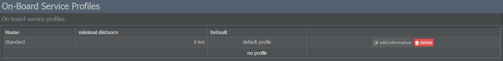

# Defining Service Profiles

## Crackers or Caviar?

Remember the days when airlines offered free drinks and a newspaper on every flight? It didn't cost them much, but passengers appreciated the service.

Our virtual passengers like to be pampered, too! Fortunately, good on-board service - drinks, meals, newspapers and so on - isn't that expensive and the higher rating is definitely worth the price.

Business and first class passengers are harder to please, but if you offer first class seats, then why not offer first class service? It's not profitable to install big seats and sell cheap tickets because the passengers dislike your service. 

Of course service profiles aren't mandatory. Once you've equipped your aircraft with seats, flight attendants and pilots, it's ready for take-off, so you're free to cut the on-board service and roll the savings into lower ticket prices. However, good on-board service will make flights at a particular price point more attractive for customers.

## Creating & Assigning Service Profiles

If you want to set up service profiles, navigate to the Commercial tab and select Service Profiles. You can create a new one by entering a name on the right side of the screen and clicking on Create Profile.

On the following page, you can define which on-board service you want to offer in each class (Business, Economy, First). The available options are divided into a food section, which includes drinks, snacks, a main course and a second meal, and a non-food section, which lets you determine the available headphones, meal packaging, newspapers and magazines.

Each service option can be viewed together with its associated costs. You'll also get an overview of how your choices influence the customers' ratings.

There's no recipe regarding the best and most economical settings. The choice of on-board service depends on your airline concept: If you're planning on running a low-cost carrier, your passengers probably won't be sleeping on a bed of roses, so keep your business plan in mind when setting up service profiles.

Once you're finished, you can go back to the overview and make one of the available service profiles your default. This will automatically apply it to any new flights you create, assuming that no distance restrictions apply to them.


**Short-Haul vs. Long-Haul Flights**  
Some meals require flights to have a range of at least 800 or 1,500 km, so if your default service profile includes any of these, it will not be applied to shorter flights and the game will leave them blank instead. Therefore, it may be necessary to create different service profiles for short-haul and long-haul flights.


You can also assign service profiles manually once you start creating flight numbers or by visiting the Inventory page in the Commercial tab. 
