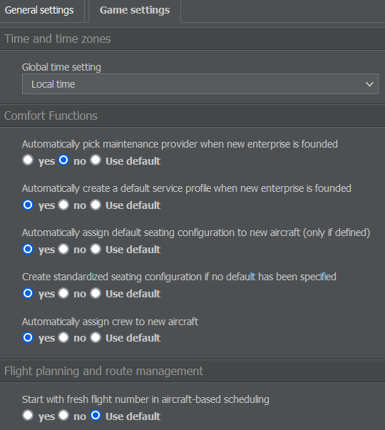
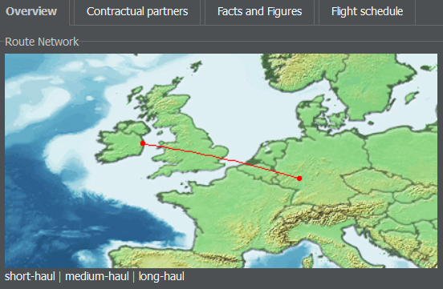

# Company Overview

Hovering over your company's name at the top left of the screen provides you with several options regarding your enterprise.

## Overview

The dashboard is separated into seven parts (also called widgets) - Company, Upcoming Events, Notepad, Stock, Financial Rating, Image and Subsidiaries - and is handy to look up quick information about your company.

### Company

The Company widget displays the logo (if you uploaded one) as well as the most important information about the enterprise, such as its name, code, hub, home country, airline rating, fleet size and number of employees. By clicking on Info Page, you can access your company's [Enterprise page](#enterprise).

### Upcoming Events

In the Upcoming Events widget, you can see your fixed expenses and income of the next three days based on contracts and terminated events like aircraft deliveries. The week-end closing is the time when your financial period resets and when staff are paid.


**Info**  
These events don't belong to the direct costs of a flight. To extend the list, click on View Complete Financial Schedule or select Cash Flow in the Management tab.


### Notepad

This widget allows you to write down notes regarding your enterprise. You can see them as long as you're logged into AirlineSim. To add or edit a note, double click it. The note will only be displayed to you - no other player can see it.

### Stock

If an enterprise makes an [Initial Public Offering (IPO)](), the Stock widget displays information like the stock quote and an overview of the shareholders. Clicking on IPO Information leads you to a page showing the stock data in detail (which can also be accessed via Corporate Finance in the Management tab).

### Financial Rating

This section shows a simplified version of your airline's economics: The Cash Flow indicates how much money the airline is making; the Profit Margin represents the amount of profit you earn in relation to the revenue. All the listed factors are summed up in the Overall Rating.

### Image

This widget displays your airline's current image regarding the three booking classes (Economy, Business, First) and cargo. The higher the green bar, the more your customers like your product. In order to keep track, you can see both the current and last week's image as well as the overall trend.

### Subsidiaries

In this widget, you'll find a list of all the subsidiaries you are controlling as the main shareholder. Further details on stocks can also be reviewed on the Subsidiaries & Portfolio page in the Management tab.

## Settings (General)

If you click on Settings right below the Overview option, you can edit the following details:

### Public Information 

This is the text that other users see when they visit your airline's overview page. Most players use it to inform about interlining specifications or their company's milestones.

### Main Logo

Here, you can upload a logo for your company. The logo will appear in your airline overview and is purely cosmetic. The file must have a size of 300 x 100 pixels. If you want to delete your logo, just click on the small trash can icon. 

### Small Logo

You can add a smaller version of your logo which will be displayed throughout the game (on arrival and departure billboards, for example). This image must have a size of 120 x 23 pixels. Please make sure it also complies with our logo guidelines (available under Database > Naming Rules in any game world).

## Settings (Game)

Next to the General Settings, you'll find another tab with Game Settings. This allows you to personalize AirlineSim by overwriting some of its global settings. A similar menu is available in the Settings tab on the top right of the screen.

### Time and Time Zones

You can choose whether the times in AirlineSim should be shown as the hub time, local time or UTC. The selection affects all displayed times within the game, such as slots, timetables and the financial schedule.

### Comfort Functions    
            
The Comfort Functions allow you to determine whether the game should handle some tasks automatically. These can include:

* Picking a maintenance provider when a new enterprise is founded,
* creating a default service profile when a new enterprise is founded,
* assigning a default seating configuration to new aircraft (only if defined),
* creating a standardized seating configuration if no default has been specified
* and assigning crew to new aircraft.

As these settings affect your gameplay, it's recommended to adjust them to your liking.

### Flight Planning and Route Management

Here, you can specify details related to flight numbers, aircraft scheduling, boarding methods, cargo and baggage as well as a few other options.

### Notifications

This lets you determine which in-game notifications you want to receive from AirlineSim.

### System Settings

Use this menu to choose whether or not you want to receive email notifications when someone sends you an in-game message.

### User Interface

In this section, you can adjust the game's visuals by choosing between a Dark, Light and Classic theme. You can also define settings regarding color blindness accessibility as well as some other interface related options.

## Company Setup and Liquidation

Underneath the settings, you have the option to create a new enterprise or to liquidate your current one.


**Warning**
If you choose a liquidation, all data of your enterprise will be irreversibly removed. All assets will be sold, buildings will be demolished, existing minority stakes will go to AirlineSim and majority stakes will lead to the deletion of the daughter enterprise. The shareholder will receive the remaining values divided by their share.


Keep in mind that a reset is only possible for holdings (i.e. enterprises which belong to your account directly).

## Enterprise        

The Enterprise page provides information regarding a specific company.

### Overview

This section shows the most important details like the company's name, hub and rating as well as its route network, fleet, subsidiaries, published information, statistics and news. The page also offers a report function where you can contact support in case an enterprise doesn't comply with the game rules.

### Contractual Partners

In this tab, you'll find information about the airline's business relations (leasing partners, for example).

### Facts and Figures

Here, you get a summary of the company's statistics, such as the number of operated flights, the achieved revenue or the amount of transported passengers and cargo.

### Flight Schedule

This page sorts all of the enterprise's flights by departure and arrival airports. The flight times may be displayed as hub time, local time or UTC.
