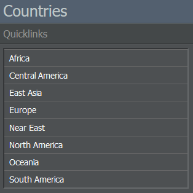

# Database Tab

The database tab lets you access important game resources like different directories, the Online Reservation System (ORS) and the game rules.

## Directories

### Countries

This section provides a list of all available countries in the game. Selecting a country will lead you to its information page where you can find details regarding its signed treaties, the market access for foreign investors as well as its airports.

### Enterprises

Here, you can review all enterprises that are registered in your game world. Clicking on a letter will open a list of the fitting companies and show their codes, alliance associations and headquarters. Picking an airline redirects you to its Enterprise page.

### Alliances

This menu lets you filter the game world's existing alliances. Each list entry displays the alliance's name, headquarters and status. By clicking on a specific alliance, you can view its information page where you have the option to apply as a member.

## Other Resources

### Fleet Lists

Using the Fleet Lists page, you can search each country for its registered enterprises and their associated fleets. 

### Statistics

On this page, you'll find a selection of statistical details regarding the game world. The general statistics include values like the number of enterprises or flights per week. In the weekly capacities menu, you get a list of the transported passenger / cargo amount. The detailed statistics section contains links to a variety of rankings.

### Online Reservation System

As one of the game's core features, the [Online Reservation System (ORS)]() generates a multitude of daily connections and distributes passengers between the players' flights.

The interface lets you search for available connections by entering an origin / destination, the earliest departure / latest arrival time and a payload type (Economy, Business, First Class and Cargo).

The search results are listed with their date, departure and arrival time, additional stops (if applicable), flight number, price and, most importantly, their rating. The ORS will also indicate whether a flight is already full or if it's still bookable.

## Game Rules

In this section, you can look up the game's general rules, the naming and logo guidelines as well as forbidden routes. The forbidden routes refer to country or airport pairs that aren't allowed to be operated in the game, usually due to political restrictions in the real world or the game's prohibition of intra-city flights.
