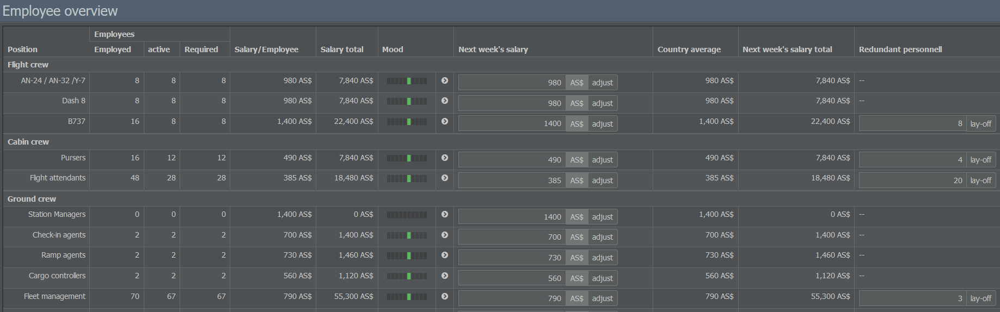
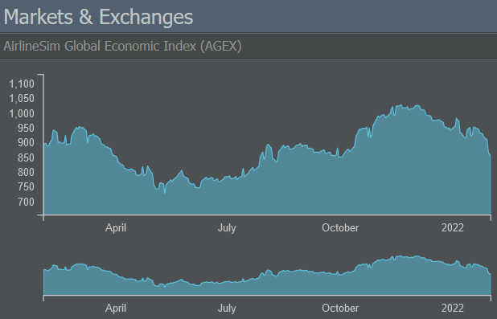

# Management Tab

The Management tab grants access to the Procurement, Human Resources, Investments and Finance menus.

## Procurement

### Aircraft Manufacturers

On this page, you can see all the available aircraft types grouped by manufacturer and category (props, regional jets, narrow- and wide-bodies).
Clicking on an aircraft model gives you a summary of its related variants and some general information like their capacities, speed and range.

Selecting one of the variants opens the aircraft fact sheet with all of the aircraft's relevant data (list price, production period and rate, route restrictions, payload, range, noise and maintenance category, performance etc.). It also allows you to check leasing / purchase options and review used aircraft offers (if applicable).

### Aircraft Market

If you're looking for used aircraft, the Aircraft Market is the right place to go. The available aircraft can be filtered by financing type (cash, credit or leasing), offer type (auction or immediate purchase) as well as aircraft family.

Each offer provides important information like the plane's owner, its age and condition as well as the available payment options. If you want to get an overview of your existing bids and offers, switch to the Your Bids and Your Offers tabs on the top of the page.

## Human Resources

### Personnel Management

With the help of this menu, you can review and manage your employed staff. The page groups employees by their position (flight, cabin and ground crew) and provides insights into their employment status, mood and payroll details.

Except for pilots, all employees are hired automatically when needed. However, you're able to change their salaries by typing the desired amount into the text field of the Next Week's Salary column. Be careful: The wages you pay affect your staff's friendliness and customer orientation and, ultimately, your company's image.

If you need to dismiss employees, enter the number of staff members into the text field of the Redundant Personnel column.


**Important**  
Canceling work contracts requires you to make a redundancy payment equal to several weeks of default salary.


### Crew Management

This page lets you manage your pilots. On the left, you see a list of the currently employed and required pilots for each aircraft category (props, regional jets, narrow and wide-bodies). The green number displays the amount of reserve pilots; the red value shows how many pilots you still need. Aircraft which are ordered and not yet delivered are not part of this list.

The aircraft categories indicate which type of plane a pilot is allowed to operate. If you want to find the right pilot for a specific model, use the menu on the right to hire unemployed pilots or train new ones. Keep in mind that training a pilot will cost 5 to 8 times their weekly salary (depending on the aircraft category).

If you have non-working pilots, you can re-train them to operate another aircraft type by using the menu on the bottom right. The costs for re-training are much lower than training new pilots as existing staff usually have some general flying experience.

## Investments

### Markets & Exchanges

The Markets & Exchanges section depicts the development of the AirlineSim Global Economic Index (AGEX) and the game's fuel prices. 

The rest of the page shows the different stock exchanges and indices. Remember that the content of this page may vary depending on whether your game world supports [Initial Public Offerings (IPOs)]() or not.

### Subsidiaries & Portfolio

If you acquired shares in other companies, this page will list them together with some general information such as ratings and book values.

### Order List

Here, you can find a summary of your buying and selling orders regarding stock as well as your subscribed [IPOs]().

## Finance

### Corporate Finance

This menu provides information on your company's equity and debt. The Equity tab shows details on shareholders and [IPOs]() (if applicable) while the Debt page displays existing loan contracts as well as information on new loans.

### Accounting

The accounting sheet is divided into three tabs: The Income Statement, the Balance Sheet and the Bank Account.

The Income Statement lists all revenues and expenses of your company as well as the final earnings. To provide more insight into your current financial situation, it structures the data into the following accounting measures:

* **EBITDA**: Earnings before interest, taxes, depreciation and amortization. In AirlineSim, this includes all expenses from your regular operations, while mostly imputed costs like depreciation of flight equipment or purely financial figures like the cost of capital are not. There is also an Adjusted EBITDA which excludes irregular expenses.

* **EBIT**: Earnings before interest and taxes. This is also called the Operative Result because it takes the depreciation of the equipment required to run your operations (like buildings and aircraft) into account and gives you an idea of how well the company did after subtracting all operative costs from the revenue.

* **EBT**: Last but not least, these are the earnings before taxes. Since there are no taxes in AirlineSim (yet), this can be seen as the final result. It differs from the EBIT in that it also adds or subtracts the costs of capital (like interest) or earnings from asset deals (like stock trades). Therefore, it is also called the Financial Result.

The Balance Sheet displays two tables: At the top, you get a profit and loss statement which is divided into an Expenses and an Earnings section. Both show the respective accounts (e.g. aircraft handling fees or leasing revenue) and their associated balance values. Underneath, you can see your company's Assets (such as buildings or flight equipment) and Liabilities (like equity or loans).

The Bank Account tab lists your earnings and expenses along with their date, time and value.

### Cash Flow

On this page, you'll find an overview of your company's financial schedule which shows all earnings and expenses related to contracts, such as

* leasing payments,
* payments for private handling services,
* loan payments,
* staff salary (week-end closure)
* and dividends (if there was a successful [IPO]()).

The list also provides the next date and time for a payment. If it continues in the next period, only the first payment will be displayed.
Earnings and expenses related to flights and maintenance won't be included here since they will be paid once the services are done and don't have a fixed amount or time associated with them.

### Asset Management

The Asset Management page is split into two parts: An Aircraft Assets tab which shows your acquired aircraft and allows you to sell or lease them (by clicking on the green book icon next to a model) and an Aircraft Transfer tab which lets you transfer aircraft from your current enterprise to any other subsidiary of your holding.

### Leasing

In the Leasing section, you get an overview of your leased aircraft along with their age, lessor, billing dates and leasing rates. You also have the option to cancel each of the leasing contracts. By switching to the second tab, you can view the aircraft that you have leased out. 
